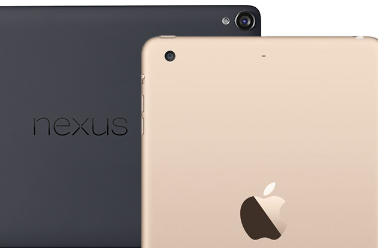
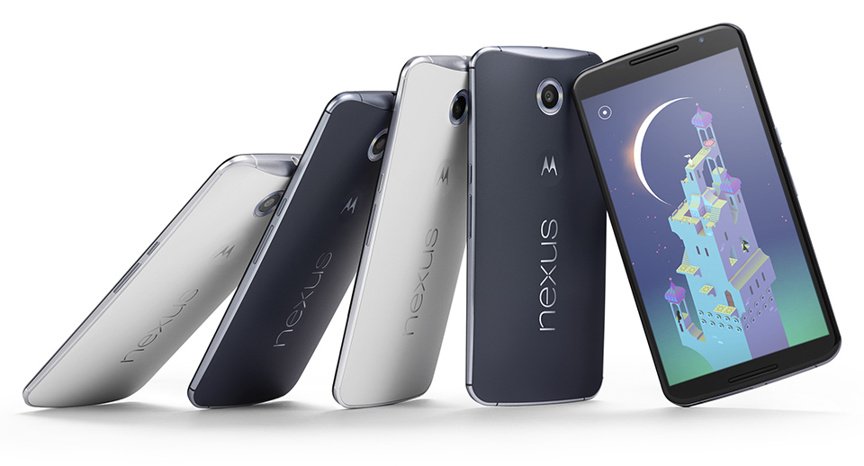
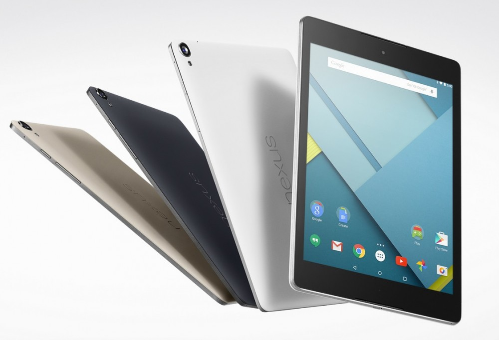
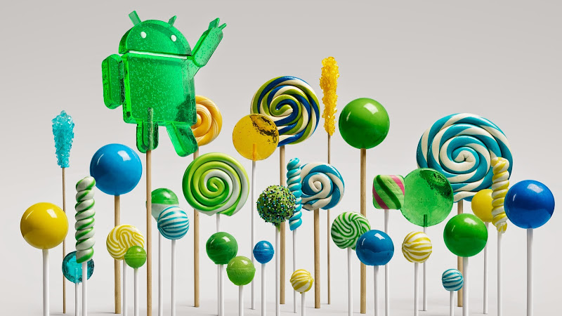
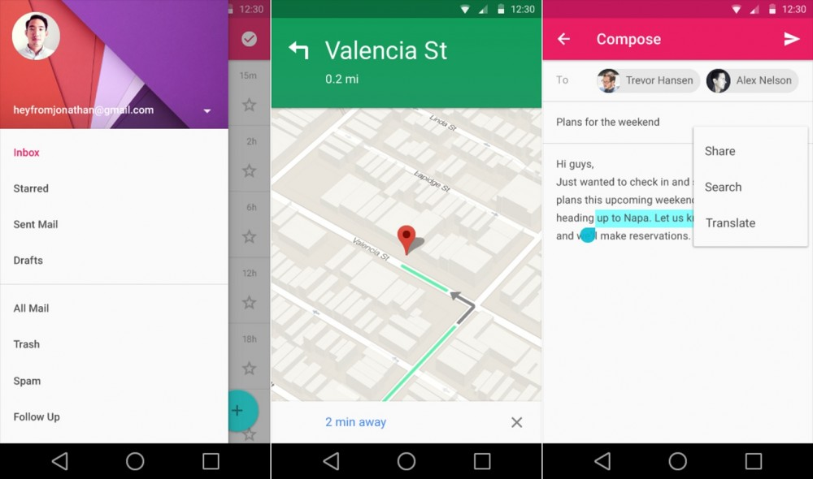
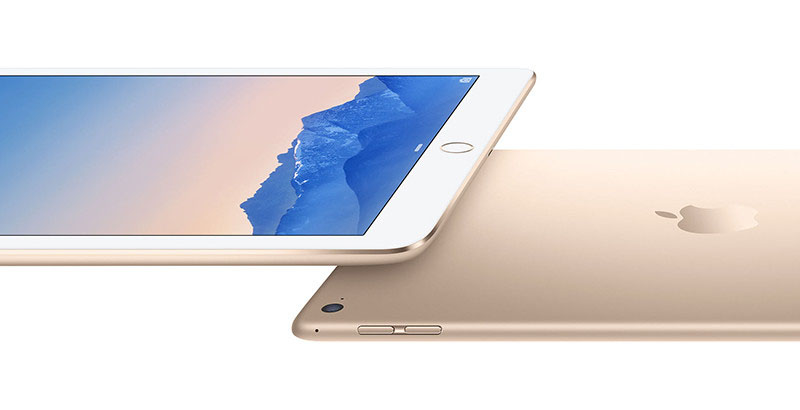
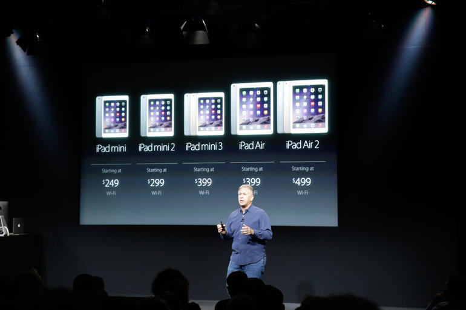

# Apple ir Google naujienos

Paskutinis mano pašnekesių apie IT įrašas buvo dar vasarį, kai išsiplėčiau pakalbėti apie Samsungo tuomet pristatytą [Galaxy S5](http://reanimated.lt/it-talk-2-samsung-galaxy-s5). Per pastarąsias dvi dienas iš IT industrijos milžinų Google ir Apple susilaukėmė išties gan nemažai naujienų ir kaip įprasta, negaliu apie tai nutylėti. Tad apie tai ką ten išvydome svarbiausio.

### Google

Skirtingai nei kompanija Apple, Google kaip ir pernai, savo naujus įrenginius pristatė sąlyginai tyliai ir ramiai: tiesiog paprastu įrašu savo[ tinklaraštyje](http://officialandroid.blogspot.com/2014/10/android-be-together-not-same.html). Entuziastams didelių staigmenų čia nebuvo, dauguma duomenų jau buvo žinoma iš anksto. Keli bendri pastebėjimai apie pristatytus naujuosius Nexus linijos įrenginius:

-Nexus 6, nors tikrai puikus įrenginys [technine prasme](http://www.gsmarena.com/motorola_nexus_6-6604.php), tačiau 6 colių ekranas yra didelis nope. Mano manymu telefonai turi būti maximaliai 5 colių ir nors ir suprantama, kad kuo didesnis ekranas, tuo juo maloniau naudotis pavertus ant šono, bei dviem rankomis, ypač kai kalbama apie internetus, bei žaidimus, tačiau panaudojamumas naudojantis viena ranka tampa apribotas. Atsiranda poreikis užuot tvirtai laikius telefoną, jį imti stumdyti po ranką, norint pasiekti viršutinę ekrano dalį, o dėl tokio stumdymo ir slydinėjimo delne labai išauga rizika jį išmesti, nė nekalbant apie ergonomiškumą ir patogumą. Tuomet ir atsiranda tokie juokeliai, kaip kad buvusi Apple reklama apie tobulą telefono dydį, kuri pasirodo nebegalioja šiemetiniams iPhone’ams.

Iš esmės tokį dydį galima paaiškinti nesunkiai: pirmiausia tai skaičiukų lenktynės. Šiuo metu, kai mobiliųjų telefonų progresas yra gan lėtas, tai vieną modelį nuo kito išskiria tik didesni skaičiukai specifikacijų lape. Tas, kas pasiūlo 2,5Ghz vietoj 2,3 ar 3GB RAM’ų, vietoj 2GB, jau yra ženkliai geresnis. Kai konkurentai leidžia telefonus su aukštesnėmis rezoliucijomis, turėti „tik“ FullHD ekraną jau yra likimo užnagaryje ženklas. O dabartiniai techniniai apribojimai sąlygoja, kad yra sunku pagamini mažesnius, nei 5,5 colio dydžio QHD ekranus, tai ir turime planšetafonus arba kitaip tariant phablet’us. Antroji priežastis, kodėl daugėja tokių telefonų gali būti ir tai kad žmonės po mažu prie jų jau apsiprato. Nemažai kas skaito tokius įrenginius planšeto ir telefono kompromisu. Iš principo pati idėja graži – užuot turėjus du atskirus įrenginius, gali turėti vieną, kurį neproblematiška nešiotis ir visada turėti su savimi, tačiau čia pamirštamas vienas esminis skirtumas: su planšetu aš galiu pilnai naršyti, žiūrėti video visą darbo dieną, nesibaininat, kad ir 10h įjungto ekrano, kai tuo tarpu naudojantis be perstojo telefonu, elektros lizdo reikėtų ieškoti dar vidurdienį.

-Daug kieno planus per daug negalvojant iškarto čiupti Nexus telefoną sutrikdė paskelba kaina: jeigu iki tol buvę Nexus įrenginiai turėjo konkurencingas specifikacijas už tikrai prieinamą kainą, o pure android experience buvo kaip malonus prizas prie viso to, tai tuo tarpu 6-tasis modelis stengiasi pasiūlyti top of the line technologijas, tokias kaip kad 500ppi QHD ekranas, atsparumas vandeniui, 3GB operatyviosios atminties ar Snapdragon 805 2,7Ghz procesorius. Ir už tas technologijas visgi šį kartą tenka susimokėti, kaip reikiant: paskelbta oficiali Nexus 6 kaina – 650$ yra tokia pati, kaip kad ir pas iPhone 6, o mūsuose pastarasis parduodamas nuo 2700Lt, tad panašios kainos galima tikėtis ir ant 6-tojo Nexus’o. Tai beveik du kart brangiau, nei praeitų metų modelis, kuris jei neskaitant vidutinės baterijos yra išties puikus dar ir šiai dienai.

-O štai Nexus 9, naujausias Google planšetas, kuris panaikina iš prekybos iki šiol vis dar pardavinėtus Nexus 7 ir Nexus 10 yra ko gero gražiausias Android planšetas šiai dienai. Tiek ir pats dizainas, tiek ir tableto pristatymas yra jau Apple kalibro marketingas. Piece of beautifull hardware.

-Iš video gali susidaryti vaizdas, kad kamera, yra išlindusi iš korpūso ir kaip kad Nexus 5 ar naujojo iPhone atveju, trukdys stabiliai padėti įtaisą ant lygaus pavirščiaus. Ištikrųjų kamera nėra išlindusi nė kiek daugiau, nei korpūsas vidurinėje dalyje, tiesiog ji yra įtaisyta šoninėje korpūso dalyje, o kraštai yra mažumėle užlinkstantys, tai ir susidaro toks įspūdis. Padėtas ant stalo, įrenginys guli stabiliai ir nesiūbuoja maigomas.

-Geriausia, kad grožis slypi ne tik išorėje: viduje turime ne tik garsiuosius HTC BoomSound garsiakalbius, kurie HTC One telefoną padarė be abejonės garsiausiai ir kokybiškiausiai grojančiu telefonu, tačiau ir NVIDIA Tegra K1 procesorių, kuris savo sparta lenkia ne tik visus naujausius Snapdragon modelius, tačiau pagal spartos testų rezultatus, prilygsta 2012-tųjų metų Macbook Pro kompiuteriui. Žinoma, sintetiniai testai realiai visiškai nepasako apie tai, kaip procesorius elgsis realiomis sąlygomis, tačiau suderinant su nauja labiau optimizuota Android versija, beveik nė neabejoju, kad šis planšetas bus smooth, kaip niekas kitas. Jeigu jau Nexus 7 buvo nebrangaus, tačiau našaus planšeto sinonimas, tai neįsimylėti šios versijos yra tiesiog sunku. Projektuojama šio įrenginio pardavimo kaina Anglijoje – 1400Lt.

**Android Lollipop**

Apie sekančią, jau 5-tąją android versiją Google pastaruoju metu kalbėjo jau gan nemažai. Ir štai trečiadienio vakarą, kartu su naujausiais įrenginiais buvo oficialiai pristatytas ir šis, ko gero vienas iš didžiausių Android atnaujinimų, kur be galybės patobulinimų ir naujų API, smarkiai pakeičiamas ir pats OS veidas. Kaip kad pernai Apple perėjo iš iOS 6 į iOS 7, tokio pobūdžio atsišviežinimą dabar daro ir Google su savo plokščio dizaino gairių turinčiu \(tačiau visgi ne plokščiu\) dizainu [ryškiomis spalvomis, lengvumo, bei vientisumo pojūčiu](https://medium.com/android-design/understanding-material-design-cf2d60a16de3). Google naujosios sistemos vizija yra išties labai labai patraukli ir pagal naująjį dizainą baigiamos atnaujinti visos oficialios kompanijos programėlės, tačiau žiūrėsime kiek vientisumo sugebės išlaikyti programėlių kūrėjai, kurie šiuo atžvilgiu gauna mažesnį spaudimą, nei pas Apple ir tai gali tapti pagrindine rakštimi.

Pagrindinės Lollipop naujovės:

-Pranešimai: jeigu naudojatės programa ir jums staiga kas paskambina ar pradeda skambėti žadintuvas, tai bus parodomas nedidelis iššokantis pranešimas ekrano viršuje su pagrindiniais veiksmais, užuot pertraukinėjus jūsų darbą. Taipogi bus galima pranešimus užtildyti, kad šie jums nustatytą laikotarpį \(pvz kol būsite susirinkime\) netrukdytų išvis. Šita funkcija praplėsta su galimybe tam tikrus pranešimus, pvz skambučius nuo konkretaus kontakto, praleisti pro bloką, kad juos pamatytumėte net tada, kai visų likusių pranešimų matyti nepageidaujate.

-Prietaisų dalinimasis. Kelių prietaiso naudotojų idėja jau plėtojama ir ankstesnėse Android versijose. Pradžioje koncentravimasis buvo labiau į tai, kad planšetiniu kompiuteriu gali naudotis keli žmonės, pvz šeimos nariai, tad jie galėjo turėti savo atskiras paskyras, tarp kurių būtų galima lengvai ir patogiai junginėtis ir kiekvienas iš jų gali turėti savo programėlių rinkinį su savais nustatymais. Iš esmės panašiai, kaip kad skirtingos vartotojų paskyros kompiuteriuose. Dabar šis funkcionalumas plečiamas dar toliau ir tarkime užmiršus savo telefoną namie, galėsite paprašyti savo draugo laikinam prisijungimui kurio metu akimirksniu galėsite pasiekti savo kontaktus, skambučių sąrašą, sms žinutes ar nuotraukas. Taipogi pristatyta nauja ekrano užrakinimo galimybė: galite pažymėti vieną ar kelias programas ir kitas naudojas galės naudotis tik šiomis nurodytomis programomis \(ypač aktualu žmonėms, kurie turi vaikų, kurie mėgsta įlysti ten kur nereikia\).

-Tęstinumas. Tiek Apple, tiek Google, tiek ir Microsoft savo naujose operacinėse sistemose siekia kuo didesnio tęstinumo. Dauguma iš mūsų turime ne po vieną išmanųjį įrenginį ir šios kompanijos nori, kad turinys būtų pasiekiamas nepriklausomai nuo to kuriuo įrenginiu naudojatės. Tad ir su penktąja Android versija, jūsų klausytos dainos, padarytos nuotraukos ar atidaryti interneto puslapiai bus akimirksniu pasiekiami bet kuriame jums priklausančiame įrenginyje. Kitaip tariant galite šokinėti nuo vieno įrenginio prie kito ir jaustis, lyg visą laiką naudotumėtės vienu ir tuo pačiu. Pvz pradėjus klausyti dainos planšetu namie, jūs galėsite ją pratęsti klausyti nuo tos vietos, kur baigėte jau savo mobiliąjame telefone išėjus iš namų.

-Project Volta. Apie tai jau rašiau [atskirame įraše,](android-iniciatyva-pavadinimu-project-volta.md) bet jei trumpai, tai iki 40% baterijos energijos sutaupanti iniciatyva, kurios metu bus tvarkingiau tvarkomasi su foniniais procesais \(pvz, update procesas vykdomas tik tada, kai jūs pasijungiate prie energijos šaltinio\).

-Ryšiai. Sklandesnis perėjimas nuo wifi į mobiliųjį internetą. Tad pradėjus pokalbį per Skype’ą ir išėjus iš namų pokalbis nebenutrūks.

-OK Google. Device’ai su atitinkamu įrangos palaikymu turės galimybę atpažinti balsines komandas net neįjungus ekrano. Iš esmės valdymas be prisilietimo. Bus galima užklausti kiek valandų, net jei telefonas guli toli nuo lovos ;\)

-Spalvos. Yra žmonių, kuriems begalo svarbus spalvų atkūrimas jų mobiliuosiuose ekranuose. Taigi, nuo šiol Lollipop suteiks galimybę, kaip kad PC monitoriuose ar televizoriuose kalibruoti ekrano spalvas!

-Audio. Pagrindinė priežastis, kodėl Apple nešiojamieji kompiuteriai tokie populiarūs tarp muzikos kūrėjų yra ta, kad ši kompanija susitvarkė su garsu gerai nuo pat pradžių, kai kiti į tai nelabai kreipė dėmesio. Ir nors dabar gerą garso įrangą galima rasti ir kituose kompiuteriuose, tačiau Macbook’ai jau užsitarnavę savo vietą. Google susiėmė ties šia sritimi ir Android 5.0 turės mažesnio vėlinimo audio įvestį, USB audio įrenginių palaikymą, bei multi-channel mixing galimybes.

-Pažadinimas iš miego. Įdiegtas funkcionalumas pažadinti telefoną patapšnojus ant ekrano ar tiesiog jį pakėlus.

-Paleistų programų išsaugojimas. Nuo šiol paskutinių paleistų programų langas \(recents\) niekur neprapuls, net jei ir perkrausite telefoną.

-Nustatymų perkėlimas. Vienas iš mažumėlę varginančių aspektų įsigijus naują telefoną yra tai, kad reikia vėl viską nusistatinėti pagal savo poreikius. Su L šį kartą bus papraščiau: jei jūsų senas telefonas turi NFC čipą, bus galima tiesiog suglausti naująjį telefoną su senuoju ir sistemos nustatymai ir paskyros akimirksniu nusikopijuos į naująjį telefoną. Jeigu programėlių kūrėjai bus įgalinę tokią funkciją, tai šio perkėlimo metu persikels ne tik pačios sistemos nustatymai, tačiau net ir individualių programėlių nustatymai, kas yra ko gero labiausiai neat funkcija, kurios iki šiol, su restore funkcija dar neturėjome. Tačiau nesitikėkite per daug, nes bent jau pradžioje tokių programėlių tikrai dar nebus daug.

Kai kurios iš šitų funkcijų, užkietėjusius Android naudotojus gali visai nenustebinti ir jie sakys, kad nieko čia naujo ir daug kas buvo pasiekiama ir seniau. Ir taip, tuo atžvilgiu jie yra teisūs. Ekrano kalibravimą, mažesnį vėlinimą turintį garsą ar net elementarų prožektorių pranešimų juostoje custominiai romai, kai kurie gamintojai su savo skinais na ar Xposed moduliai siūlo jau senai. Svarbu yra visai ne tai, kad kažkas buvo tai sugalvojęs pirmiau. Svarbu tai, kad tos funkcijos įtraukiamos į bazinį android funkcionalumą ir nuo šiol bus prieinamos visiems, be jokių papildomų priemonių. Pagaliau tai taps standartu. Kiekvienas toks atnaujinimas yra ženklus žingsnis pirmyn OS gyvavimo cikle. Kaip, kad Apple su kiekvienu atnaujinimu perima vis daugiau jailbreak fintų, taip ir android’as su tokių funkcijų, kaip Tap2Wake, kuris yra vienas populiariausiu Xposed modulių, intergravimu vis labiau mažina naudotojų poreikį nulaužinėti savo telefonus.

Android Lollipop oficialiai prieinamas taps lapkričio mėnesį, tiesa, ne Nexus įrenginiai, kaip visada, turės palaukti gerokai ilgiau, jeigu jiems išvis pasiseks. O aš, gerus porą mėnesių prasėdėjęs su developer preview versija, jau skubu įsirašinėti naujausios, dar šiandien paleistos bandomosios versijos, kuri yra jau visai nebetoli galutinės, ypač atsižvelgiant, kad Nexus 6 pradedami shipinti jau už dviejų savaičių, o pastarieji jau tikrai turės galutinę Android Lollipop versiją :\)

### Apple

Tiek šiandien apie Google. Dabar pakalbėkime apie Apple renginį. Čia taipogi turiu keletas apibendrinimų:

-Visų pirma pats maloniausias ir visai netikėtas momentas renginyje buvo lietuvaičių broliukų Sauliaus ir Aido Dailidžių pasirodymas ant scenos. Šie vyrukai pristatinėjo naują savo ypač populiarios ir pripažintos foto redagavimo programos Pixelmator versiją iPad planšetiniams kompiuteriams. Net ir buvo paminėta, kad vyrukai yra iš Lietuvos! Galima didžiuotis tokiais jų pasiekimais, bei tuom, kad garsina mūsų šalies vardą.

-Continuity. Ši, mano jau aptarta tęstinumo funkcija, čia dar labiau praplėsta. Be klausomos muzikos, nuotraukų ar redaguojamų dokumentų, kurie automatiškai sinchronizuojasi tarp skirtingų Apple įrenginių, nuo šiol galėsite net ir atsiliepti į skambučius ir kalbėti panaudodami Macbooke esantį mikrofoną, net jei jūsų iPhone yra išvis kitame kambaryje.

-Naujieji iPad’ai. Atrodytų dar ne taip senai rašiau apie [iPad Air pristatymą](http://reanimated.lt/apie-apple-eventa), bei vienas iš jųjų atsidūrė ir pas mane, o štai turime jau ir naujesnius. Žinoma Apple nebūtų Apple, jei šie iPad’ais nebūtų dar plonesni, dar greitesni, šį kartą jau ir su TouchID sensoriumi, saulės atspindžiams atspariu ekrano padengimu. Jei pirmasis Air’as ir taip jau buvo vienas iš rinkos spartos lyderių, tai dabar jame įdiegtas dar 40% spartesnis procesorius, bei 2,5x spartesnė GPU, kurie mano galva duotam momentui yra overkill, bet kitą vertus Pixelmator pademonstruotas 4K rezoliucijos foto redagavimas ant planšeto atrodo kietai. Ir visa tai yra už tą pačią kainą, kaip kad praėjusiais metais pristatytas modelis.

-Iš esmės iš iPad pristatymo be inkrementinių, Apple jau būdingų patobulinimų, visas pagrindinis dėmesys krypo į geresnę foto kamerą. Atkeliavo kartu su iPhone 6 pristatyti timelapse, bei slow-mo režimai. Oh really? Kas gi fotkina su savo iPad’ais… Vienintelė kamera, kuri ištikrųjų yra aktuali iPad’e yra priekinė, skirta vaizdo skambučiams. Žinoma ji irgi mažumėle patobulinta, tačiau iš esmės manau niekas nesupyktų, jei puiki galinė kamera būtų tiesiog perkelta į priekį. Bent jau aš tikrai nesupykčiau ;\)

-Kaip ten bebūtų, jei dar tik planuojate įsigyti planšetinį kompiuterį, tai šis naujasi iPad’as yra ko gero pats geriausias planšetas šiai dienai. Ne pigus, žinoma, tačiau nepriekaištingas. Tačiau, jei situacija tokia, kaip kad pas mane ir jau turite praėjusių metų iPad Air, manau, kad upgrade’as jums visiškai nereikalingas, nes ir dabartinis planšetas buvo absoliučiai greitutėlis ir puikus ir naujojo iPad’o plonumas ar kamera, mano manymu pirkimo visiškai nepateisina.

-Su iPad mini 3 žinios kur kas liūdnesnės. Iš esmės šis planšetas atnaujintas tik su TouchID. Visos naujovės tame ir pasibaigia. Pirmiausia, tai praėjusiais metais Apple sudarė vaizdą, kad mini bus bekompromisis mažesnysis iPad’o brolis, žmonėms, kuriems galbūt reikia geresnio portatyvumo, kuriems 10 colių galbūt yra per daug, bei kuriems reikia prieinamesnės kainos. Tuo tarpu dabar, tai viena karta užnugaryje likęs įrenginys, praradęs savo vienavertiškumą. O įdomiausia tai, kad šio minio ir pirmos kartos Air’o kaina dabar yra vienoda. Jei ankščiau buvo galima svarstyti ar pirkti didesnį ar pigesnį, tai dabar jokios dilemos nebelieka išvis.

-Dar įdomesnis yra sprendimas vienu metu rinkoje palikti net tris minius. Reiškiasi šiuo metu galima nusipirkti iPad mini už 250$, iPad mini 2 už 300$ ir iPad mini 3 už 400$. Kitaip tariant, dviejų visiškai vienodų įrenginių, kurie skiriasi tik piršto skaitytuvu, kaina skiriasi 100$. Klausimas kam reikėjo palikti pirmos kartos iPad Mini rinkoje, kai jo specifikacijos prilygsta viso labo iPad 2. Yra teorija, kad Apple šių prietaisų nemažai parduoda ugdymo institucijoms. Ir kai perkami šimtai ar net tūkstančiai vienetų, tai tas 50$ skirtumas sudaro didelius pinigus. Galbūt tai ir tiesa, bet visvien manau, kad jei jau ir minio šiais metais nenaujino, tai bent jau praeitų metų modelis galėjo tapti pigiausiu iPad’u už 250$, na o šis naujesnis modelis su TouchID būtų pardavinėjamas už 300$, išlaikant 100$ skirtumą nuo praeitų metų iPad Air, kuris dabar atpigintas. Žinoma į visą šitą situaciją galima pažiūrėti ir iš kitos pusės: Apple už dyką pridėjo TouchID \(kaina gi neišauga ir yra tokia pati, kaip iPad Mini 2 praeitais metais\), na o jei jums nereikia TouchID, tai galite nuo šiol sutaupyti 100$.

-Manau, kad Apple gerokai apstojo su iPad’ų tobulinimu. Po retina ekranų pristatymo, kurie ištikrųjų sujaukė iki tol buvusią rinką, daugiau ryškių patobulinimų iPad’ai gavę ir nebuvo. Treti metai jie tiesiog kiek plonesni ir greitesni, bet iš esmės visiškai tokie patys įrenginiai. Taipogi jeigu svoris dalinai ir turi įtakos – nes visgi prietaisas nemažai laikomas rankose, tai plonumas tokio tipo įrenginyje yra klaustukas. Galbūt aš mieliau rinkčiausi 4 milimetrais storesnį iPad’ą, kuris būtų 1cm storio, tačiau žadėtų 15h bateriją.

-Na ir pabaigai: neabejotinai didžiausia renginio naujiena tapo naujasis, net 5K rezoliucijos Retina iMac modelis. Šio įrenginio įspūdinga ne tik visus nustebinusi ekrano raiška \(5120 x 2880\), kuri yra 67% didesnė, nei dabar vis daugiau apkalbamo 4K, tačiau ir kaina – 2500$. Iš pirmos pažiūros tokia kaina gali pasirodyti itin didelė, tačiau tai ne eiliniam namų vartotojui skirtas, o profesionalams, dirbantiems su dizainu, grafika ar video skirtas kompiuteris. Šiuo metu, jei nežiūrėti į visai kraštutines išimtis, vidutinė kokybiško 4K ekrano kaina iš tokių gamintojų, kaip Sharp ar Asus yra apie 2000-3000$. Atsižvelgiant dar ir į tai, kad 5K raiškos monitorių rinkoje išvis net nėra ir tik kompanija Dell vos praėjusį mėnesį anonsavo iki metų pabaigos į prekybą paleidžianti savo 5K raiškos monitorių už tuos pačius 2500$, ši Apple kaina pasidaro net labai puiki. iMac’ai beja, jei kas nežino, nėra tiesiog monitoriai, jų viduje sumontuotas ir pats kompiuteris, tad jūs ne taip, kaip Dell variantu, komplekte taipogi gaunate: Radeon R9 M290X, susitvarkysiančią su visais tais milijonais taškų, 8GB operatavysios atminties, 1TB Fusion Drive \(128 GB NAND flash + 1 TB HDD\), bei i5 3.5GHz procesorių. Jei procesoriaus pasirodytų mažoka, už našesnį žinoma reikės suploti papildomai. Tačiau, kai visa tai ateina viename pakete už itin konkurencingą kainą, tokiems gamintojams, kaip Dell reikės smarkiai pakoreguoti savo kainas.

Nesu kurios nors stovyklos palaikytojas. Tiek Android, tiek Apple įrenginiai turi savų privalumų ir trūkumų. Pykstu ant Apple dėl iPad mini, nors iš esmės ir praeitų metų modelis, kuris dabar dar ir pigesnis ir kainuos iki 1000Lt yra visai patrauklus variantas, jei ieškote nedidelio planšeto. Pykstu ant Google, dėl Nexus 6 dydžio, viskas ko reikėjo, tai tiesiog atnaujintas Nexus 5. Tačiau labiausiai pykstu ant abiejų kompanijų, kad bazinius planšečių dydžius vis dar daro 16GB. Come on, niekam tiek nebeužtenka, o už papildomus GB kompanijoms tenka primokėti po 100$. Didesnė minimali talpa ko gero yra labiausiai vartotojų geidžiama funkcija po baterijos darbo laiko. Tačiau, kaip ten bebūtų, ištiesų tai gyvename laikais, kai net vidutinės klasės išmanieji įrenginiai \(vidutine klase aš laikau telefonus nuo 800Lt\) jau yra awesome ir pasižymi tikrai sklandžiu ir sparčiu veikimu, tad visi nusiskundimai iš esmės gaunasi labiau first world problems. Turiu, naudoju ir džiaugiuosi įrenginiais iš abiejų stovyklų ir pas manęs, kaip technologijų entuziastą, kuris tiesiog myli kokybiškus įrenginius, karo ir priešpriešos nei vienai pusei nėra. Ir nesuprantu tų žmonių, kurie smarkiai ginčyjasi, bando vienas kitam kažką įrodyti ir „atvesti“ į protą. Kiekvienas naudojamės tais įrenginiais, kuriais norime ir kurie labiausiai atitinka mūsų pačių poreikius. Gyvenkime draugiškai ir tiesiog žavėkimės technologijomis, kurios daro [išties nuostabius dalykus](http://goo.gl/olfHPI).

