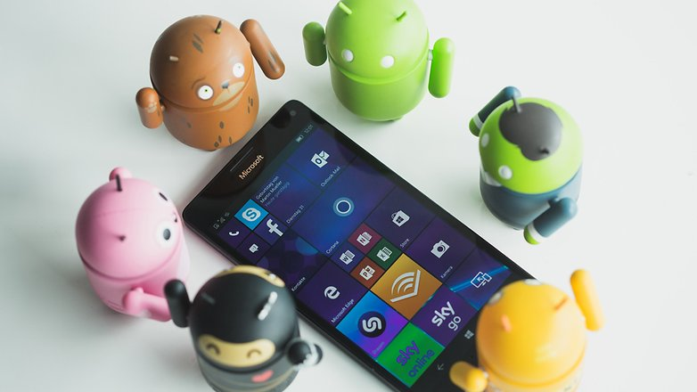
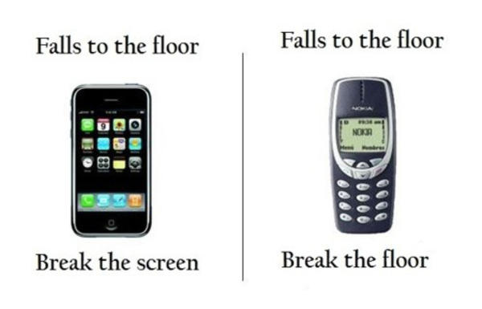
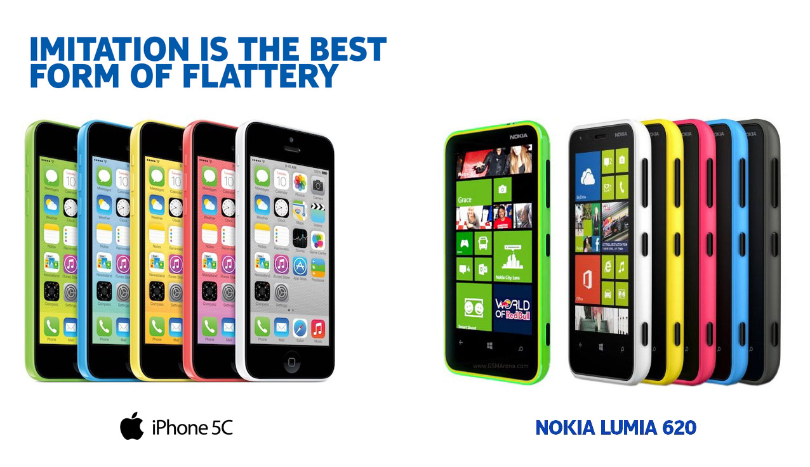
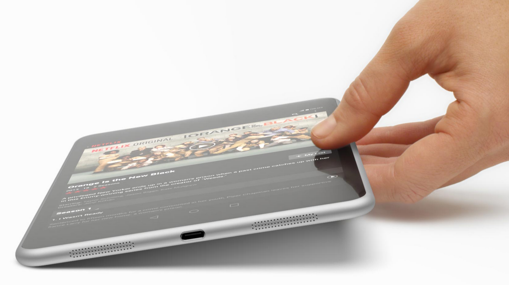
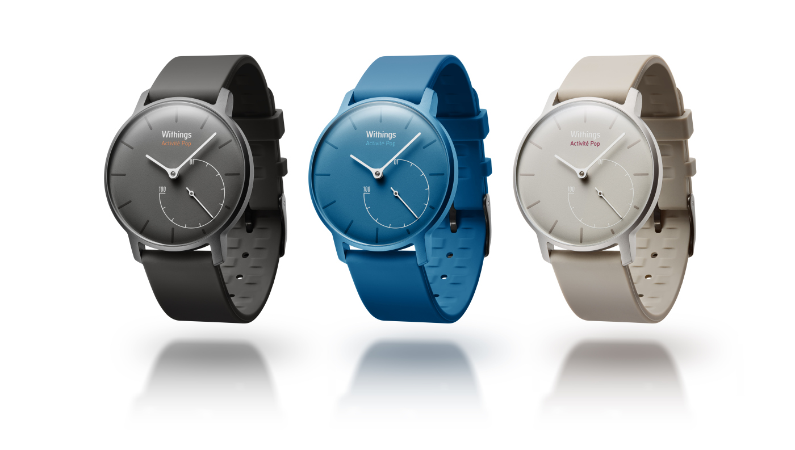

# Ar „Nokia“ sugrįžimas galimas tik su „Android“?

Vos tik pradedi dalintis savo prisiminimais apie pirmuosius turėtus telefonus, kurie pas daugumą buvo būtent „Nokia“ – visų veiduose atsiranda lengva šypsena bei nostalgijos jausmas. Kiekvienas iš mūsų turi prikaupęs savo žavių „„Nokia“ istorijų“. Deja, vėlesni pasakojimai, prasidėję su išmaniųjų telefonų bumu, prarado savo pozityvią gaidelę. Po eilės tragiškų verslui metų, teko parduoti visas savo gamyklas ir „Lumia“ prekės ženklą „Microsoft“ korporacijai. Tačiau ne viskas taip jau blogai: ne taip senai paskelbta apie planus sugrįžti į mobiliųjų telefonų rinką, o internete pradėjo plisti gandai apie tai, jog ši kompanija planuoja pagaminti išmanųjį su „Android“ operacine sistema. Daugelis ėmė tikėti, jog pirmieji tokie „NokiaDroid“ aparatai gali turėti labai didelį visuomenės susidomėjimą ir net galbūt bent kiek atgaivinti kadaise absoliučia lydere buvusią, sparnus nudegusią, tačiau persiorientuoti bebandančią kompaniją.

Kodėl gi taip yra, jog šitiek metų visus mus nuvildavusi kompanija vis dar išlaiko mūsų susidomėjimą ir viltį?

O kai pagalvoji – kaip gi galėtų būti kitaip? Ar prisimenate kokie telefonai buvo iki įvykstant išmaniajai revoliucijai? Baterijos galėdavo atlaikyti ištisas savaites, o jei telefonas ir išsikraudavo – paimdavai visiškai kito „Nokia“ telefono bateriją, įdėdavai ją į korpusą ir naudodavaisi toliau, lyg niekur nieko. Problemų tai nesukeldavo, nes šio prekinio ženklo telefonai buvo kone pas visus. Nė nepradėkim kalbėti apie dizainą. Žinoma, ne visi kompanijos telefonų dizainai buvo išties pateisinami, kai kurie atrodė taip, jog juos galbūt kūrė dizaineris, per daug susikoncentravęs į stilių ir visai pamiršęs ergonomiką, tačiau telefonų dizainų įvairovė buvo tokia plati, jog kiekvienas galėjo surasti kas jam prie širdies. Šiomis dienomis, iš esmės, Visi mobilieji telefonai – tai didelis stačiakampis ekranas su keliais milimetrais rėmelio aplinkui. Žinoma, truputį skiriasi nugarėlės lenktumas, spalva ar medžiagos, bet žiūrint iš priekio, daugumą telefonų būtų sunkoka atskirti vieną nuo kito. Žinoma, nepamirškime ir mitais tapusių istorijų apie šio gamintojo telefonų tvirtumą. Puikiai žinome juokelius, jog nukritus „Nokia 3310“ ant plytelės, duždavo ne telefonas, bet plytelė.

Ir kai pažvelgi į technologijų kompaniją, kuri anksčiau pasižymėdavo tokiais visapusiškai puikiais telefonais, norisi nubraukti visas buvusias nesėkmes ir tikėti, kad šios kompanijos genialumas vėl atsiskleis. „Nokia“ brandas, nors ir sušlubavęs, tačiau vis dar yra neįtikėtinai stiprus ir tuo dar galima būtų pasinaudoti.

Pradėjus gaminti „Lumia“ prekės ženklo gaminius, „Nokia“ pademonstravo, jog apie kokybiškų telefonų gamybą dar tikrai išmano. Originalus, konkurentų neprimenantis ir lengvai atpažįstamas dizainas, į telefonų pasaulį pagaliau įnešęs daug ryškių, žaismingų spalvų. Eksperimentavimas su naujomis surinkimo medžiagomis, davęs mums tvirtą, įbrėžimų ne itin bijantį polikarbonato korpusą, suteikiantį telefonui tvirtumo, vientisumo. Na, ir niekada nenuvilianti „Carl Zeiss“ optika, kuri ypatingai suspindėjo su „Lumia 1020“, kuri padarė tokį didelį šuolį mobiliųjų telefonų fotoaparatuose , jog kiti gamintojai nuotraukų kokybe šį telefoną vijosi vos ne porą metų. Nors rinkos šiuo prekės ženklu pažymėti telefonai neužkariavo, tačiau reikia pripažinti, jog įtakos padarė tiek, kad net „Apple“, išleido akivaizdžiai „Lumia“ telefonų įkvėptą „iPhone 5C“.

O svarbiausia – šios serijos pagrindinis dėmesys buvo nukreiptas į labiau prieinamos kainos segmentą, kuriame šie telefonai išties spindėjo. Tuomet, kai pradėti gaminti pirmieji „Lumia“ telefonai, biudžetinis segmentas buvo pripildytas krūvomis „Samsung“, „Motorola“, „LG“, „HTC“ ir kitų gamintojų telefonais, kurie itin gera kokybe nepasižymėjo. Todėl „Lumia 520“ – pigus, išties kokybiškai surinktas, ilgaamžiškas telefonas, su visai padoriomis specifikacijomis ir turintis sparčią, nekimbančią vartotojo sąsają, skirtingai, negu kiti tuometiniai šio segmento telefonai. Šis telefonas tapo tikra žvaigžde ir buvo ne tik geriausiai parduodamas 2013-tųjų „Windows Phone“ telefonas, bet ir vienas geriausiai parduodamų telefonų šioje kainų kategorijoje. Tai privertė pasitempti kitus gamintojus ir kelti savo gaminių kokybę. Biudžetinis, tai dar nereiškia, jog sunkiai naudojamas, nepatikimas ir prastas.

Taigi, atrodytų, visos figūros buvo sustatytos tinkamose pozicijose ir po persigrupavimo turėjome išvysti kompanijos sugrįžimą. Tačiau tai neįvyko. Viską nulėmė viena, tačiau itin reikšminga klaida: operacinės sistemos pasirinkimas. „Windows Phone“, kuri pasirodžiusi daug ką viliojo savo išskirtine vartotojo sąsaja ir žadėjo mums itin didelį potencialą, visus itin nuvylė taip ir nesugebėjusi išsukti savo ekosistemos, taip, kaip tai padarė konkurentai. Technologiškai pati sistema buvo išties galinga ir gerai optimizuota, „Microsoft“ programuotojų nėra kuo kaltinti, tačiau koją pakišo labai didelis pavėlavimas į rinką. Įsibėgėjus programėlių kultūrai niekas nenorėjo pirkti išmaniųjų telefonų, kuriuose neturėsi tų pačių funkcijų, kurias turi kiti. Nėra nieko labiau nuviliančio, kai visi draugai ar pažįstami bendrauja, dalinasi potyriais, žaidžia, bei dalinasi nuotraukomis aplikacijose, prie kurių tu paprasčiausiai neturi priėjimo. O programėlių gamintojai nepanoro eikvoti savo laiko, pinigų ir kitų resursų, kuriant platformai, kuri paprasčiausiai neturi užtektinai vartotojų. Daug kas iš kūrėjų kalbėjo apie sistemos pranašumus, bet užsimindavo apie tai, jog nerizikuos ir palauks kol ši ekosistema subręs ir susilauks daugiau vartotojų ir tik tada perkels savo programėles „Windows Phone“ sistemai. Taip ir prasidėjo uždaras ratas, iš kurio ši operacinė sistema taip ir nesugebėjo išlipti, kad ir kokios pastangos buvo dedamos. Traukinys jau buvo nuvažiavęs ir vienintelė klaida – pavėlavimas į jį, visiškai nužudė bet kokius „Nokia“ šansus, nepaisant to, kad techniškai šie telefonai buvo puikūs. Tad „Nokia“ tapo pasmerkta grimzti į užmarštį.

Tad iš to nesunku padaryti išvadą, jog viskas, ko „Nokia“ telefonams tereikia – tai išspręsti programinės įrangos bėdas. Ir visas jas kuo puikiausiai išsprendžia „Android“. Suomių kompanijai nebereikėtų kurti naujos ekosistemos – viskas jau savo vietose: milijonai programų ir žaidimų programėlių parduotuvėje, dominuojanti operacinė sistema, turinti didžiausią kiekį vartotojų ir kurią vartotojai pažįsta. O ir šios sistemos našumas, lyginant su praeitimi, išties nepalyginamas. O „Nokia“ net jau ir yra turėjusi patirties su „Android“ prieš porą metų išleisdama „Nokia N1“ planšetę. Tačiau šis produktas pasirodė tuo metu, kai susidomėjimas planšetiniais kompiuteriais jau pradėjo slopti, o dėl oficialiai neskelbiamų priežasčių šis produktas buvo pardavinėjamas labai ribotame rinkų kiekyje. Tai buvo pagrindinės priežastys, kodėl šis 7.9 colio dydžio ekraną turintis „NokiaDroid’as“, nors ir susilaukęs daugybės kalbų, tačiau sėkmės taip ir nepatyrė. Nepaisant to, tai buvo išties puikus kūrinys – geros specifikacijos, pateisinama kaina, bei puikus dizainas. Rinkoje jį būtų buvę galima statyti greta „Google Nexus 7“, tačiau pastarasis visgi turėjo vieną didelį pranašumą, kuriuo gali girtis visi „Nexus“ gaminiai – operacinės sistemos atnaujinimų užtikrinimą. „N1“, nors ir puikus visais kitais atžvilgiais, tačiau, kaip ir buvo galima tikėtis, atnaujinimais lepinamas nebuvo ir viskas baigėsi ties „Android 5.0 Lollipop“.

Naujoji, atsigauti bandanti „Nokia“ nebus tokia pati – suomiai patys negamins telefonų, juos tik licencijuos kompanijoms „HMD global“, bei kinų „FIH Mobile“, kuri yra „Foxconn“ filialas \(šios dvi kompanijos ir nusipirko „Nokia“ likučius iš rankas nuleidusių „Microsoft“ už 350 milijonų dolerių\), tačiau dėl kiniškos kokybės nereikėtų per daug jaudintis, nes „Foxconn“ yra būtent ta įmonė, kuri pagal „Apple“ užsakymą štampuoja visus „iPhone“ modelius bei būtent šis kinų gamintojas bendradarbiaudamas su „Nokia“ ir pagamino minėtąjį N1“ planšetinį kompiuterį.

Taipogi „Nokia“ jau spėjo nusipirkti ir fitneso bendrovę „Withings“, vieną gražiausių dizainų turinčių išmaniųjų laikrodžių gamintoją ir tai gali signalizuoti apie tai, kad kompanijos bandymas sugrįžti gali būti ir kiek kitoks, nei tikimasi. Galbūt „Nokia“ naujasis tikslas nebėra būti tik vardu ant jūsų išmaniojo telefono korpuso. Telefonų verslas gali likti tik foniniu, o fokusas gali persikreipti į vis dar itin didelį potencialą turintį nešiojamųjų įrenginių \(angl. „wearable tech“\) segmentą, daugiausiai orientuotą į sveikatą, sportą bei greičiau ir patogiau pasiekiamą informaciją. Nemažai technologijų ekspertų kalba apie tai, kad visos mobiliosios technologijos juda ta linkme, tad „Nokia“ gali nuo šiol pasižymėti nebe pačiais telefonais, o išmaniaisiais prietaisais, kurie jungiasi prie jūsų telefono.

Žinau, galbūt per daug pozityviai krykštauju apie šitaip nusiritusią žemyn kompaniją. „Nokia“ tikriausiai jau niekada nebebus rinkos lyderė. Galima sakyti, kad šias mobiliųjų technologijų varžybas laimėjo „Samsung“, „Apple“ ar sparčiausiai iš visų kylanti „Xiaomi“. Tačiau aš tikiu, kad ši rinka yra bent šiek tiek nuobodesnė, neturėdama suomiško dizaino įtakos. Pamenu, koks susidomėjimas kildavo, kai pasklisdavo pirmosios naujienos apie išleidžiamą „N95“, „N900“ ar kokį kitą modelį, nes žinodavau, kad jis bus kažkuo išskirtinis, kažkuo įdomus ir netikėtas. Tad „Withings“ stiliaus dizainas, „Nokia“ brandas bei netikėtas kūrybiškumas, na, ir galiausiai „Android“ operacinė sistema yra tai, kas dar gali išgelbėti kompaniją.

Tikiu, kad „Nokia“ dar nėra praradusi savo magijos, kurią kadaise turėjo ir mes jos dar išvysime. Juk visiems mums patinka istorijos su laiminga pabaiga.

Šį mano straipsnis publikuotas IT portale: [kompiuteriai.lt](https://www.kompiuteriai.lt/ar-nokia-sugrizimas-galimas-tik-su-android-operacine-sistema/)

