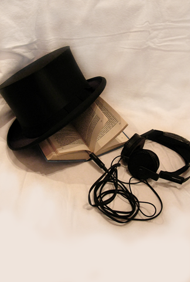

# Audio knygos

Apie audio knygas žinau ir pats kalbu jau ne pirmi metai, tačiau pats išbandyti jų privalumus susiruošiau tik visai neseniai. Pačiam pirmajam bandymui pasiėmiau [kolegų jau reklamuotą](http://blog.lrytas.lt/fotoblog/audio-knygos/#comments) Alex Exler knygą „Programuotojo žmonos užrašai“. Knyga yra rusų kalba, tačiau kadangi problemų su šia kalba visiškai neturiu, tai susiklausė visai smagiai.

Išviso pažiūrėjus į audio knygų kiekius lietuvių ir rusų kalba, tai net nėra ką lygintis. Rusų trackeriuose galima rasti tiesiog tonų tonas knygų, kurių visom perklausyti ko gero net gyvenimo neužtektų. Užsimanai konkrečios knygos, nubėgi, pasižiūri: O! Yra! Tuo tarpu mūsų Aklųjų asociacija yra išleidusi ne tiek jau ir daug laisvai pasiekiamų knygų, tad tikriausiai konkrečios knygos jūs nerasite, o reikės tiesiog rinktis iš to kokia yra pasiūla.

Beklausydamas šių nuotaikingų merginos pamastymų, susitikinėjant su užkietėjusiu programuotoju, išskyriau keletą tokio knygų griaužimo privalumų ir trūkumų:

### Audio knygos privalumai

**Judėjimo laisvė** – skaitydamas paprastą knygą būni apribotas: arba skaitai, arba veiki. Tuo tarpu klausyti audio knygos gali einant į paskaitas, važiuojant viešuoju transportu, bėgiojant, ar skutant bulves. Taip dažnai tenka viešajame transporte pamatyt skaitančius žmones. Skaitymas tokiomis sąlygomis gana prastai atsiliepia regai, o ir užsiskaitęs savo stotelę pravažiuoti gali. Vat sėdies su ausinuku kišenėj, klausai tos pačios knygos ir gali laisviausiai žiūrėti pro langą.

**Išraiškingumas, intonacijos** – dažniausiai skaitant knygas, sausai perskaitai tekstą, tegauni informaciją, tačiau jokio išraiškingumo. Kad ir skaitant garsiai, gali susimaišyti, praleisti kablelius, nesustoti reikiamose vietose, arba paprasčiausiai nesuprasti ir naudoti netinkamą intonaciją. Tokių bėdų klausant audio knygos nėra. Žinoma lietuviškos knygos perskaitytos gana monotoniškai ir tiesą sakant migdančiai, tačiau pasižiūrėjus į rusiškus ar angliškus profesionalius įgarsinimus, tai tas pats skaitytojas sugeba ne tik, kad puikiausiai atskleisti menkiausią emociją balsu, bet ir visiškai skirtingais balsais įgarsinti skirtingus veikėjus, ką jau bekalbėti apie įvairius audio efektus. Juk taip faina klausytis scenos parke, kai tuo pat metu girdi paukščių čiulbėjimą, ar vėjo ošimą. Tai yra milžiniškas, fantaziją daug labiau suaktyvinantis pranašumas.

**Kalbų mokinimasis** – tarkim norite įgilinti savo anglų, rusų ar dar kokios kalbos žinias, vat tam labai gerai pasitarnauja audio knygos. Klausotės svetimą kalba įgarsintos knygos ir jūsų ausis po truputis įgunda, jūs imate vis geriau suprasti šią kalbą. Žinoma tai galima padaryti ir su popieriniu variantu, bet pripažinkit išgirsti svetimo žodžio tarimą yra kur kas geriau, nei pamatyti jo rašybą ir nežinoti kaip jis taisyklingai skaitomas.

**Akių tausojimas** – daug skaitantys žmonės dažnai būna su akinukais. Kodėl? Nes paprasčiausiai po tam tikro laiko akys būna nualinamos, o juk skaitai tokioje įdomioje vietoje! Na niekaip nepriverti savęs atitraukti akis ir duoti joms pailsėti. Klausant audio knygų, vienintelis pavojus, kad tarkim paskaus ausis dėl nepatogių ausinių, tačiau daug knygų ar muzikos klausantis žmogus, kaip ir savaime turėtų pasirūpinti geromis, patogiomis ausinėmis.

**Mažesnė aplinkos triukšmų įtaka** – kai kambaryje yra kitų triukšmų, pvz groja muzika, šnekasi žmonės, stovi įjungtas televizorius, paprastas skaitymas tampa gana neefektyvus, nes pasidaro velniškai sunku susikaupti. Kai klausai audio knygos, ši problema gali išlikti, bet pasidaro daug švelnesnė. Pvz mano ausinės gana gerai izolioja aplinkos garsus, tad šiek tiek padidinęs garsą absoliučiai nieko nebegirdžiu, išskyrus skaitomą knygą. Tada jokia pašalinė muzika tau nebetrukdo mėgautis knyga.

### Trūkumai

**Būtinas dėmesio skyrimas** – nors turi neribotą judėjimo laisvę, tačiau audio knygai reikia skirti dėmesį. Tikrai niekaip neišeis atrašinėti laiškus internete ir tuo pačiu klausytis knygos. Panašiai ir kitose sferose. Kad gerai suprasti, nepamesti dėmesio, turi paprasčiausiai patogiai įsitaisyti, dar geriau – užsimerkti ir va tada viskas kuo puikiausiai susiklauso. Pats labiausiai mėgstu klausytis prieš užmiegant. Paklausai kokį pusvalanduką ir kai jauti, kad jau imi nebegirdėt, sustabdai ir miegi.

**Privalomas tinkamas grotuvas** – taip, audio knygas galima klausytis ant bet kokio mp3 grotuvo, tačiau nevisi jie tam pritaikyti. Jei grotuvas neturi audio knygos funkcijos, tai sustoję klausytis knygos ir užsimanę paklausyti muzikos, kitą kartą turėsite pasileisti knygą iš naujo ir atsisukti į tą vietą, kurioje baigėte. Kai grotuvas tam pritaikytas, tai tiesiog išjungiate knygos klausymą, įsijungiate muziką, na o vėliau galite tęsti nuo tos pačios vietos, kurioje baigėte savo knygą.   
Taip pat grotuvas turėtų pasižymėti talpia baterija, nes vidutinė audio knyga trunka 8 valandas. Nemanau, kad bus labai smagu, kai vidurį jūsų klausymo seanso grotuvas paprasčiausiai išsikraus.

**Visiškas priklausymas nuo skaitytojo** – kai skaitai knygas kartais taip būna, kad tam tikras vietas nori perskaityti lėtai ir dėmesingai, galbūt net ne vieną kartą, o būna ir vietos, kurios mažai domina ir tiesiog prašoki akimis. Klausant audio knygos visada išlieka vienodas tempas, jokių pagreitėjimų, jokių sulėtėjimų.  
O ką daryti, jei knygos įgarsintojo balsas jums išvis nepatinka? Juk dėl šlykštaus balso jūsų nuomonė apie knygą gali būti visai iškreipta.

Kaip matot – privalumų sugebėjau įžvelgti daugiau. Tai nereiškia, kad Tadas nuo šiol meta standartinį skaitymą ir knygas vien tik klausys. Na jau ne… Manau knygos tokios, kokios jos yra, neišnyks dar gan ilgokai. Visgi jokia audio knyga nesuteiks tokio pačio skaitymo malonumo, tačiau tai puiki alternatyva turiningai praleisti laiką savo smulkių, daug mastymo nereikalaujančių užsiėmimų metu. Važiuoji sau dviračiu ir klausai kokio keliautojo nuotykius Afrikoj. Žavinga :\)

