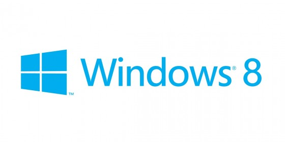

# Diskusija apie Windows 8

Su kolega, blogeriu Ernestu turėjom diskusiją apie Windows 8. Aptarinėjome prieštaringą šios operacinės sistemos vardą, nes kaip bebūtų sąsajos pasikeitimus vieni vertina teigiamai, o kiti nėra nusiteikę taip pozityviai ir pranašaujama blogosios sesės Vista likimas. Aptarėm šios sistemos privalumus, galimybes, bei žinoma trūkumus, o kadangi šiems komentarams parašyti vis vien prireikė nemažai laiko, o ir pateikiam gan nemažai informacijos, bei nuorodų į kitus šaltinius – tai nenoriu, kad visą tai pasimestų ar kur prapultų. Archyvuoju pas savęs ir tikiuosi, kad galbūt ir jums bus įdomu pasiskaityti ir galbūt pakoreguoti arba dar labiau patvirtinti susidarytą nuomonę apie naująją Microsoft’o sistemą.  
Kalba gan neformali, visgi taigi buvo komentarai po straipsniu, tačiau palieku viską kaip yra. Vardan autentiškumo :j

Ištrauka iš Karolio straipsnio:

**Bendrai apie Windows 8**

Windows 8 įdomu buvo tai, kad kompiuteris iš tiesų greitai užsikraudavo iki prisijungimo lango, tačiau prisijungus sistema kraudavosi velniškai lėtai, net jei Skype nebuvo „startup“ sąraše. Apskritai, tai jokių didelių naudingų vartotojui pokyčių šioje OS nepastebėjau. Man, kitaip nei daugeliui vartotojų, atrodo, kad „Start“ mygtuko pašalinimas iš darbastalio yra gera mintis.

Tačiau su tuo, kad Metro aplinka prasta – sutinku visiškai. Programėlės pasileidžia lėtokai; jų dideli mygtukai ant nešiojamojo kompiuterio be lietimui jautraus ekrano yra beprasmiai; trūksta elementarių klaviatūros mygtukų paspaudimų kombinacijų \(pvz., Esc programėlėse nedaro nieko\); programėles įdiegiant per „Store“ gaunate tik Metro versijas; kompiuterio išjungimas pasiekiamas per Win+C, Settings, Power, Shut down – ypač daug žingsnių. Kitaip sakant – Microsoft padarė tikrai didelę klaidą neleisdami išjungti šios aplinkos. Pagaliau, šiek tiek padirbus kompiuteriu, visa sistema be Microsoft Office 2010 užėmė beveik 30 GB. Metro naudinga tik planšetėms.

Instaliuojant Windows 8, kaip ir Windows 7 supratau taip pat dar vieną dalyką – Microsoft nemoka kurti operacinių sistemų. Per 17 metų nuo Windows 95 jie nesugebėjo sukurti nė vienos Windows operacinės sistemos, kuri instaliuotųsi neignoruodama realaus pasaulio. Štai Windows 7 ir Windows 8 UEFI instaliacijos sukuria ne 1, o 2 papildomas particijas. Suinstaliavus Windows 7 per UEFI, ji iš pirmo karto neužsikrovė, tad reikėjo pasileisti UEFI shell’ą iš ArchLinux disko ir per ten užkrauti Windows Boot Loader. Na, o štai instaliuojant Windows 8 per UEFI… Kompiuteris net negalėjo užkrauti Windows 8 su UEFI iš disko. Teko instaliuoti per jau veikiančią Windows 7. Kitas dalykas – Microsoft mano, kad jų sistemos „bootloader’iui“ reikia 500 MB particijos. Linux neišnaudoju net 100 MB. Ar gera OS turėtų naudoti 500 MB sistemos branduolio ir bootloader’io užsikrovimo procesui? Aš, žinoma, apie Microsoft technologijas daug neišmanau, tad remiuosi tik bendra nuojauta.

Galų gale, grįžtant į mažiau filosofines kalbas – Windows 8 atpažino mažiau įrenginių nei Windows 7. OS užima žymiai daugiau nei Windows 7, jos naudojama aplinka yra žymiai paprastesnė, bet jie sugebėjo kažkaip mistiniu būdu sumažinti įrenginių palaikymą? Toliau kalbant apie disko vietą – Windows 8 tik išsiplėtė ir kaip komercinė OS galėtų imti ir įdiegti į visas instaliacijas viską, ko reikia vartotojui \(Skype, Office, kodekai\), bet to nepadaro. Kodėl jie nusprendė panaikinti DVD palaikymą?

Tiesa, naujojoje OS patiko Internet Explorer 10. Ši naršyklė iš tiesų pagaliau tapo kažko verta konkurente Firefox, Google Chrome ir Opera. Atliekant smulkius bandymus, ji krovė puslapius bene visados sparčiau nei pastarosios. Atvaizdavimo problemų taip pat nepastebėjau. Naršyklėje netgi jau buvo instaliuotas Flash. Jei būčiau Windows vartotojas – duočiau šansą šiai naršyklei dar kartą. Bet kadangi nesu…

Kitas argumentas prieš naująjį Microsoft produktą – vietoje to, kad įtrauktų į Windows 8 pasirinkimą tarp Metro ir įprastos Aero aplinkos, jie nieko nepadarė ir taip susimažino savo pardavimus. Arba vietoje pasirinkimo tarp Metro ir Aero buvo galima padaryti funkciją programas paleisdinėti darbastalyje per Metro meniu. Toks paprastas žingsnis būtų išgelbėjęs juos nuo didelio vartotojų nepasitenkinimo. O dabar bet kuriai naujesnei programai, kuri turi savo Metro UI, pats Metro meniu tampa beprasmis, nes per jį paleidžiant programas jos pasileidžia Metro UI, jei tik gali.

**Reziume**

Windows 8 – Microsoft kompanijos fiasko. Tai nereiškia, kad kompanija bankrutuos, nes jos istorijoje pilna tokių pat blogų nenusisekusių produktų \(pvz., Windows Neptune, Windows NT 4.0, Windows Vista\). Greičiausiai priežastis tam paprasta – velniškai bloga kompanijos politika, kuri aptariama kaip nepavydėtina net praėjusiame dešimtmetyje išleistuose vadybos vadovėliuose. Štai [žurnale „Valstybė“ rašoma](http://mokslas.delfi.lt/technologijos/microsoft-istorija-nuopuolis.d?id=60121287) daug įvairių priežasčių kodėl Microsoft praranda gerus darbuotojus ir klientus. Tačiau esminė šio įrašo mintis – net ir nemokamai gaunant Windows 8 produkto kodus, neapsimoka keisti Windows 7 į Windows 8. Nebent turite planšetinį kompiuterį. Turėsite tik nereikalingo vargo prisitaikant prie nepatogios darbo aplinkos bei nežymiai sulėtėjusią sistemą. Nenoriu agituoti, bet turbūt daugiau naudos būtų išbandyti Ubuntu ar kitą Linux distribuciją. Bet apie tai – kitą kartą…

Komentarai:

By [**reanimated**](http://www.reanimated.lt/) on [Gru 3, 2012](http://versme.net/blog/eilinis-microsoft-fiasko-windows-8/comment-page-1/#comment-18283)

Taip, modern’as man nepatinka ir realiai į jį nosį beveik ir nekišu \(čia vat praignorinu tą vietą, kur daugelis skundžiasi, nes iš esmės – jei nenori, modern’o tiesiog nenaudoji ir tiek. Nebūtina jo išjunginėt. Jis yra ten kažkur ir tegul būna. Nemaišo gi. Čia kaip pamenu WinXp laikais man Windows Media Playeris būdavo taip pat\) ir pamatau tą sąsaja nebent tik įjungiant kompą, bet kadangi kompas stovi savaitėm be perkrovos, tai vieną kartą spustelti modern’e mygtuką desktop didelės problemos nematau. Kai kas tą sąsaja net ir pamėgsta. Man asmeniškai Rainmeter’is, kaip desktop enhancement labiau patinka.  
Pagrindinės priežastys kodėl visgi naudoju Win8, tai žymus OS greičio būstas naudojant su SSD. Win7 su SSD sukasi tikrai ne taip sparčiai, 8-tukai SSD išnaudoja gerokai efektyviau. Kiek žinau tokia pat situacija yra ir su RAID, bei 64bitų platformom kur procesai beveik dvigubai mažiau apkrauna kompiuterio atmintį. Dar draugui rekomendavau rašyt į laptopą, nes akumuliatorius ilgiau dirba ir išties – draugas įsirašęs išpešė extra 1h akumuliatoriaus darbo. Įdomu būtų padaryti eksperimentą ir pažiūrėti kaži kiek to baterijos būsto būtų ant win7 tiesiog išjungus Aero.  
Ir nevisai galiu sutikti su įrenginių atpažinimu. Win 7 atveju man po švarios instaliacijos pirmiausia reikėdavo instaliuoti tinklo plokštės driverius, bo be jų interneto nebuvo, o tik po to, win update pagalba suplaukė visi likusieji ir kažkodėl nvidia driverius dar atskirai reikėdavo įrašinėt. Win8 po instaliacijos nedariau nieko išvis, viskas kaip sakoma out of box. Pirmą kartą man asmeniškai windows’ai patys savarankiškai sugebėjo taip sklandžiai susitvarkyt. Tas net nustebino. Na bet čia reikia paminėti, kad man gal dėlto kad hardware’as pas manęs visas šviežias, šių metų ir gamintojai dar Customer Preview metu jau buvo driverius parašę. Tikiu, kad su senesniu hardware viskas ne taip sklandžiai gali būti.  
Win8 iš esmės ne tiek spartinimu buvo užsiimta, kiek perdaroma, pergalvojama ateičiai, pritaikoma portable device’ams, kaip kad ultrabook’ai ar tablet’ai. Ir tai yra esminė Win8 pasikeitimų esmė. Ir net jei neturim jokio intereso tablet’am, bo norim naudot tiesiog dabar ant pc, privalumai vis vien lenda, nes win tampa stabilesni, mažiau reiklūs energijai, bei naudoja mažiau atminties. O ir atsirado krūva naujų feature’sų. Pvz vat pergalvoti įsijungimo/išsijungimo scenarijai, darbas su procesais, file history kūrimas, atminties apsauga, atsirado native vhd, iso, usb 3.0 support’as, Direct Composition \(GDI technologijos apėjimas/praplėtimas\), Direct Manipulation \(pritaikymas multi touch technologijom\), įrašymo į flash’ą galimybė \(WindowsToGo\), video subsystem patobulinimai, kaip kad geresnis darbas su multi monitoriais, software rendering, stereoscopic 3D palaikymas na and so on nes pakeitimų sąrašas tuom nesibaigia.  
Taip, gal ten apdorojimo, programų pasileidimo laikai ir nepasikeitė, tačiau iš MS pusės duoklė inovacijoms padaryta. Nėra win8 bloga operacinė, kaip kad čia gali pasirodyti iš šitų testų, nes iš esmės tai lyg praplėsta, patobulinta win7 versija. Windows 7.1

By [**Ernestas Lukoševičius**](http://versme.net/) on [Gru 3, 2012](http://versme.net/blog/eilinis-microsoft-fiasko-windows-8/comment-page-1/#comment-18304)

reanimated, modern turi omenyje Metro aplinką? Jei taip, tai atkrenta pusė Windows UI, kas HDD užima ganėtinai daug. Neatrodo labai efektyvu ir naudinga. Surface dabar keikiamas už tai, kad reklamuojama 64 GB talpa iš tiesų yra beveik dvigubai mažesnė.  
Labiausiai klausimą kelčiau ar turėtų didžiausias pakeitimas OS būti target’intas į dar mažą rinką? Kodėl jie iš karto bandė sujungti visas platformas į vieną aplinką?  
Štai suinstaliavus Windows 8 tau reikės visur atsisakinėti Metro programėlių, nes atidarant, pvz., paveiksliukus, juos siūlys atidaryti su Metro programėlėm.  
Dėl akumuliatoriaus – galbūt tie išnaudojimai kokiai nors specifinei procesorių serijai, kaip kad Intel Atom? Nes būtent baterijos testą \(filmo žiūrėjimas\) atlikinėjau kartu su pateiktais testų, bet nepamatęs daugiau 10 min. skirtumo nė vienoje iš šių OS, nusprendžiau jo visai neįtraukti.  
Taip – tinklo plokštės ir WiFi adapterio tvarkyklių man instaliuoti taip pat nereikėjo. Tačiau vaizdo kameros, Bluetooth, „touchpad’o“ ir dar kelių kitų nerado net per Windows Update. „Multitouch“ taip ir nepavyko priversti veikti. Tuo tarpu naudojant Windows 7 viskas turėjo Microsoft duotas tvarkykles iš karto, išskyrus tinklo plokštę ir WiFi adapterį. O įranga ne tokia jau ir sena – vos 1.5 metų. Esminis dalykas tas, kad net 2 metų nesulaukusios įrangos natyvų palaikymą jie jau nutraukė. „Gražu“.  
Taip – Windows 8 esminiai pakeitimai buvo „ateičiai“ – įrenginiams, kurie dabar rinkoje užima labai mažą dalį. Kitaip sakant, Microsoft nesitaikė į jau esančius vartotojus. Manau, kad tai labai ryžtingas žingsnis, turint omenyje stiprius atgarsius po Windows Vista ir vis didėjančius vartotojų srautus link Apple ir Linux pusių. Per pastaruosius metus mano lankomame universitete Apple produktai kaip grybai po lietaus… O Microsoft daro tokias nesąmones.  
Kad stabilesni nepasakyčiau – tiek Windows 7, tiek Windows 8 man asmeniškai veikė stabiliai, bet nusiskundimų dėl Windows 8 stabilumo iš pažįstamų girdėjau daugiau nei iš Windows 7 per tokį patį laikotarpį nuo paleidimo. Dėl atminties – taip pat, dar šiandien pažįstamas skundėsi, kad Windows 8 naudoja daugiau atminties. Žinoma, tai lašas jūroje. Galbūt tiesa, bet nesakyčiau, kad reikšmingai. Reikėtų daugiau testavimo ir palyginimo.  
O kaip buvo pergalvotas darbo su procesais scenarijus?  
Natyvus VHD palaikymas jau buvo Windows 7. USB 3.0 palaikė ir Windows 7, o ar palaiko vos suinstaliavus sistemą tai klausimas grįžta vėlgi prie to ar tavo įrangos tvarkyklės jau būna Windows 8. „Multitouch“ technologijų palaikymo padidinimas yra lašas jūroje – juk Windows 7 turėjo geresnį Speech Recognition ir Microsoft manė, kad tai yra ateities kompiuterio valdymas? O kiek žmonių jį naudoja šiandien?  
Be to, juk žmonės bėga prie Apple ir Linux produktų ne todėl, kad jų kompiuteriuose trūksta apps’ų, interaktyvumo ar kad jie kasdien sėdėdami prie savo kompiuterio negali dirbti su multitouch ekranu? Čia grynai aklas šovimas į rinką, spėjant, kad jai to reikia, nes kažkas rinkoje jau „making profits“, vietoj to, kad išspręstų esančias problemas ir išlaikytų esančius vartotojus.  
Aišku, manau, dar vieną problemą Metro UI sprendžia – Windows Phone programėlių trūkumą. Dabar programuotojų susidomėjimas jų kūrimu ir apskritai žmonių susidomėjimas šia mobilia OS turėtų būti bent šiek tiek didesnis.  
Kas dėl geresnio darbo su keliais monitoriais – anksčiau buvo pilnai išsprendžiama Windows 7 su viena maža programėle. Dabar dar neteko bandyti Windows 8 su keliais ekranais, bet esu tikras, kad Microsoft nenustebins savo patobulinimais DPI scaling’e. Ar jį bent kiek patvarkė, ar ir toliau skirtingo dydžio vaizdus teks žiūrėti, arba kęsti iškraipytas detales? Dėl 3D – tas tai tikrai privalumas.  
O šiaip – taip, Windows 8 nėra bloga OS \(tuo labiau, kad net patys testai rodo tik pagreitėjimą\), kaip ir sakiau įrašo pabaigoje – tiesiog, jei iki šiol naudojote Windows 7, tai turbūt neturėsite daug noro pereiti prie Windows 8, nes per prievartą kišama MetroUI tikriausiai nebus maloni naudoti be lietimui jautraus ekrano. Skonio reikalas, todėl ir sakau „turbūt“, „tikriausiai“.

By [**reanimated**](http://www.reanimated.lt/) on [Gru 4, 2012](http://versme.net/blog/eilinis-microsoft-fiasko-windows-8/comment-page-1/#comment-18306)

Ernestai, metro pavadinimo gi nebeliko, modern’as tas UI vadinasi nuo šiol. Ten pasirodo kažkokie vokiečiai trademark’ą užsiregistravę buvo, dėlto MS teko pasivadint kitaip, nors man pavadinimas metro patiko labiau.  
Dėl vietos skandaliukas tai man kiek juokingas. Gi naivu tikėtis būtų buvę, kad windows’ai užims irgi vos kelis GB kaip koks iOS. Tai dėlto už lygiai tą pačią kainą, kaip apple atidavinėja dvigubai talpesnį modelį iš kurio lieka tie patys 16Gb. Tiesiog jie aišku galėjo ir reklamuoti, kad 16GB total free space, o ne kaip dabar. Bet čia jau žinoma marketinginiai triukai. Lygiai, kaip kad perki 1Tb diską, o gauni 931Gb. Aišku, kad jei norėtų galėtų padaryti, lygiai, tačiau ir kaina būtų didesnė. Tiesa tas pats Apple irgi reklamuoja, kad 16Gb, nors iš esmės gauni kiek virš 12Gb. Jau filmas geresnės kokybės gali ir nebetilpt. Tiesa, taip, tikėjausi, kad WinRT versija užims gerokai lyginant su konkurentais, gal tik negalvojau, kad šitiek. Tikrai manau reikėjo net ne, kad apkarpyti labiau, o galbūt išvis parašyti naują OS skirtą ARM procam. Dabar RT versija share’inasi nemažai tų pačių bibliotekų, kaip kad normali Win versija, tačiau klausimas kiek jos tame tablet’e išties reikalingos. Bet visgi MS dirba gabūs programuotojai, ne durniai kokie, reiškia priežastis po tuom kažkur visgi slypi. Galbūt tai susiję su techniniais klausimais, galbūt dėl ateities planų.  
Targetinamas taip kol kas dar į mažą, bet gan sparčiai didėjančią rinką. Viena Windows versija įprastai būna skirta 3 metams \(vista atveju dėl perdarinėjimo gavosi ilgiau, 5-eri berods\). Leisk priminti, kad prieš 3 metus tabletų rinkos dar net nebuvo, o pažiūrėk, kas dedasi dabar. Jau ne vienas mano pažįstamas turi arba planuoja įsigyti artimiausiu metu, kai prieš metus aš buvau vienintelis savo pažįstamų rate, kuris turi. Manau ateityje, kai brandiniai tablet’ai turės versijas, kurių kainos prilygs dabartiniams pigiems kinietiškiems tabletams, tokį daiktą turės jau ne kas kelioliktas, o kas kelintas žmogus. Kai kurie gal net po kelis. Vienas namie, vienas mašinoj ir pan. Kad kompiuterija pereina į portable ir mobile, tai čia faktas. Ir išvis manau, kad jau stovim praktiškai ant krašto, kai mobile ir PC jau netruks susilies į vieną. Turėsim telefonus, kuriuos pajungę į dock’ą pajungtą prie monitoriaus – gausim pilnavertį PC. Tokį variantą jau buvo galima dar šiemet iš Canonical matyt, kur darė ubuntu ir android’ą vienam telefone. Aišku stacionarai dar užsibus tiems, kam reikia išties daug našumo, pvz video apdorojimui, žaidimams ir pan. Bet visumoj, eiliniam vartotojui jau net dabar, konkrečiai šiuo metu siūlomi telefono modeliai, kaip kad Galaxy Note 2 su keturių branduolių procesoriumi ar 2Gb operatyvios, kurių pilnai užtenka visom everyday funkcijom, kaip multibrowsinimas, pilnavertis text editing, fullhd peržiūra, usb device’ų support’as, printing ir kita: [http://youtu.be/9nh2NSLgaII](http://youtu.be/9nh2NSLgaII) \(išties įdomus video, siūlau pažiūrėti visą\). Manau, kad jei perėjimą į portable platformas Win pradėtų tik nuo sekančios win versijos, tai vėl visi šūkautų kad MS vėluoja į traukinį. Reikia žengti kartu su technologijomis, o ne paskui jas. Atsirado normalus touch’o palaikymas, toks koks turi būt – atsirado ir įrenginiai. Touch palaikantys įrenginiai jau visgi tikrai senai yra, bet lūžis įvyko tik pastaruoju metu, būtent dėlto. Žmonės jau dabar asmeniniam naudojimui vis dažniau renkasi laptopus, o ne PC, nes reikia pripažinti – tikrai patogiau, praktiškiau, o tarp jų daugėja laptopų hibridų su besivartaliojančiais, ar išvis nuimamais lietimui jautriais ekranais. Pastebėk, kad ultrabook’ai ir hibridai, o ne šiaip laptopai tapo dabartiniu trend’u. Jei prieš kokius keletą metų tokia koncepcija niekaip negalėjo prilipti ir buvo vos keli tokie laptopas/tablet’as viename, kurie kainavo išties daug, tai šiemet ultrabook’ų, bei tokių hibridų jau ima tapti dauguma ir savo modelius pristatinėja visi populiarieji gamintojai. Pirmais buvo per anksti. Dabar boomas jau prasidėjo. Jeigu prieš du metus pasirodžiusi pirmoji ultrabook’ų karta kainuodavo po 6-8 tūkstančius lt, tai dabar galima pirkti modelius pradedant nuo 2,5 tūkst lt, kai tuo tarpu tie modernieji hibridai – nuo 3 tūkst lt. Kokios kainos bus dar po metų, dviejų? Laptopai, kaip kad formos faktorius, jau per nelyg ilgai užsibuvo stagnacijoj, bet atėjo ir jų eilė atsišviežinti. Štai jau kitais metais pateikiamos tokios prognozės: [http://www.elektronika.lt/naujienos/verslas/37429/2013-metais-10-15-proc-nesiojamuju-kompiuteriu-tures-jutiklinius-ekranus/](http://www.elektronika.lt/naujienos/verslas/37429/2013-metais-10-15-proc-nesiojamuju-kompiuteriu-tures-jutiklinius-ekranus/) \( nuo dabartinių 6% iki 15-20% jau ateinančiais metais.  
Reikės atsisakinėti modern’o programėlių? Jei turi daugiau nei vieną programą, kuri daro tą patį veiksmą – tau pirmą kartą paleidžiat pasiūlomas pasirinkimas su kuria programa tu nori atidaryti ir pasirinkimas išsaugomas. Kita kartą rinktis nebereikia. Be ja, lyg tie patys Win7 ar XP neturėjo defaultinių programų video, muzikai, paveikslėliams? Tai tiesiog parūpina bazinį funkcionalumą out of box. Populiarios linux distribucijos daro tą patį ir dar plačiau. Nepatinka defaultinė nuotraukų peržiūros programa – instaliavai mėgiamą programą ir ją padarei pagrindine to tipo failams ir viskas. Ir su modern, tai nepasikeitė.  
Galbūt driverių paiešką darei dar prieš oficialų win pasirodymą? Bo dauguma gamintojų savo driverius paleido kartu su oficialiu win startu. Nors man nemaža dalis jų veikė, atsisiuntus ir win7 skirtą versiją. Tiesa ne visi. Teko dabar per tas 4 savaites, kai jau official release tvarkyti hp, asus, toshiba ir acer nešiojamuosius ir nesusidūriau su driverių problemomis, išskyrus kaip ir tavo minėtas touchpad. Bet tai jo nerado tik per update, suinstaliavus rankiniu būdu – viskas ok. Ant customer preview dar problemėlių su driveriais teko apturėt ir man, bet tada nesiėmiau kritikuot, nes visgi gi ne galutinis produktas ir buvo.  
Negaliu sakyti už tikrą pinigą, bet kažkur dar vasarą skaičiau, kad Windows 8 kodo optimizavimo dėka, sistemos užimama disko vieta buvo sumažinta, bet kadangi didelės problemos šiais laikais su vieta nėra, buvo nuspresta tą extra vietą išnaudoti pridedant gan didelį standartinių driverių paketą, kad vartotojai rečiau susidurtų su nesuderinamumo problemomis. Nežinau, galbūt ir antis, netikrinau.  
Dėl Win stabilumo, tai taip, man irgi win7 veikė tikrai stabiliai, tačiau tiek customer preview versijos metu, tiek ir pora savaitėlių jau po išleidimo su win7 visgi teko susidurti su blue screen’u. Draugo laptopas dar dabar iš hybernate pareinant į bluescreen’ą meta ir nepadėjo niekas. Išbandžius ant jo kompo WindowsToGo Win8 versiją – problemos nebuvo. Ant win8 to atnaujinto mėlynojo lango dar iki šiolei \(tfu, tfu \) matyti net nuo developer preview versijos dar neteko. Sunaudojama atmintis \(galiu paliudyti, nes buvo smalsu pačiam ir prieš OS persirašymą užsifiksavau duomenis\) ko ne lygiai dvigubai sumažėjo \(suinstaliavau lygiai tą patį programų paketą, kaip kad ir ant win7\).  
Šiaip tai tikrai nemanau, kad 8-ti bus sėkmingesni už 7-tus pagal pardavimus ar market share’ą, tačiau lygiuoti su višta taipogi nederėtų, nes produktas tikrai visa galva geresnis. OS sparti, stabili, optimizuota, kompiuteriai, kurie veikia su Win7, su 8-tais tikrai nepradės lėčiau veikti, gamintojai pasirūpino driveriais. Tokios problemos buvo esminės vistoje ir nei viena iš jų nepasikartojo su šia versija. Aštuntų pardavimai kalba panašiai: 4 savaitės, parduota 40milijonų. Ta pati win7 per du mėnesius buvo parduota 60 milijonų kopijų tiražu. Tad kol kas win8 sekasi net ir geriau. O MS dar kaltina savo partnerius atsilikimu, nes dar tik 58% visų naujų kompų dabar shipinama su nauja OS, kas trukdo OS skvarbai į rinką. 7-tukai tokiu metu buvo šipinami jau 89% kompų. Vėliau pardavimai aišku sumažės, nusistovės ir ko gero win7 lygio nebeaplenks, tačiau 128mil ribą, kurią pasiekė vista per pirmus metus – nė nėra abejonės, kad aplenks. Net jei pardavimai, būtų, tokie lėti, kaip kad vista, kur buvo parduodama apytikriai po 10 mil/mėn, tai jau aplenkiama su extra 30 milijonų tiražu. Nė nekalbant, kad pardavimai žinoma bus geresni, nei vista. Ir visgi mes vadinam vista fail’u, bet net ir ji iki sustabdymo buvo viso parduota 384mil kopijų. Palyginimui: per visus 2007-tus metus pasaulyje parduota 271mil PC’iukų. Vadinam fail’u nors tai vis vien uždirbo MS milijardus. Tada ir aš noriu tokio fail’o, kuris reikštų, kad ten vietoj kokių 6 milijardų gausi 4 :D Fail’o savoka šiuo atveju naudojama kiek kitaip. MS yra monopolija ir jos produktai varžosi ne su konkurentais, o patys su savimi tarpusavyje. Tai reiškia tu sumoki pinigus arba už vieną jų produktą arba už kitą. Esmė nepasikeičia – pinigai atitenka jiem, o ne konkurentam. Tad net ir su fail produktu kompanija uždirba daugiau, nei bet kas kitas.  
Nekišam čia linux’ų ar MacOS’ų. Taip šių alternatyvių OS market’as po truputėlis auga jau eilė metų ir tai normalu tokiose dominavimo sąlygose, nes absoliutus 100% dominavimas yra labai retas reiškinys ir galimas tik labai mažose rinkose. O, bet, tačiau… Linux… Jau kiek metų jie veržėsi bent jau iki simbolinio 1 procento ribos… Ok, dabar turi net 1,64%. Bent jau tokioje situacijoje, kokie dabar yra linux – grėsmės MS jie absoliučiai nesudaro. Linux’ai turi kardinaliai pasikeisti, kol to neįvyks jie niekada nebus masėms patraukliu produktu. Mac’ai kiek stipresni ir tai nestebina dėl Apple situacijos, gi brangiausia pasaulio kompanija, tačiau tai brandiniai, aukštesnės klasės produktai, kurie taipogi dominuojančios pardavimų masės neįgaus. Čia tarsi nauji Porshe ar Mercedesai. Tie kas gali – perka dėl įvairių priežasčių, bet liaudis važinėjasi su Passat’ais ir Audinėm \(svarbiausia, kad atlieka savo pareigą sako liaudis\). Visą Mac’ų platformą šiuo metu sudaro 58 milijonai įrenginių. Tai žiūrėk, net mėnesio senumo Win8 jau visą tą Mac’ų masę beveik pasiekė. Windowsai sukasi dešimteriopai didesniais maštabais. Dar tikrai ne dabar ir ne greit apie kitų OS grėsmes kalbėt.  
Native usb 3.0 ar nfc palaikymas tai ir reiškia, kad veiks be jokių 3-party driverių ant bet kurio kompo. Ir win7 native tokių funkcijų tikrai neturėjo. VHD jo – sorry, my bad, turėjau galvoje hyper-v klientą, kuris būdavo tik Windows Server versijose.  
Į techninius dalykėlius nebesileisiu, norint galima pasikapstyti po internetus \(vienas labiau man patikusių, gan nuodugnus ir giliai pasikapstantis straipsnis, rašytas profesionalo buvo čia:[http://arstechnica.com/information-technology/2012/10/better-on-the-inside-under-the-hood-of-windows-8/](http://arstechnica.com/information-technology/2012/10/better-on-the-inside-under-the-hood-of-windows-8/)\).  
Tiesiog nesuprantu, kodėl nauja papildoma sąsaja pridėta prie win7 branduolio, iškarto jum sugadina OS, kad pradedat ant jos stumt. OS branduolys nuo to nesusigadina, o kaip tik buvo nemažai praplėstas įvairiomis naujomis funkcijomis. Taip, galbūt ta nauja sąsaja nėra maloni visiem, bet mėgstu užduoti paprastą klausimą: kiek savo naudojimosi kompiuteriu laiko praleidžiate atsidarę ir spoksodami į start meniu? Visas reikalingiausias programas susidedam ant desktop’o ar prisipininam prie taskbar’o ir start’ą naudodavom arba a\)greitai failų/programų paieškai, b\)nuėjimui į kokį mycomputer, control panel ar dar kur nors ir c\) kompiuterio išjungimui. Visos šios funkcijos lygiai taip pat veikia ir su nauja sąsaja. Jeigu tarkime buvo papratimas kokį vlc paleisti, paspaudus win mygtuką, suvedus vlc ir spaudžiant enter, tai lygiai tokia pačia komandų seka jis pasileis ir ant win8. Tad senojo start’o funkcionalumas niekur neprapuolė. Tiesiog buvo praplėstas extra galimybėm, kaip kad kalendorius, el.paštas, rss naujienos ir pan, kas tikrai nemanau, kad yra į blogą.  
Užbaigiant: Win7 patinka, tačiau Win8, kurie yra tie patys Win7 + daug įvairių papildomų naujų smulkmenėlių, kurios į akis nelenda, tai jau blogis. Pagalvokit ar ne perdaug sprendžiat apie OS iš vieno vienintelio jos aspekto?

Šaltinis: [http://versme.net/blog/eilinis-microsoft-fiasko-windows-8](http://versme.net/blog/eilinis-microsoft-fiasko-windows-8)

