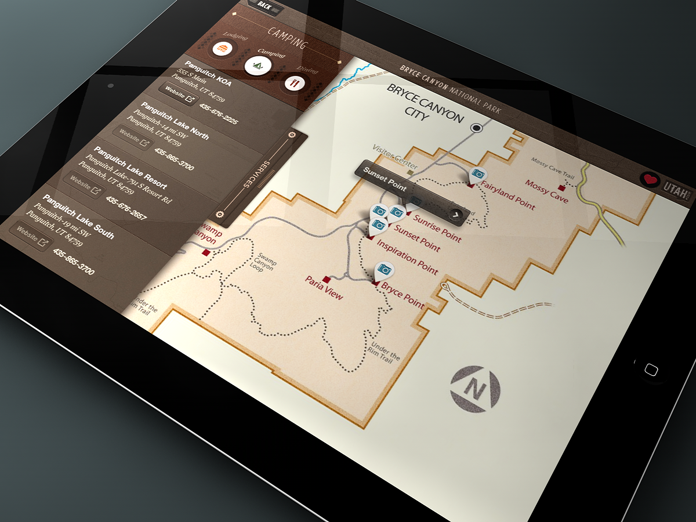
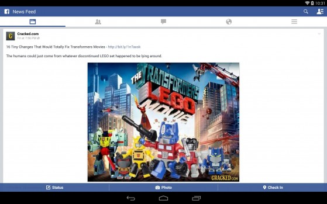
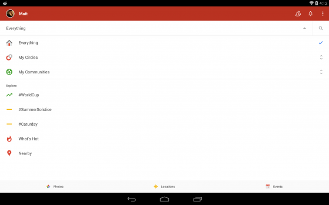

# iOS User Experience

Niekam nepaslaptis, kad kai kurie technologijų entuziastai yra Apple hateriai. Iš esmės nesuprantu hate’inimo priežasties. Manau, kad dažnu atveju, tai yra hate’inimas iš principo, nes jei nepatinka ten koks tarkim Motorola ragelis, tai jo tiesiog neperki ir tiek, o ne pradedi atkakliai ant jo stumti ir įrodinėti savo tiesas internete ir realiame gyvenime.  
Taip, Apple produktai turi išties didelį antkainį, taip, jie irgi turi savų bug’ų ir problemų, tačiau kartu su didele kaina ir gan didelius apribojimus turinčia user friendly, tačiau tuo pat metu dumb OS, visgi ateina išties premium produktas. Niekas nesiginčyja, kad iPhone’ai, Macbook’ai ar iPad’ai nėra surinkti kruopščiai ar iš nekokybiškų dalių \(visokių greit nusidėvinčių plastmasių ar pan\). Lygiai kaip ir niekas nesiginčijo dėlto, koks atotrūkis nuo kitų tabletų buvo padarytas tuomet, kai į rinką buvo paleistas pats pirmas retina ekraną turintis planšetas. Tai, kad vieną kartą pasinaudojus tokiu ekranu, nelabai besinori grįžti prie įprastinio yra ne marketinis gimmick’as, o daugumos pripažįstamas faktas.

Tačiau dabar neketinu kelti diskusijų, kuriose būtų kalbama, kad už tuos pinigus galima nusipirkti vieną ar kitą konkurentą, turintį spartesnį procesorių, mažesnį svorį ar dar kitus pranašumus. Taip, tikrai pripažįstu, kad galima rasti optimalesnių kainos ir kokybės santykių variantų, tačiau tuo pat metu manau, kad jei sau išgalima be jokių sunkumų nusipirkti iškart kokybišką daiktą, tai kam tada sukti galvą?

Šį kartą noriu atsakyti į neretai užduodamą klausimą, kodėl savo Galaxy Tab’ą iškeičiau į iPad Air.

Jei atsakyti tiesiai, aiškiai ir visai trumpai: dėl overall user experience.

Kiek realiai jums svarbios specifikacijos? Jausitės kietesnis, kad jūsų planšetas bus 300 ar tai 500 Mhz spartesnis? Planšetas, kaip ir bet koks kitas kompiuteris, turėtų turėti tiek galios, kad nestriginėdamas susidorotų su visomis kasdieninėmis užduotimis, bei kartas nuo karto jam užmaitinamais žaidimais. Kas iš to, kad viduje bus dvigubai daugiau galios, nei jūs išvis kada išnaudojate? Čia tas pats, kas žmonės, kurie į savo kompiuterį susikiša 8-12Gb RAM’ų ir viso labo sėdi facebook’e. „Pravers ateityje“ kažkas sako. Na taip, resursų poreikis vis auga, tačiau pakol sulauksite laiko, kai būtų galia išnaudoti jūsų potencialiai laukiančią galią, tai jūsų device’as jau bus morališkai ir technologiškai pasenęs. Rinkoje jau bus įrenginiai, su naujomis technologijomis, kurios efektyviau panaudodamos mažesnį kiekį resursų sugeba išpešti geresnį rezultatą, nei visi jūsų tie 2x’ai.

Taigi, nors ir yra galingesnių aparatų, tačiau iPad Air galingumu tikrai nėra ko skųstis, nes šis aparatas puikiai, nelagindamas susitvarko su bet kuo, ką jam paduosite. Android, kuriam iki ketvirtos versijos pasirodymo reikėjo slėptis po lapais dėl savo pristabdymų, pakibimų ir nulūžimų, šiuo metu savo daržą irgi apsitvarkė ir OS’as androidiniuose tabletuose veikia ne ką praščiau, nei iPad’as. O ir žiūrint į pačias OS, savo funkcijomis vis labiau panašėja viena į kitas ir vartotojo patirtys pereinant iš vieno įrenginio prie kito persineša be jokių didelių sunkumų. Notification centeriai, multitaskingo kortelės ar meniu iš esmės vos ne visur vienodi. Tačiau tarp šių OS visgi yra vienas esminis skirtumas…

Tiek daug kartų kalbėta ir aprašinėta iOS ekosistema vis dar yra pranašesnė. Taip, Google Play Store savo programų kiekiu pralenkė App Store, tačiau kūrėjai vis vien labiau myli iOS, nes visgi didžiausia tabletų rinkos dalis, kaip ten bebūtų, atitenka būtent jam, o ir dar pridėkime tą faktą, kad Apple’ininkai yra labiau linkę mokėti ir kūrėjai gauna daug didesnius pelnus. Aišku daugiau laiko skirsite tai vištai, kuri deda auksinius kiaušinius :j  To pasekoje iOS programos malonesnės akiai, nuolat prižiūrimos, dažnu atveju programos pasirodo pirmiau ir rūpinamasi ne tik telefoniniais apps’ais, bet padaromos specialios atskiros versijos ir iPad’ui, kitaip tariant nepalyginamai didesnis kiekis programų išnaudoją tablet formos faktorių. O malonesnės naudojimui programos yra labai svarbu, nes visa tokio įrenginio vertė ir yra programose.

Norit ginčykitės, norit ne, tačiau vis vien turėsit pripažinti, kad android’as yra visų pirma mobiliakų operacinė sistema, kurią Google kiša priedo ir į planšetus. Labai nemaža dalis androidinių programų yra tiesiog ištemptos telefoninės programos, kas yra netik neefektyvu, neproduktyvu, tačiau ir neskoninga. Screw you, net tokios korporacijos, kaip Facebook ir Google turi štai tokius „pritemptus“ dizainus:

Už lango 2014-ųjų vidurys, tabletai gyvuoja jau 6-tus metus ir tai yra vartotojo sąsajos kokias sugeba pasiūlyti dvi didžiausios milijardinės kompanijos? Ką jau bekalbėti, kad paties Google programos pas konkurentus kažkodėl atrodo geriau, nei savoje OS…

Nė nekalbu, kad net ir nulaužinėjimo prasme iPad’as turi daug malonesnį experience’ą: parsisiunti vieną vienintelę programą, pajungi iPad’ą, ji viską padaro ir valio, turi jailbreak’ą. Jokių ten kapstymų internete apie bootloader atrakinimą, rootinimą, recovery, bei custom rom įrašinėjimą, nekreipiant dėmesio, kad visą tai reikia ne tik rasti, bet ir išmanyti, bei visvien yra nemažai vietų, kai something can go wrong.  
Net ir modus ir piratines programas gali įsirašinėti vos ne to paties app store principu: išsirinkai iš didelio katalogo, paspaudei ir norimas hack’as susirašo į įrenginį. Nereikia naršyti po forumus norit padaryti kiekvieną mažiausią pakeitimą.

Žinoma, nesakau, kad iPad’as be minusų: 1 GB RAM’ų sąlygoja stambius atminties taupymus, tokius, kaip naršyklės tab’ų reloadinimas kiekvieną  kartą, kai į juos sugrįžtama iš kito tab’o. Share’inimas tarp skirtingų programų vis dar toks pat idiotiškas, kaip kad ant Windows 8. Taip pat, 7-ta iOS versija vis dar nėra išbaigta iki pat galo ir vis dar turi bug’ų ir kartas nuo karto sugeba nulūžti, bei laikui bėgant po truputis lėtėja ir t.t.

Bet kaip ten bebūtų, kol android’as kardinaliai nepersitvarkys savo namų planšetuose, tol aš jį laikysiu tik savo mobiliąjame telefone, o ne planšetėje. Aš noriu tablet experience, o ne didelio didelio telefono.

