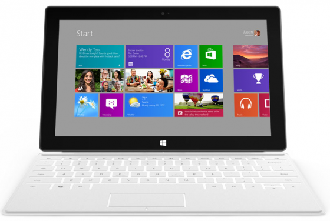
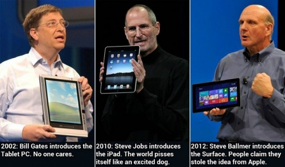
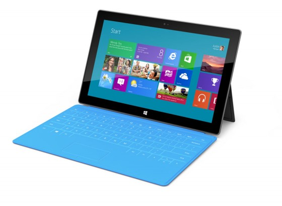

# MS Surface – naujas žingsnis planšečių evoliucijoje

Dar vakar prieš einant miegoti, internetas užsikimšo naujienomis apie paslaptingąją Microsoft organizuotą konferenciją ir apie joje pristatytą naują planšetę – _Surface_, tiesiog žinojau, kad į šią temą privalau įleisti naugučius. Kodėl? Nes tai HUGE! Planšetė, kuri smarkiai keičia rinką.

Apie viską nuo pradžių.

Savo konferencijoje MS pristatė dvi naujosios planšetės versijas: RT – mum jau įprasto tipo planšetė su specialia Windows RT OS, veikiančia su mobiliuoju ARM architektūros procesoriumi, bei versiją su Win8 Pro su naujos kartos Ivy Bridge procesoriumi. Būtent dėl šios versijos ir kyla tiek daug triukšmo planšečių rinkoje. Pradžioj susipažįstam kas slypės Surface viduje:

**OS:** Windows 8 Pro \(aka, Windows ant Intel prosesoriaus\)  
**Display:** 10.6-inch HD Display: 16:9, 1920×1080.  
**Chip:** Intel Core i5 „Ivy Bridge.“  
**Weight:** 903 g  
**Thickness:** 13.5mm  
**Ports:** microSDXC, USB 3.0,  HDMI, Mini DisplayPort Video  
**Battery:** 42 watt-hour  
**Configs:** 32GB, 64GB, 128GB

Taip ne viskas pasakyta. Nėra procesoriaus spartos, operatyviosios atminties kiekio. Taipogi šios specifikacijos iškart iškelia kelis klausimus. Pirmiausia, kaip tokios specifikacijos susitvarkys su 8-tukais. Visgi šie yra tikrai reiklesni, nei bet kokia kita mobilioji OS iki šiol. Win8 yra praktiškai tokio pat reiklumo, kaip Win7 ir manau i5 turėtų tempti viską pakankamai stabiliai. Tad ate ate, Android ir iOS įprasti programų lūžinėjimai? Palauksim, pamatysim.

Antras svarbus klausimas: kiek 42 vatvalandžių baterija sugebės išmaitinti tokį galingą Ivy Bridge procesorių. Naujasis, trečios kartos iPad’as turi 42.5 vatvalandžių bateriją ir siūlo mums 9h gyvenimo. Tačiau čia reikia atsižvelgti į dvi sąlygas: pirmiausia, iPad’as turi milžiniškų 2048×1536 rezoliucijų ekraną, kuris yra tikras energijos eikvotojas. Surface siūlo „tik“ 1920×1080, kas visvien yra nuostabu, nes pasiūlo konkurencingą ir geidžiamą FullHD vaizdą, o tai dar ir atsilieps mažiau baterijos sąnaudose. Tačiau čia išlenda kita sąlyga: Apple gaminamas A5 procesorius, kuris veikia ARM architektūros pagrindu eikvoja kelis kart mažiau energijos, nei pilnas, kompiuterinis Intel i5. Tačiau, manau, kad MS naujasis žaisliukas turėtų išstenėti apie 6-7h. Kas irgi yra pakankamai neblogai. Aišku, čia pasirodo kaip gan nemažas trūkumas lyginant su iPad. Bet ar tikrai? Kodėl aš manau, kad MS planšetė yra tokia game-changer, po kurios išleidimo tablet’ų rinka moduliuosis gan smarkiai?

Pirmiausia pažiūrėkime į realius planšetės pranašumus:

### Integruota klaviatūra ir touchpad’as

Pagrindinis visų, tablet’us naudojančių žmonių skundas būdavo, nepatogus rašymas su lietimui jautria klaviatūra. Taip, jos puikiai gali užtekti parašyti Facebook’o status update’ui, ar tai atrašyti skype žinutei, tačiau pabandykit prisėsti ir parašyti straipsnį, kaip šis. Patirsit tikrą riešų išprievartavimą, o ir sugaišite nemažai laiko darydami klaidas, kai paspaudžiate visai ne tą mygtuką, kurį norėjote. Taip, prie daugumos tablet’ų galima nusipirkti papildomų priedų, tarp kurių ir išorinės klaviatūros. Problema, kad nusipirkę planšetą, dar turite ieškoti ir leisti pinigus dar kartelį. Čia MS žengia panašiai, kaip kad tai daro Asus Transformer planšečių serija: perki planšetą ir iškart gauni ir fizinę klaviatūrą su touchpad’u, kurie smarkiai padidina produktyvumą. Nepaisant to, klaviatūra veikia dar kaip ir stovas, bei planšetės apsauga \(coveris\). Dar puikiai žaidžiama Apple mėgstamomis spalvomis, bei dizainu, kas tikrai traukia ne vieno technofill’o akis, nes daiktas tikrai stilingas ir gražus. Kad ir kiek nesunkiai pastebimas konkurentų kopijavimas. Skirtingai nuo Apple SmartCover, šis turi didelį pranašumą, turėdamas dar ir fizinius mygtukus, kurie sukurti protingai – uždengus planšetą – atsijungia ir nieko ten neprispaudinėsit. Pagal klaviatūros spalvą kis ir pačio Metro naudojamas spalva ir pan. Toks išmanus ir gerai apgalvotas priedas dabar yra tiesiog privalomybė visiems aukštos klasės planšetukams.

### Integruotos jungtys

USB 3.0, HDMI, bei DisplayPort . Čia yra labai pagirtinai geras MS ėjimas. Tiesioginius portus šiuolaikinėse planšetėse rasite tik pas vieną kitą. O tokia jų gausa iš vis abejoju ar kur kitur yra. O tai į planšetų daržą atveda tokias galimybes, kaip: pelės pajungimas, televizoriai, projektoriai, kietieji diskai ir kas ko gero labiausiai aktualu biuruose – spausdintuvas!!! Tiesiog bitch-slap’as visiems dabartiniams tablet’ams.

### Pilnavertė OS

Tai yra pats pagrindinis MS privalumas, kuris ir keičia viską ką matėme paskutinius tris metus. Iki šiol tabletų rinka buvo bandymas užpildyti rinkos tarpą, tarp nešiojąmųjų kompiuterių ir mobiliųjų telefonų. Šios rinkos pildymas pasisekė pakankamai neblogai, atsižvelgiant į tai, kad produktai, su kuriais pradžioje net nebuvo žinoma ką reikia veikti, atrado kelią į vartotojų namus. Jie puikiai tiko nuotraukų, video medžiagos peržiūrėjimui, skaitymui internete, ar elementarių programėlių, bei žaidimų naudojimui. Tačiau turėjo labai prastą reputaciją, kaip darbo įrankiai. Pristatyti keli ofiso paketai, vos kelios rimtesnės programos, tačiau kaip bebūtų ARM procesorius turi savo apribojimus ir šios turėjusios būti produktyvios programos buvo per daug suvaržytos ir nenaudingos.

Ir štai MS dabar ateina su planšetu, kurio viduriuose suksis tikrų tikriausia operacinė sistema – Win8. OS, kurios programos neturės būti specialiai parašytos, modifikuotos ir pan. Planšetas, kuris gali paleisti bet kurią programą, kurią naudojate ant savo namų kompiuterio: audio, video redagavimo, serverių, programavimo įrankius, naršykles, media grotuvus. Tik pagalvokit: 3DsMax, AutoCad, Visual Studio, NotePad++, PhotoShop ir svarbiausia – pilnavertis office paketas: Outlook/Word/Excel – šventoji trijulė, ant kurios sukasi viso pasaulio verslas.

Pirmą kartą tablet’as pasiūlys tikrą netbook stiliaus kompiuterio patirtį, atsikratant didelių ir sunkių kompiuterio krepšių ant jūsų nugaros. Šitokiam aparačiukui iš esmės krepšys net nebūtinas, kuo puikiausiai šį stiliaivą galima laikyti tiesiog rankose. Pastaruosius 3 metus su visais Galaxy Tab’ais ar Ipad’as buvo panašiai, tiesiog su portatyvumu mes aukojome produktyvumą. Dabar MS pasiruošęs viską pakeisti. Tab’ai galutinai pavirs tikrais kompiuteriais, o ne tik žaisliukais. Ir išvis, pirmą kartą kažkas pristato produktą, kuris ištikrųjų priverčia iPad’ą atrodyti pasenusį!! Iš tiesų taip galėjo tik tikrasis Apple konkurentas dar nuo šių dviejų kompanijų pradžios – Microsoft.

### Ipad killer’is?

Taigi, ar Surface gali patapti tuo legendniu ir ilgai lauktu iPad killer’iu? Apple fanatikai gali iškart rėkti, kad jokios realios baimės iPad’ui ši planšetė nekelia. Ir jie iš esmės yra teisūs. Apple turi milžinišką privalumą, nes būtent jie užkūrė šią rinką. Leiskit priminsiu, kaip iš tikrųjų viskas buvo:

Taigi Apple naujosios tabletės pasirodymas nežlugdys, galbūt atvirkščiai, kompanijai reikės stengtis labiau, nei tarkime per dabartinį iOS6 pristatymą ir labai realu, kad šį kartą daug rimčiau griebsis įdėjos sujungti stalinių kompiuterių, bei įrenginių su raidele i operacines sistemas. Jei konkurentai jau yra tai padarę, Apple tiesiog nebegali leisti sau taip atsilikti. Trendus yra papratęs kurti obuolys, o šį kartą jų pagrindiniai konkurentai sumanymą įgyvendino greičiau. Bad, really bad.

Prakąstas obuolys yra susikūrę neįtikėtiną programėlių ekosistemą, taipogi jie turi itin pasišventusią, tiesiog jų produktus garbinančią fanų bendruomenę ir dėlto visada bus žmonių, kurie pirks iPad ir jiems jo visiškai užteks paprastam browsinimui, bei media vartojimui. Tad, kaip Apple buvo absoliutus lyderis su absoliučiąja rinkos dalimi \(70-80% rinkos\) taip ko gero ir liks.

Tiesiog MS šį kartą padarė tai, ką eilę metų sėkmingai darė Apple: paėmė svetimą įdėją, ją smarkiai patobulino, padarė much more appealing to consumers ir nušluostė visiems nosis. Apple sukurta formulė veikia. MS šoka į tabletų rinką pavėlavęs net keliais metais. Niekas kitas jau neišpeštų iš to nieko gero, o vat MS tai padaro ir dar taip jog Apple girtis nebegali: sujungtas entertainment device su productivity device viename įrenginyje. Stilius, pramogos, produktyvumas. Brand new produktas, kai Apple jau keli metai nepristato nieko naujo, o tiesiog užsiima esamų produktų tobulinimu. Sekantis kompanijos gaminys vėl turi būti revoliucinis, nes kitu atveju Apple pozicijos planšečių rinkoje tikrai realiai gali sušlubuoti. Pirmą kartą, iškilo kažkas realaus iš priešo, kuris visada buvo realus. MS puikiai moka žaisti galimybių, bei kainos kortomis. Tai parodė itin didelis kompanijos noras išstumti Xbox’ą į mūsų svetaines ir jiems tai puikiai pavyko. Dabar ši kompanija lygiai taip pat pjaunasi tabletų rinkos dalį ir realiai jokie Asus, ar Samsung’ai nepajėgūs su tuo priešintis ir tik klusniai atidavinės savo rinką.

### Miglota Win8 ateitis

Žmonėms, manantiems, kad Win8 bus nevykęs produktas – pasiūlysiu pažiūrėti plačiau, nes jūs nematot bendro vaizdo. MS baigia sukurti neįtikėtiną ifrastruktūrą, kurioje viskas nuo telefono, planšeto, žaidimų konsolės iki jūsų asmeninio kompiuterio sukasi toje pačioje terpėje, naudoja tas pačias programas, kurios atsimena jūsų visus duomenis ir turite priėjimą prie absoliučiai visų savo failų, kad ir kur jūs bebūtumėt. Informacijos mainai vyksta neribotai ir be galo paprastai. Galbūt nematėte E3 metu pristatyto [SmartGlass](http://www.engadget.com/2012/06/05/microsoft-smartglass-hands-on/)? O ką jau kalbėti apie tai, kad vieną dieną į šią OS pilnavertiškai įžengs ir visa Xbox šeima… Dramblys kurio nesustabdysi. Visa ši imperija sukasi ant vieno esminio faktoriaus: kiek daug būtent Metro pritaikytų programų prikurs programų kūrėjai. Nes kitu atveju neliks priežasties vartotojams keisti savo puikiai veikiančių 7-tukų, į 8-tukus. O programų kūrėjus naujoji MS vizija traukia it muses ir sutartys su didžiausiais vardais jau senai pasirašytos. MS jau dabar, dar net nepaleidusi savo naujosios OS turi 9x daugiau programų kūrėjų, nei tarkim kokia nors RIM kompanija, bebandanti užkariauti verslo sektorių jau n metų. MS tereikia sukurti pakankamai daug kalbų apie savo naująją OS, ir ji tai puikiai daro, o visa kita įvyks lyg užsukta. Būsimosios OS infrastruktūra bus gerokai plačiau įsišaknijusi, nei tos pačios Apple, nes apims žymiai platesnę produktų sferą. Visi didieji, kaip pvz Adobe jau dabar ruošia Metro skirtas sąsajas, nes jie tiesiog negali to nepadaryti atsižvelgiant į MS vartotojų kiekį \(84.83% visų kompiuterių naudotojų\). O realiai Win8 nėra tiek jau smarkiai kitokia, nei Win7, tik pateikta per kitokią, Metro stiliaus prizmę. Jūs lygiai taip pat galite išlysti į jums įprastą standartinį win desktop ir su metro praktiškai nė nesusidurti. O gi visi norėtumėm planšeto, kuris pasiūlytų Win7 patirtį. Jei kas geriau pamena, tai Win7 irgi turi touchscreen palaikymą, tiesiog tais laikais tai buvo dar per anksti ir nieko didelio neįvyko. Tai tiesiog buvo planavimas į priekį. Dabar MS kiek pergalvojo savo požiūrį, technika pagalingėjo ir dabar Win 8 žada būti netikėtai stiprūs liečiamuose aparatuose. Galbūt nuo šios sąsajos labiausiai nukenčia tik standartinių PC’iukų vartotojai. Tačiau, jei turėsite nors vieną naujos kartos Microsoft’o gaminį , tai jūs mielai ir kompiuteryje įdiegsite Win8. Vien dėl suderinamumo ir sąsajos vienodumo.

### Google susirūpinimas

Taigi Apple tai nesukels tiek daug rūpesčių, tiesiog reikės stengtis kiek labiau, nei tiesiog dėti naujausius chip’us į savo produktus. Ištikrųjų kas labiausiai turėtų susirūpinti – tai visos likusios planšetės, bei Google stovinti su savo Android OS už jų. Šiuo metu Android’as turi susišlavęs apie 30% rinkos, tačiau už savo nugaros neturi pilnavertės desktop OS ir žaidžia tik, kaip mobile OS žaidėjas. Iki šiol turėjęs tik vieną konkurentą, Google įgavo kitą, itin galingą ir itin stipriai išplėtotą priešą, kuris turi itin daug patirties, pasimokė iš savo klaidų ir kardinaliai pakeitė savo mąstyseną. Apple tampa per daug tolimas priešas Google, tačiau dabar atsirado reali galimybė būti išstumtiems išvis į trečiąją vietą. Ogi pagalvokim: skirtingai, nei Apple ir MS, Google neturi ko apjunginėti, neturi jokių rimtų darbo įrankių. Tai ir yra didžiausia problema. Viskas ką šiuo metu gali pasiūlyti šios kompanijos OS, tai turinio vartojimas. Mūsų išmaniųjų telefonų lygio turinio vartojimas. Ir tiek. Taškas. Tol, kol Android sistema neperšoks nuo ARM procesorių ir netaps pilnavertė OS, jai gresia tikrai bad days, lyginant su MS sukurtu produktu. O Chrome OS laikyti pilnaverte išvis negalima, nes ji dar net normaliai nepasirodžiusi jau yra mirusi. Google savo dabartinėje situacijoje tiesiog tampa nebekonkurencinga tablet’ų rinkoje.

Paprastas gyvenimiškas pvz: ateinat į parduotuvę ir renkatės planšetą. Vienoje pusėje jums siūlo tarkim tą patį Asus Transfomer Prime – galingą, spartų tablet’ą su fizine klaviatūra, bei Android ICS. Kitoje pusėje Surface. Su vienu galite naršyti internete, žiūrėti filmus, tikrintis paštą. Galima net bandyti žaisti žaidimukus. Su kartas nuo karto lūžinėjančiomis programomis, nevisai korektiškai atvaizduojamu flash’u ir apribojimais. O tuo tarpu su kitu planšetu galite atsidaryti AutoCad’ą, Mathlab’ą, Exel’į ar pilnutėlį Chrome su visai įskiepiais ir pan. Galite redaguoti savo nuotraukas Photoshop’u ar paredaguoti audio įrašą su Audacity. Tiesiog rojus IT sferoje dirbantiems žmonėms, verslui, bei studentams. Realiai toks prietaisų lyginimas išvis gaunasi absurdiškas. Dvi visiškai skirtingos lygos. Visi nori turėti aparačiuką, su kuriuo galima veikti viską, ką nori, o ne tik skaitinėti internetus. Iš esmės lyginti bet kurį android tablet’ą su Surface prilygsta tam, lyg lygintumėte savo telefoną kišenėje su kompiuteriu stovinčiu po stalu.

Iš esmės Surface įsispraudžia ir smarkiai apkarpo ne tik dabartinius tablet’us, tačiau ir ultrabook’us. Manau ilgalaikei perspektyvoje tokio pobūdžio tablet’ai laimės ir mes pamiršime, kad kažkada naudojome notebook’us. Jų dienos tiesiog suskaičiuotos. Tačiau jei Surface absoliučiai šluosto nosis tablet’ų rinkoje, tai ultrabook’ai tampa daug didesniu iššūkiu, nes šių produktų kategorijos tampa apyligės. Žinoma ultrabook’ai sugeba pasiūlyti daugiau galios, daugiau vietos, didesnius ekranus, tačiau realios dabartinės jų kainos siekia apie 8000Lt, kas bendrąjai masei yra tikrai per didelė kaina. Šis MS produktas dar neturi paskelbtos kainos, tačiau visai realu, kad ji būtų kiek virš 1000$. Manau per artimiausius metus stebėsime šių dviejų mobiliųjų įrenginių, nuversiančius nešiojamuosius kompiuterius nuo sosto, kovą, žinoma iš kurios išloš būtent vartotojai. Lošim kainos ir techninių galimybių sąskaita.  Labai tikėtina, kad taip akivaizdžiai nugalėtojo visgi ir nebus ir turėsime abi šias rinkas, dėlto, kad žmonėms, pripratusiems prie tradicinių laptopų, ultrabook’ai yra daug labiau priimtinesni. Gi visada yra sustabarėjėlių žmonių, kurie kratosi naujienų.

Belieka prisiminti, kad čia pats pirmasis MS šūvis. Jie tikrai dar bus neapgalvoję visko. Bus daug ir įvairių problemų. Vėlesnės jos leidžiamų planšečių kartos, vis tobulės, taisys praeitų trūkumus. Natūralus žengimas pirmyn. Tad kuo toliau tuo bus tik dar gražiau… Prieš 5-metus nė nebūtume pagalvoję, kad nešiosimės knygutę, su kuria skaitysime internetus, dar po 5-erių metų ims šypsena, kai galvosim, jog į pirmąsias planšetes rašydavome šitiek apribotas operacines sistemas, prie kurių reikia taikytis visiems.

### Išvados

Nereikia pamiršti, kad per pristatymą buvo parodytos dvi planšetės. Aš beveik visiškai nieko nekalbėjau apie RT versiją… Na pripažinkim, iš esmės tai tik dar vienas mažas evoliuciškai patobulėjęs tablet’as, beveik niekuom neišsiskiriantis nuo kitų, tik turintis neprastas rezoliucijas. Iš esmės 95% planšečių, bei telefonų dabar sukasi būtent ant ARM. Tačiau tai kas padaro tablet’ą geru yra būtent OS. O RT versijos windows’ai galės naudoti tik specialias šiai platformai parašytas programas. Tai yra stabdis ir tikrai didelio lūžio nedaro. Tai tiesiog produktas, siūlantis dar vieną alternatyvą iš MS stovyklos ir jei jau kompanija eina į šią rinką – jei būtina tokių turėti. Vartotojams reikia turėti pasirinkimą, tačiau ne tokį platų, kad jie jame nebesigaudytų.

Tikrasis žaidimo keitėjas yra būtent antrasis modelis. Nesakau, kad Surface iškart bus super mega perkamu produktu. Ko gero pagrindinė to priežastis – kaina. Šiuo metu iPad siekia 500$ ribą. Labai tikėtina, kad Surface’as bus kone perpus brangesnis. Tad kol lubos nesileis, šis aparatas bus konkurencingas tik komercinėje nišoje, kurioje iPad realiai yra bevertis ir naudojamas tik mados tikslais. Manau labai daug institucijų, įmonių ir įstaigų labai teigiamai priims Surface’ą. Priims teigiamai net nemaža dalis paprastų vartotojų, kurie galės sau tai leisti. Jie jau dabar priima net labai teigiamai, tik pasižiūrėkit vartotojų, bei kritikų reakcijas po pristatymo. Vėliau, kai technologijos kainos ims kristi, kaina nusileis ir tokie planšetai ateis į visų mūsų gyvenimus. Tiesiog reikia priimti, kad PC era praėjo, dabar gyvename jau post-PC laikais ir tokios platformos, kaip staliniai ar nešiojamieji kompiuteriai turės mutuoti ir pasikeisti itin smarkiai. Mūsų telefonai pataps stalinių kompiuterių pakaitalais, notebook’ai bus pakeisti planštetais ir viskas bus sujungta į vieną visumą, be jokių laidų ir apribojimų. Didžiosios kompanijos žino, kad jei viską pakeisti greitai ir kardinaliai – toks produktas nebus priimtas masės. Žmonės išsigąs naujovių. Tad didieji planai vykdomi po žingsniui – keičiant ir tobulinant po vieną laiptelį. Kol galiausiai viskas bus pasikeitę neatpažįstamai ir tiesiog negalėsim suprasti, kaip be viso to, sugebėjome gyventi anksčiau. Win8 tik pirmasis naujosios kartos kompiuterijos žingsnis.

