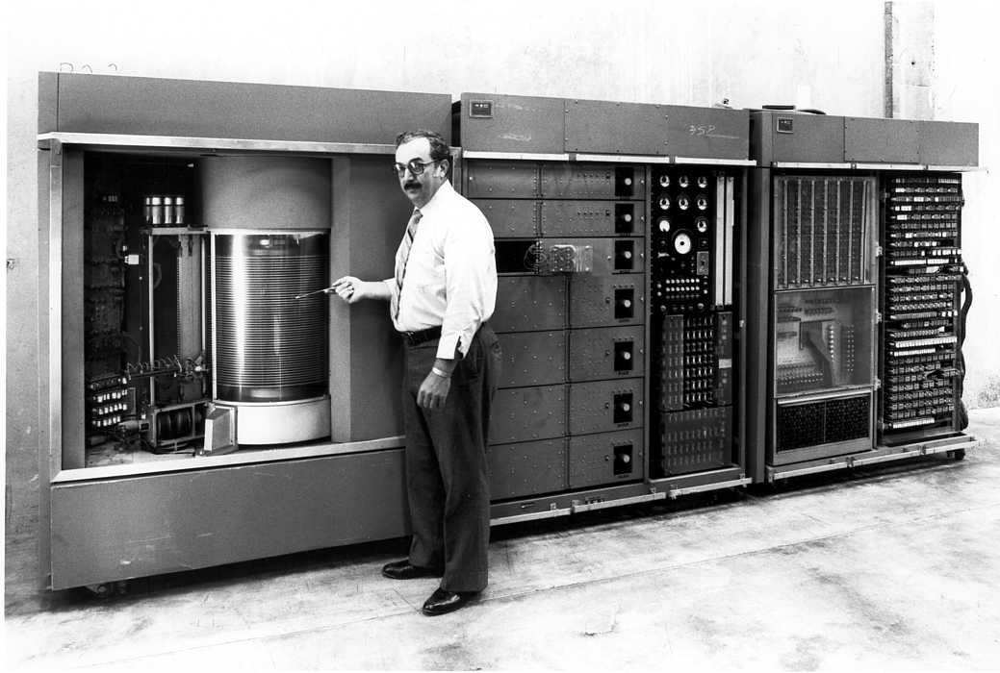
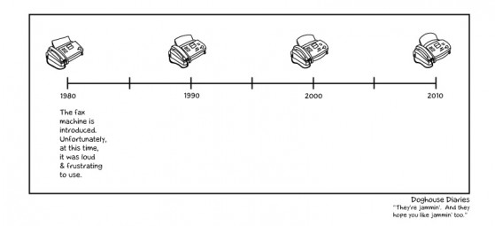
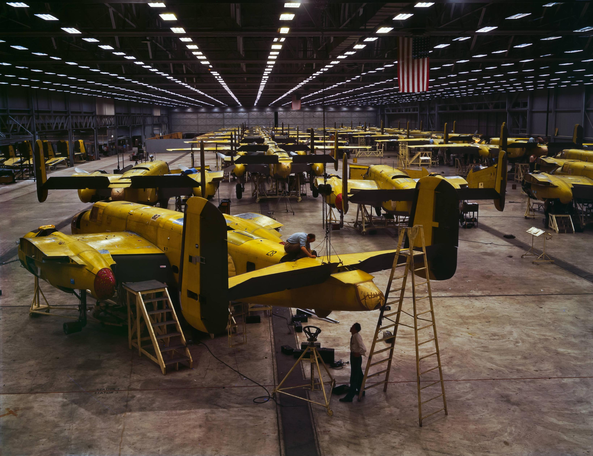
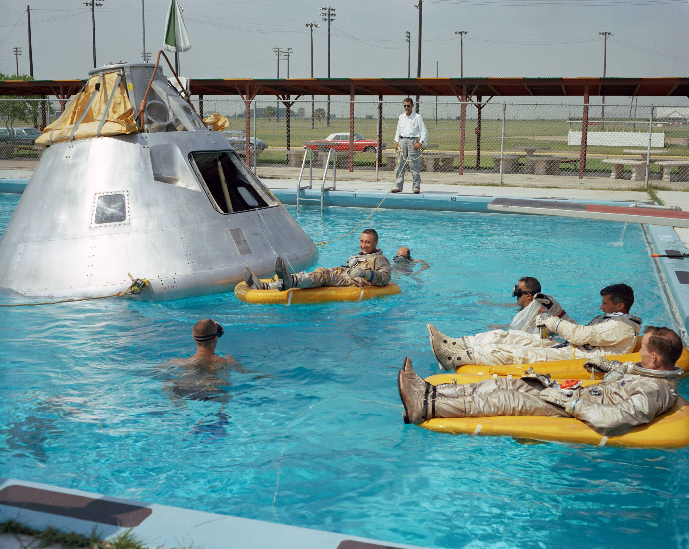
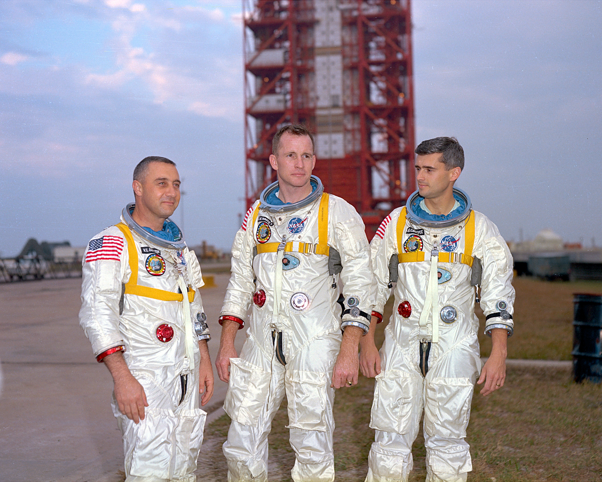
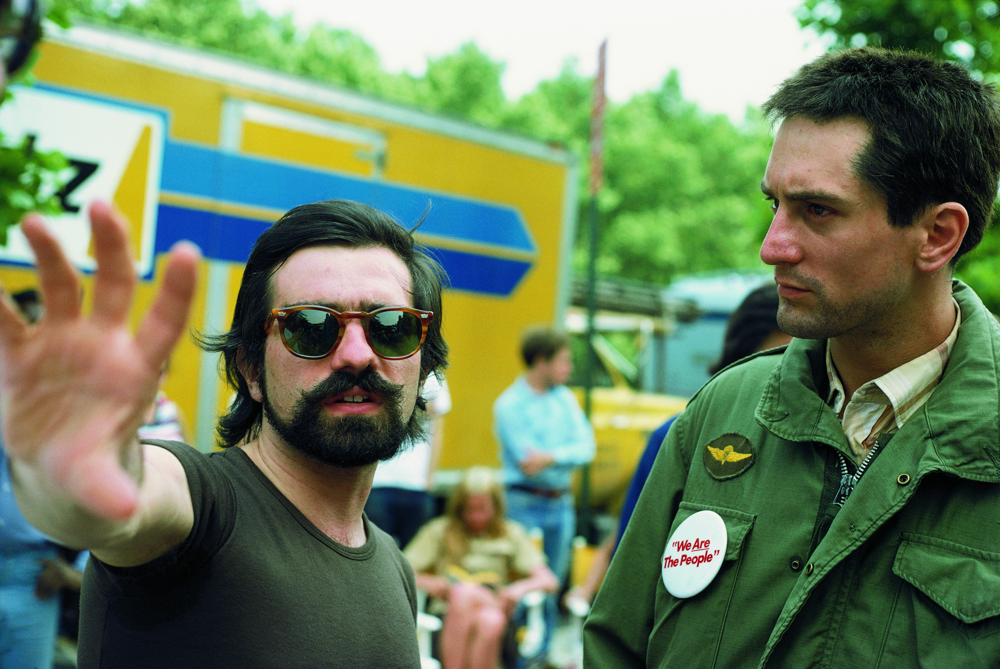

# Ne viskas pažanga, kas pažanga kvepia

Visi žinome apie tai kokiu sparčiu tempu tobulėja technologijos. Internetas sukurtas mano gimimo metais, o dabar be jo neįsivaizduojamas pasaulis. Komiškai klausomės istorijų apie kambarius kadaise užėmusius lempinius kompiuterius, kaip kad paveiksle pavaizduotas IBM 305 RAMAC, kuriame pirmą kartą panaudotas kietasis diskas, su įspūdingais 5MB atminties, ar apie ikonišką tapusiu Bill Gates pasisakymą, kad 640Kb RAM’ų bus užtektinai visiems.

Tačiau ne visada progresas yra toks jau didelis, kaip kad tikėtumėmės. Dabar 2014-ieji, o mes vis dar naudojamės fakso aparatais, kurių atliekamų funkcijų kokybė ar net pati aparato išvaizda iš esmės nepasikeitė per pastaruosius 30 metų.

 Tokių pavyzdžių yra ir daugiau. Labiausiai mano dėmesį atkreipia fotoaparatai. Taip, tikrai nesiginčyju dėl profesionalių veidrodinių foto kamerų, kurios žinovo rankose gali užfiksuoti tiesiog [kvapą gniaužiančius vaizdus](http://www.kevinmcnealphotography.com/Landscapes/United-States/Washington/i-7RgRfPC/0/X2/Mt.St.Helens_Sunrise_18x12-X2.jpg). Tačiau, tai gan nišinė rinka, kurioje avarage Joe įprastai nesisukalioja. Omenyje visgi turiu masinę consumer rinką. Tuos fotoaparatus, kuriuos naudoju aš, jūs ir daugybė kitų tokių interneto lankytojų ir šio puslapio skaitytojų. Esmė, kad nors ir mes galime pasidžiaugti pakeitę fizinį formatą į skaitmeninį, bet iš esmės prisitaikymas prie tam tikrų niuansų ir susidūrimas su tam tikrais apribojimais, sąlygoja tai, kad fotografija nenuėjo tiek jau toli, kiek būtų galima įsivaizduoti. Leiskite parodyti keletą pavyzdžių. Spausti ant foto:

Atrodytų, kaip foto kokybė, kokias galima daryti su aukštesnės klasės nauju mobiliuoju telefonu. Žinoma, prisitraukus šias foto arčiau, matosi dulkės, bei grublėtumo efektas, tačiau to nedarius, foto kokybė išties mažų mažiausiai decent. O dabar pabandykite atspėti kokio senumo šios foto? Pirmoji, kuri iš šio rinkinuko atrodo ko gero prasčiausiai, daryta dar 1942! Taip, prieš 72 metus! Sekančios dvi jau šiektiek jaunesnės – darytos prieš 47 metus, t.y. 1967-aisiais. Paskutinė, De Niro ir Scorsese foto iš Taxi Driver filmavimo, daryta 1976-aisiais, tačiau atrodo lyg būtų daryta praėjusią popietę, kokio New York’o ar Boston’o gatvėse, ne tik dėl kokybės, bet ir dėl šiems laikams būdingų hipsteriškų madų :D Šios foto nėra dirbtinai nuspalvintos, prie jų nėra prikišta photoshop’o, tai tiesiog originalių foto skenuoti vaizdai. Nesakau, kad dabartiniai vidutiniai fotoaparatai fotografuoja prastai, su bet kokiu biudžetiniu fotoaparatu padarytumėte ko gero žymiai geresnių foto, nei šios, tačiau dauguma žmonių dabar fotkina su mobiliaisiais ir tokiu atveju, galima suprasti, kad kokybės atžvilgiu mes praktiškai likome praktiškai ten pat 

