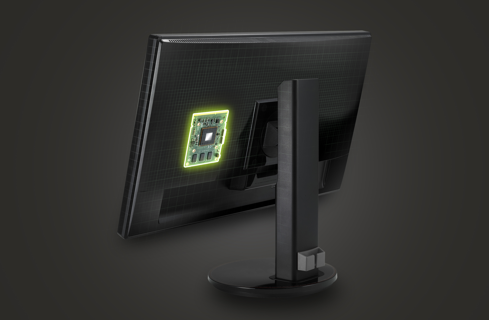

# Nvidia G-Sync

Tradiciškai kompiuterių monitoriai ir televizoriai vaizdą ekrane atnaujina fiksuotu dažnumu. Įprastinis rinkos standartas yra 60Hz, kas reiškia, kad vaizdas atsinaujina 60 kartų per sekundę. Kai kurie į profesionalius žaidėjus orientuoti monitoriai siūlo 120 ar net 144Hz ir suprantama – kuo didesnis dažnis, tuo judesys ekrane atvaizduojamas sklandžiau. Idealiame pasaulyje žaidimo kadrų kiekis per sekundę turėtų atitikti su monitoriaus dažniu ir tuomet turėtume visiškai idealų vaizdą. Problema ta, kad visgi negyvename tokiame pasaulyje ir vaizdo plokštės stengiasi kadrus generuoti kiek įmanoma greičiau ir rezultatas monitoriui pateikiamas iškarto, vos tik darbas atliktas. Tai sukūrė vienas iš dažniausių vizualinių problemų, su kuriomis tenka susidurti žaidėjams, net jei šie ir yra investavę į galingus kompiuterius.

-Jei GPU plokštė yra galinga ir uoliai besidarbuodama generuoja kadrus dažniau, nei kad monitorius atsinaujina, t.y. daugiau, nei 60FPS’ų, extra kadrai pateikiami monitoriaus atsinaujinimo ciklo metu. Kitaip tariant, užuot turėjęs vienam vaizdo atnaujinimo ciklui vieną kadrą, monitorius gauna du ir ima rodyti vieną vaizdo dalį iš senesnio kadro, kitą iš naujesnio tuo pat metu ir to rezultatas – plėšyto vaizdo efektas, angliškai vadinamas screen tearing’u. Šios problemos sprendimui buvo sukurta V-Sync technologija, kurios principas labai paprastas – vaizdo plokštė apribojama iki monitoriaus dažnio ir pateikia naujus kadrus tik tada, kai monitorius būna pasirengęs. Vadinasi turint įprastinį monitorių V-Sync fiksuoja kadrų kiekį ties 60 kadrų per sekundę ir jokie pašaliniai kadrai netikėtai nebeišlenda atnaujinimo metu, tad minėto vizualinio efekto nebelieka. Tačiau šis sprendimas nėra idealus, nes atsiranda kita problema: striginėjimas \(stuttering\).



-Yra itin sudėtinga žaidimo kadrus generuoti visada stabiliu tempu, vien dėlto, kad kiekvienas žaidimo kadras gali kardinaliai skirtis savo kompleksiškumu nuo prieš tai buvusio. Pvz, galima pastebėti, kad bėgiojant po uždaras patalpas, kadrų kiekis yra kur kas didesnis, nei atvirose vietovėse, kuriose atvaizduojama be galo daug skirtingų kraštovaizdžio detalių ir yra didelis, toli siekiantis matomumas. Taigi, kadangi kai kurios žaidimų vietos yra kur kas labiau reiklios resursams, vaizdo plokštė ima generuoti šiuos kadrus lėčiau. Jei šis kadrų generavimas nukrenta žemiau monitoriaus dažnio \(įprastiniu atveju mažiau 60FPS\), kompensavimui, kadras imamas kartoti, iki kol sugeneruojamas naujas. Tai sukuria vaizdo striginėjimo efektą. Jei kadrų kiekis krenta itin ženkliai, tai šis striginėjimas tampa ypač ryškus, kaip kad pateikta video pavyzdyje.

Dėl itin didelio blaškymo, bei padidėjusio input lag’o galima pastebėti, kad profesionalūs žaidėjai dažniausiai išjungia V-sync lauk ir geriau susiduria su dideliu vaizdo kapojimu, nei, kad taikstytųsi su sumažėjusiu reakcijos laiku.

### NVidia G-Sync

Kompanijos Nvidia sprendimas šiai problemai yra itin paprastas, dėlto stebėtina, kad prireikė šitiek metų pakol šis sprendimas buvo įgyvendintas. Iš tikrųjų nėra jokios techninės priežasties, kodėl šiuolaikiniai LCD monitoriai tūrėtų veikti fiksuotu dažniu, apart to, kad LCD monitoriai buvo sukurti pakeisti senuosius CRT, kurie privalėdavo veikti fiksuotai. Taigi, Nvidia pašalina šią perimtą savybę iš senųjų ekranų įdėdama į monitorių specialių chipą, kuris pats reguliuoja monitoriaus kadrų atnaujinimo dažnį pagal tai, kada vaizdo plokštė būna pasiruošusi ir taip užtikrina, kad viskas įvyktų tinkamu metu. Rezultatas – sklandus vaizdas, be jokių pašalinių vaizdo defektų, striginėjimų.

Žinoma, kadangi tai yra Nvidia sprendimas, tai jūs turite turėti būtent Nvidia vaizdo plokštę, bei specialų naują monitorių, su minėtuoju G-Sync chipu. Kadangi technologija dar visai nauja, o ir yra aktualiausia tik labai specifinei demografijai – geimeriams, tai už šią technologiją palaikančius monitorius tenka susimokėti nemažą kainą, tačiau kaip bebūtų, beveik visi šie monitoriai būna 144Hz, bei su labai maža delsa, tai bent jau tai iš dalies pateisina pirkinį. Tačiau kai technologija darysis vis dažniau sutinkama, po mažu nukris ir jos kaina ir turėsime naują standartą, kuris sprendžia ilgus metus visus kamavusią problemą.

### AMD Freesync

AMD taipogi turi savo standartą, pavadinimu Freesync ir nors technologiniai įgyvendinimai turi šiokių tokių skirtumų, tačiau pats principas iš esmės yra toks pat. Blogiausia tik tai, kad šių dviejų kompanijų sprendimai sukuria didesnį išsiskaidymą – technologijos yra nesuderinamos tarpusavyje, tad jei nusipirksite Freesync monitorių, liksite apriboti vaizdo plokščių pasirinkime tik ties AMD plokštėmis ir jei ateityje norėdami atsinaujinti vaizdo plokštę, nuspręstumėte griebti Nvidia, tektų keisti ir patį monitorių. Ir šis išsiskaidymas nepanašu, kad bus išspręstas greitu metu. Nvidia tikrai neims naudoti Freesync, nes jų sprendimas uždirbs pinigų už kiekvieno parduoto monitoriaus, o ir neleis naudotis G-Sync savo pagrindiniams konkurentams, tad panašu, kad būsime įstrigę.

### O ar tai išties veikia?

Skirtumas tarp G-Sync monitoriaus ir paprasto yra išties didelis, nors visgi skirtumas labai priklauso nuo to, kokį žaidimo našumą turėjote prieš tai. Bet kas, kas nukrenta mažiau, nei 30 kadrų per sekundę, vis vien atrodys prastai, tad ant silpnos geležies nereikia tikėtis stebuklų. Taipogi galima pastebėti ir tai, kad jeigu turima vaizdo plokštė sugebėdavo išlaikyti ganėtinai stabilius 60FPS, tai skirtumas taipogi nebus toks jau ryškiai matomas.

Kaip bebūtų, tačiau kadangi panaikinama bet kokia kapojimo ir striginėjimo tikimybė, žaidimai dar niekada nebuvo atvaizduojami taip sklandžiai ir maloniai akiai. Skirtumas ypač ryškus, jei kurį laiką pasinaudoję G-Sync monitoriumi, grįžtate prie įprastinio. Kaip kad su kokybiškais muzikos įrašais – grįžti atgal tiesiog nebesinori.



