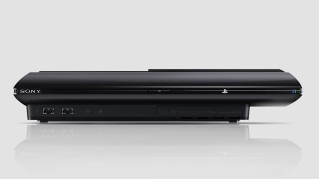

# Pats metas įsigyti PS3

Tikrai ne visi yra konsolių fanai. Nors bendra koncepcija – žaisti naujausius kompiuterinius žaidimus įsitaisius patogiai fotelyje atrodo išties patraukliai, tačiau konsolės susilaukia kritikos iš užkietėjusių žaidėjų, dėl gamepad’o nepatogumo lyginant su klaviatūros ir pelės deriniu žaidžiant šaudykles, bei dėlto, kad asmeniniai kompiuteriai yra techniškai pranašesni ir tie patys žaidimai ant PC atrodo geriau, nei jų konsoliniai variantai, kurie dėl tam tikrų technologinių apribojimų turi mažinti žaidimų rezoliucijas, kadrų skaičių per sekundę, tekstūrų kokybę ar piešimo nuotolį. Tačiau konsolės, be sofos patogumo faktoriaus turi dar vieną esminį pranašumą – žaidimai ne retai ne tik, kad pasirodo ankščiau konsolėse, bet dalis žaidimų savo „ekranizacijos“, jei taip galima vadinti, asmeninių kompiuterių scenoje išvis nesusilaukia. Tai vadinamieji ekskliuzyvai.

Būtent dėl ekskliuzyvų kiekio iš praėjusios kartos konsolių \(PS3 ir Xbox360\) aš labiau preferinu būtent Sony įrenginį. Nors Xbox’o pultelis, Kinect’as ir pats įrenginio dizainas man labiau patinka, nei PS3, tačiau bėda ta, kad Xbox’o dauguma žaidimų visgi yra išleidžiami ir Windows aplinkoje, tad juos galima žaisti kompiuteriuose. Jei žiūrėti tik į išties aktualius žaidimus, tai lieka tik Forza, Halo, Gears Of War ir iš esmės viskas. Trys žaidimų serijos… Iškarto kyla mintis, kam tada pirkti X’ą, jei praktiškai visą kitą galima žaisti ir ant gaming PC.

Štai su PS3 yra kitas reikalas – yra nemažai, bei išties gerų ir vertų dėmesio ekskliuzyvų, kuriuos rasite tik būtent čia ir niekur kitur. Keli verti dėmesio pamynėjimai:

**Metal Gear Solid**  
**The Last of Us**  
**Beyond: Two Souls**  
**Demon’s Souls**  
**Uncharted**  
**inFamous**  
**Heavy Rain**  
**LittleBigPlanet**  
**God Of War**  
**Gran Turismo  
Killzone  
Motorstorm**  
**Journey  
Heavenly Sword**  
**Ni No Kuni ir t.t.**

Ir tai ne kokie nuvalkioti, niekam neįdomūs, indie developerių žaidimai, o AAA title’ai su milžiniškais biudžetais, leidžiami pačių garsiausių kūrėjų kompanijų. Tačiau nesiveliam į Xbox vs PS3 ginčus, mes čia visai ne apie tai…

Aš buvau vienas iš tų žmonių, kuris visiškai praleido PS3 kartą. 2006-2013-tieji, iki šiemetinio PS4 pasirodymo prabėgo, pakol aš dar mokiausi mokykloje, studijavau, bei kartas nuo karto casual pažaisdavau ant PC, o štai prie PS3 per visą šį laikotarpį turėjau progą prisiliesti išvis vos kelis kartus pas draugus ar pažįstamus. Atrodytų: ech, kiek gi nemažai praleista, ar ne? O žinot… Visai gi ne! Šitas visas neskubėjimas įsigyti konsolės išėjo ir į naudą.

Konsolės gyvavimo metu mes dažniausiai išbandome tikrai nemažą dalį žaidimų. Visada stebime naujienas, žaidimų pristatymus, laukiam mėgstamo žaidimo sekančios dalies ir pan. Deja, tikrai ne kiekvienas iš tų graujų, kuris pradžioje atrodė tarsi „the next big thing“ pasirodė esąs išties vertas ir iš paskos seka tik nedidelis nusivylimas ir klausimas, tai ką tada žaisti toliau? Kartais nuo vieno auksinio žaidimo iki kito praeina nemažas laiko tarpas, kuris visas užpildomas „tik šiaip gerais“ ar vidutiniais žaidimais. Aš, kaip žmogus, įlipęs į nuvažiuojantį PS3 traukinį tik dabar, galiu rinktis iš milžiniškos žaidimų bibliotekos, kurioje „grynuoliai“ jau yra atsisijoję. Tereikia pasidomėti apie žaidimus, kurie susilaukė tikro žaidėjų pripažinimo ir galima nerti tiesiai į pačius pačiausius grajus. Jokių vidutinių žaidimų, jokių blogų žaidimų, jokio ilgo laukimo. Prisėdi ir per artimiausius kelis mėnesius peržaidi visą ką PS3 turi pasiūlyti geriausia. Tarsi visos Kalėdos būtų užklupusios vienu metu.

Paprastas pavyzdys: įsivaizduokit, kad peržaidžiate Uncharted, jis velniškai patiko ir užuot po to laukus du metus, įsijungiama iškart sekanti dalis, kuri yra dar ir geresnė! Ką jau kalbėti, kad peržaidus visą trilogiją dar lauks Red Dead Redemption ar praėjusių metų topiniu žaidimu tapęs The Last Of Us. Tai patirtis, prie kurios žmonės labiau pripratę kitose media formuose. Pvz. parsisiunti visus mėgiamo serialo sezonus, kai jis jau būna pasibaigęs ir sužiūri po tiek serijų per dieną, po kiek norisi, užuot kankinusis su viena per savaitę ir po to mėnesius trunkančią pauze iki sekančio sezono \(dabartiniai Sherlock’o ar Game of Thrones fanai gali mane suprasti :D\). Ar kaip ir su knygomis, kur žmonės skaito visuotinai pripažintas literatūros klasika tapusias knygas, vietoj to, kad pirkti kiekvieną pasirodžiusią knygyno naujieną iš galbūt net nelabai žinomo rašytojo.

Žinoma, dabar jau yra pasirodžiusi PS4 ir nemažai žmonių galvoja apie jos įsigyjimą ar net jau ir yra ją nusipirkę ir aš tikrai nebandau atkalbinėti \(nors šiuo metu dar nelabai rekomenduoju\), tačiau tai padaro PS3 dar net ir  labiau patrauklesniu pasiūlymu, nes skelbimuose gerai išlaikytą konsolę galėsite nusipirkti už 400-500Lt, kas yra išties viliojančiai, jei iki šio laiko dar neturėjote šios konsolės. Juolab palyginus su PS4 kaina, kuri yra ~1800Lt nauja ir ~1300 jei pirksite iš antrų rankų.

Nes, kaip sakoma – nauja yra senai užmiršta sena.

