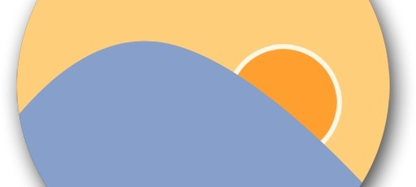
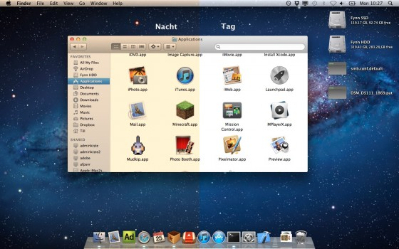

# Protingesnis ekrano apšvietimas skaitymui vakare

Jeigu esate toks pat iki vėlumos užsisėdėti mėgstantis asmuo, kaip aš ir esate aktyvus kompiuterio naudotojas – galiu jums pasiūlyti vieną išties neblogą kompiuterio programėlę, kurią atradau ne taip jau senai ir kurios teikiamus privalumus tikrai įvertinau.

Sėdėti namie prie didelio 25-27 ar net daugiau colių istrižainės monitoriaus žinoma patogu. Tačiau vakare, kai už lango jau sutemsta, o kambaryje įjungiate šviesą, atsiranda maža problemėlė, kad ekranas gali būti per nelyg ryškus intensyviam skaitymui. Vieni turi jautresnes akis ir tai pajaučia iškarto, o kiti nesusimastę sėdi ir toliau žiūri į ekraną, kuris lyginant su kambario apšviestumu, spigina it maža saulė. Žinoma, problema yra nesunkiai sprendžiama – kiekvienas monitorius turi reguliuojamą kontrastą, kurį sumažinus, ekranas šviečia ne be taip ryškiai ir tampa malonesnis skaitymui prastesnio apšvietimo sąlygomis. Senesni monitoriai leidžia keisti apšvietimo intensyvumą, o nauji monitoriai turi integruotus režimus, tokius, kaip „Game“, „Movie“, „Internet“ ar pan.

Problema tame, kad šis procesas nėra automatinis. Tad iš vakaro pasidarius malonų akims blankesnį apšvietimą, dieną greitai pastebite, kad tenka vėl lysti į ekrano nustatymus, nes vaizdas tampa sunkiau įžiūrimas. Tai ypač pasijaučia saulėtą dieną. Tad gaunasi, kad turite patys rankiniu būdu, du kart per dieną keitalioti ekrano apšvietimą, optimaliam variantui. Deja, kompiuterių ekranai kol kas neturi šviesos sensorių, kaip kad mūsų telefonai ar planšetai ir patys automatiškai apšvietimo intensyvumo nereguliuoja.

Tačiau ekrano ryškumo sumažinimas, nors ir padeda, bei yra sveikiau akims, tačiau išlieka dar ir kitokia žala organizmui. Organizmui? Taip. Yra įrodyta, kad žmonėms, kurie prieš užmiegant mėgsta pasisėdėti porą valandėlių prie kompiuterio ar paskaitinėti straipsnius lovoje iš planšetinio kompiuterio, miegas pasislenka per apytikriai 1h. Primenu, kad optimalus miegas yra tarp 7-8 valandų. Tad jei jums reikia anksti keltis, tai tikimybė, kad nebe išmiegate šio optimalaus laikotarpio. O jei mažiau miegate, tai jaučiatės prasčiau, esat mažiau produktyvūs, labiau išsiblaškęs ir pan. Kitaip tariant prastesnė savijauta, bei žala jūsų sveikatai. Pagrindinis klausimas: o kaip vakarinis pasisėdėjimas prie kompiuterio sugeba įtakoti miegą?

Galbūt dar iš biologijos pamokų prisimenate, kad akies viduje turime dviejų tipų receptorius: kolbeles ir lazdeles. Tačiau, viso labo prieš 15 metų mokslininkai atrado ir dar vieną įdomų pigmentų rūšį mūsų akyse, pavadinta [Melanopsin](http://en.wikipedia.org/wiki/Melanopsin). Šie receptoriai reaguoja tik į gan siaurą 460-480nm bangų ruožą, o tai yra mėlyna spalva. Paprastai aiškinant šio receptoriaus veikimą: jis hormonų pagalba pasako smegenims, kad dabar yra diena ir žmogus turi būti aktyvus, o kai ilgesnį laiką pabūnate užsimerkę ar tamsioje aplinkoje – melanopsin sako, kad atėjo naktis ir jau laikas eiti miegoti. Taigi, sėdint vakare prie kompiuterio ir skaitant sau internetus, iš monitoriaus gaunate tikrai nemažai mėlynos spalvos ir jūsų organizmas galvoja, kad vis dar yra diena ir palaiko jūsų, na bent jau smegenų aktyvumą lyg tai būtų tiesiog diena, nors už lango galbūt jau kokia 2 nakties. Kai atsigulate į lovą, hormonai nustojami gaminti, tačiau turi pasibaigti jau „prigamintoji“ partija, tad tai užtrunka ir todėl dar kurį laiką visai nesinori miegoti ir vartaliojatės lovoje, vietoj to, kad tuojau pat smigtumėte.

Taigi šioms abiems problemoms spręsti yra sukurta puiki ir visiškai nemokama programėlė [f.lux](http://stereopsis.com/flux/).  
Ką ji daro? Atėjus vakarui įjungia vaizdo filtrą, kuriuo yra filtruojama mėlyna spalva, ko pasekoje vaizdas tampa šiltesnis, švelnesnis ir ne be toks ryškus. Tai tikra yra maloniau skaitymui vėlyvomis valandomis, nes žymiai mažiau dirgina akis, o taipogi dėl sumažėjusio mėlynos spalvos intensyvumo, sumažina minėtųjų hormonų gamybą, dėl kurių nesinori miegoti. Tad galite skaityti kiek geidžiate, o tada ramiai gultis ir miegoti. O geriausia tai, kad programėlė visa tai daro visiškai automatiškai. T.y. nurodote savo gyvenamąją vietą ir ji pagal jūsų geografinės padėties informaciją, nusistato saulės patekėjimo ir leidimosi laiką ir pagal tai filtrą įjungia ar išjungia, kada jo reikia. Tad tiesiog vieną kartą paleidote, susikonfigūravote ir galite pamiršti.

Pirmą kartą įjungus, pripažinsiu, kad vaizdas gali atrodyti labai, bei keistai gelsvas. Galbūt, net pasirodys, kad tai yra per daug ir nemalonu, gal atrodys, kad visai nenorite sėdėti prie tokio geltono, nenatūralių spalvų monitoriaus. Tačiau ši labai paprastutė ir beveik nepastebima programa leidžia visiškai kontroliuoti šio filtro intensyvumą, tad galima susimažinti iki tiek, kad minėtasis gelsvumas praktiškai tampa ne be pastebimas, tačiau praktikoje, galiu paminėti, kad po truputis vartotojai dažnai visgi didina filtro intensyvumą kol galiausiai visgi baigia ties maximumo riba. Kai pradedi naudoti, kelio atgal praktiškai nebėra. Žmonėms, kurie dirba su nuotraukomis ar vaizdo medžiaga ir kuriems labai svarbu sodrios ir natūralios spalvos, programa net ir siūlo specialų laikiną filtro išjungimą, kad nesimaišytų po kojomis \(arba šiuo atveju po pele\) ir netrukdytų darbui.

Tačiau pasinaudojus vos kurį laiką, visiškai apie šią programėlę pamiršti ir labai greitai pripranti prie to gelsvumo. O štai netikėtai prisiminus ir pabadžius programėlę po kurio laiko naudojimo išjungti, būni tiesiog apakinamas vaizdo ryškumo ir negali patikėti, kaip galima sėdėti prie tokios „mini saulės“. Panašus efektas, lyg atsibudus naktį nupėdintumėte ir atidarytumėte šaldytuvo dureles :j

Taigi, skaitykime draugiškesniuose monitoriuose, šios programėlės pagalba ir jūsų akys ir miegas jums padėkos.

