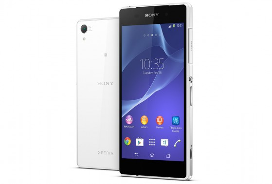
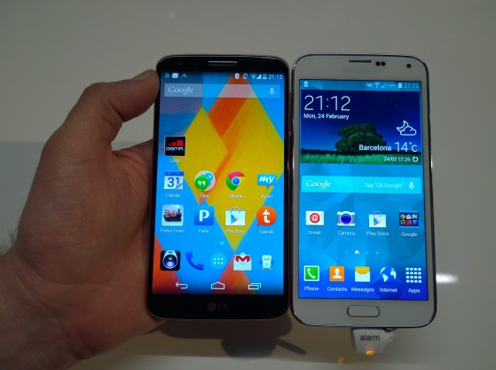

# Samsung Galaxy S5

Visi šurmuliavo ir spekuliavo koks gi bus šiemetinis Samsung’o flagmanas. Praėjusių metų modelis mušo visus pardavimų rekordus, tad nenuostabu, kad daugumai knietėjo sužinoti koks gi bus jo pakaitalas. Prispekuliuota buvo daug ir kuo telefono pristatymo data artėjo, tuo spėlionių buvo vis daugiau: pradedant, kad telefonas turės 5,2 QHD \(2560 x 1440\) ekraną, naujausią Snapdragon 805 procesorių, bei 3GB RAM, iki to, kad baterija bus padidinta iki 3200mAh arba, kad telefonas bus su labiau premium metaliniu ar net odiniu viršeliu.

Tačiau realybė gavosi šiek tiek kitokia: toks pat 1080p ekranas, tie patys 2GB RAM’ų, tas pats plastikas, storesnis, didesnis, nei praėjusių metų modelis, o taip pat „I’m too“ pasirodymui skirtas pirštų skaitytuvas, kuris pirminėse apžvalgose aprašomas, kaip toli gražu neveikiantis, taip kaip turėtų \(_it was very particular about the speed and orientation of the swiping motion used — if we weren’t doing a perfectly straight swipe down, it would refuse to unlock the phone_\), heart monitor, kuris mažai dalelei žmonių bus visgi naudingas, bet iš esmės pagrindinei tikslinei auditorijai – taps tik pasimaivymų ir pasižaidimų kelioms dienoms objektu. Ypač, kad šį sensorių galima naudoti vos su keliomis fitneso programomis. Rimtai, įsivaizduojat bėgiką, kuris bėgios prispaudęs pirštą prie kažkokio daviklio telefone? Tiesa, Samsung’as neužmiršo ir vienos patogios savo Galaxy S linijos funkcijų – SD kortelių, kas yra sveikintina, tačiau mane domina, kokios bus jos panaudojimo galimybės, dėl KitKat operacinės sistemos, kuri apriboja programų prieigą prie atminties kortelės. Gali pasirodyti ne taip jau ir naudinga, kaip kad atrodė, nebent Samsung’as kaip nors apėjo šį naujausios android versijos apribojimą. O dar verta paminėti, kad vien operacinė sistema su visa savo šlamštastika [užims visus 8GB](http://www.androidcentral.com/galaxy-s5-rom-bit-monster-taking-nearly-8gb-storage) vidinės telefono atminties!

Taigi, atmetus šias gimmick’ines naujoves, prieinam prie tikrųjų patobulinimų: atsparumas vandeniui, patobulinta kamera ir USB 3.0 jungtis. Nors ir norėčiau skeptiškai paburnoti, jog USB 3.0 naudojimas yra beprasmis, netobulinant vidinės flash atmintinės, kuri visvien USB 2.0 greičio limito nesugeba pasiekti, tačiau visgi tai yra ne visai tiesa. Šiuo atveju tikrasis trečiojo USB pranašumas – didesnis energijos pralaidumas, ko pasekoje telefonas galės krautis greičiau. Geriausias dalykas susijęs su šia jungtimi – tai, jog į tą pačią jungį bus galima pajungti ir telefonuose standartinę tapusią microUSB, tad izoliuoti nuo kitų pakrovėjų netapsite.

Atsparumas vandeniui manau visgi yra geras dalykas, nes šiuolaikinė elektronika išties yra per nelyg pažeidžiama vandens ir kai kada, telefonas gali net neatlaikyti jūsų pasivaikščiojimo per stiprų vasarinį lietų, nė nekalbu apie variantus, jei netyčia pamesit į kokią balą ar tai tūliką. Telefonų su atsparumą garantuojančiu IP67 sertifikatu iki šiolei nebuvo tiek jau ir daug, tad čia tikras taškas Samsung naudai.

Kas liečia kamerą, apie ją kolkas sunku daug teigti, pakol nebuvo atlikti profesionalūs testai, tačiau S4 kamera nebuvo prasta in the first place, tad tikiu, kad šiuo atveju su patobulintu HDR, greito fokusavimo funkcijomis, ši 16MP kamera vėlgi pastatys Samsung’ą, tarp rinkos geriausiųjų.

Konkrečiai šie keli patobulinimai yra pagirtini, tačiau kyla tikrasis klausimas: ar vien dėl jų verta rinktis būtent šį telefoną? Ką tik pristatytas Sony flagmanas [Z2](http://www.sonymobile.com/global-en/products/phones/xperia-z2/) iš esmės turi ne tik gerokai patrauklesnį dizainą, tačiau tiek ir geresnius parametrus, kaip, kad naujesnis procesorius, daugiau RAM, net 400 mAh talpesnė baterija, gali taipogi pasigirti atsparumu vandeniui, tiksliau spalvas atvaizduojančiu IPS ekranu, bei aplinkos triukšmo slopinimu pokalbių metu.

Kitą vertus naująjį Samsung Galaxy S5, atmetus nereikšmingas naujoves, galima kur kas sėkmingiau palyginti su kitu, jau metų senumo telefonu – [LG G2](http://www.mobili.lt/lt/telefonai/lg/g2_d802_32gb.html), kuris turi tokias pat specifikacijas, 0,1 coliu didesnį ekraną, nors pats telefonas yra plonesnis ir mažesnis, nei S5, kuriam tenka didinti apimtis, kad sutalpinti tuos visus papildomus daviklius, priedo turi geresnę bateriją, optinį vaizdo stabilizavimą ir bus jau išties ryškiai pigesnis. Ar mokėti ~500 papildomų pinigų už sąlyginai geresnę kamerą ir waterproof – spręsti jums.

Bus įdomu sulaukti ir pažiūrėti ką pristatys po mėnesio HTC su savo flagmano [One](http://www.mobili.lt/lt/telefonai/htc/one_32gb.html) tęsiniu. Šis praėjusių metų telefonas buvo vienas iš mano asmeninių favoritų, su geriausiais \(priedo stereo\) garsiakalbiais rinkoje, bei tvirtu metaliniu korpūsu ir manau, kad sekanti jo iteracija be patubulintos kameros \(tiesą sakant net dviejų\), bus itin panaši ir esminių naujovių nepristatanti, tad didelis daiktas, kad būtent Sony Z2 iki LG G3 išleidimo galės didžiuotis labiausiai.

Kaip ten bebūtų… Samsung’as nebūtų Samsung’as, jei marketingui negalėtų išmesti tonos pinigų. Ragelis bus einamas ir parduodamas, kaip visada nepriekaištingai puikiai, net jei žmonėms tų piršto ir pulso skaitytuvų absoliučiai nereikia. Tik pažiūrėkit į visas tas funkcijas, kurias bus galima išjungti tam, kad sutaupyti energijos ;\)

