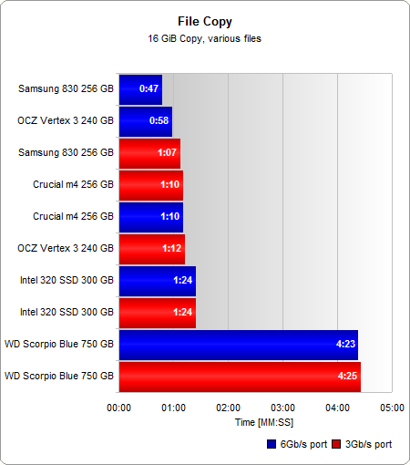

# SSD diskai

Pakalbėkime galiausiai apie tai, apie ką pakalbėti planavau dar nuo vasaros – Solid-state drive arba tiesiog SSD.

### Apie SSD

Duomenis kompiuteryje mes įpratę saugoti kietuosiuose diskuose, kurių pagrindas yra viena ar kelios magnetinės plokštelės, dideliu greičiu (nešiojamuosiuose kompiuteriuose 5400 apsisukimų per minutę, stacionariuose – 7200) besisukančios aplink savo ašį, su specialiomis mechaninėmis, skaitymo ir įrašymo galvutėmis, kurių dėka duomenys gali būti perduodami iš ir į kietąjį diską. Kietųjų diskų tobulinimas leido pasiekti gan dideles jų talpas ir ženkliai padidinti duomenų perdavimo spartą, tačiau esminiai technologijos pagrindai išliko smarkiai nepakitę nuo pat HDD sukūrimo. Kietasis diskas vis tiek išlieka mechaniniu įrenginiu, kuris sudarytas iš judančių dalių, kurios gali sugesti, be to, eikvoja pakankamai nemažai elektros energijos, o mechaninė disko pusė lemia ir tai, jog kai kurių spartos apribojimų išvengti nepavyks išvis.

Šiuos trūkumus ir pašalina naujieji Solid-state kaupikliai. Jų pagrindas – NAND flash atmintis. Iš tiesų mikrovaldiklis ir flash atminties lustai ir sudaro didžiąją viso kaupiklio dalį. Kadangi juose nėra jokių mechaninių dalių, nelieka ir tokių kietųjų diskų spartą ribojančių veiksnių kaip disko įsisukimo ar takelio išrinkimo laikas. Lyginant su HDD, žymiai sumažėja bendra kreipimosi į kaupiklį trukmė, kas ypač padidina įvesties ir išvesties operacijų per sekundę skaičių (IOPS). Duomenys į SSD kaupiklį įrašomi lygiagrečiai į atskirus lustus (netgi atsitiktiniai smulkių duomenų blokų rašymai dažniausiai vykdomi paraleliai), taigi nuo jų kiekio kai kuriais atvejais taip pat priklauso gaminio sparta. Panaudojus pakankamą kiekį greitų flash atminties mikroschemų galima pasiekti tokius skaitymo ir rašymo greičius, kurie neįmanomi net ir su pačiais greičiausiais kietaisiais diskais. Kitaip nei kietuosiuose diskuose, kai duomenys skaitomi ir rašomi greičiausiai disko išorėje, kur sektorių skaičius didžiausias, SSD kaupikliuose duomenų perdavimo sparta yra vienoda visame įrenginyje.

Judančių dalių nebuvimas įtakoja ir mažesnes energijos sąnaudas (energija nereikalinga varikliuko, sukančio HDD plokšteles maitinimui bei galvučių judėjimui virš disko plokštelių). SSD diskas taip pat neskleidžia visiškai jokio garso ir įprastai veikia vėsiau už kietąjį diską. Mechaninio gedimo galimybė taip pat tampa lygi beveik nuliui. Aišku, tyčinių „sužalojimų“ neturiu omenyje, tačiau kritimas ant žemės SSD dažniausiai neturės jokių neigiamų pasekmių. Tai ir yra pagrindinės priežastys kodėl šio tipo diskai tokie patrauklūs naudojimui nešiojamuosiuose kompiuteriuose. Jie ne tik leidžia mažinti tokių kompiuterių storį (gauname ultrabook tipo nešiojamuosius kompiuterius), atsparumą nuo duomenų praradimo, tačiau ir prailgina akumuliatoriaus darbo laiką.

Tad kodėl vis dar nenaudojame SSD visuose kompiuteriuose? Pirmoji, ir ko gero svariausia priežastis yra jų kaina. Naujos technologijos visada kainuoja brangiai ir taip yra ir SSD atveju. Jeigu vieno gigabaito kaina įprastame kietajame diske nesiekia net pusės lito, tai vieno gigabaito kaina SSD kaupiklyje gali siekti apie 4, o kartais ir kur kas daugiau. Tai tiesiogiai įtakoja ir SSD talpą, kuri modeliams su SATA jungtimi šiuo metu teoriškai siekia iki 1 TB, tačiau tokie diskai vis dar negaminami. Tiesa, yra sukurtas ir ne vienas SSD kaupiklis jungiamas PCI-E magistrale. Ji pasirinkta dėl didelio pralaidumo, kadangi netgi SATA 3 užtikrina tik iki 6 Gbps pralaidumą, kurį galima nesunkiai viršyti naudojant ne vieną o porą kontrolerių, bei sparčiąją flash atmintį.

Akivaizdu, kad jau ilgą laiką kardinaliai nesikeitę ir užsibuvę mūsų gyvenimuose HDD diskai, bei jų rinka po truputis jau ims trauktis. SSD kainos per praėjusius 2012-tuosius metus sumažėjo apie 35%.  Šiuos metus analitikai vertina net ir dar palankiau ir teigia, kad metų pabaigoje naujų flash atminties tipų, bei pingančių technologinių procesų pagalba SSD kainos gali sumažėti net iki 50%. HDD dar tikrai kurį laiką užsibus mūsų gyvenimuose, sugebėdami laimėti prieš SSD kainos atžvilgiu, tik jiems reikės pigti dar gerokai labiau. Dabartinius 1TB modelius už tą pačią kainą jau ne ilgai trukus turėtų pakeisti 3TB modeliai. Taipogi dabar vis labiau tampa populiaru naudoti hibridinį variantą – HDD ir SSD diskų porą, kai SSD skirtas tik OS ar reikalingiausioms programoms, o talpusis HDD naudojamas didelių bylų, kaip kad filmai, muzika ir etc. saugojimui.

### SSD dėvisi

Fash atmintis, naudojama SSD gamyboje, yra dviejų tipų: MLC (Multi Level Cell) arba SLC (Single Level Cell). Daugiau įrašymo lygių turinti atmintis kol kas naudojama nebent pigioms USB atmintinėms. Pirmoji rūšis yra pigesnė gaminti, kadangi duomenys atminties ląstelėje saugojami ne vienu lygiu, kaip SLC, o dažniausia dviem. Vienintelis MLC privalumas yra kaina: už tuos pačius pinigus į atmintį galima „sukišti“ dvigubai daugiau duomenų. Praktiškai visi šiuo metu paprastam vartotojui įperkami SSD kaupikliai turi įmontuotus būtent MLC NAND lustus. Spartos atžvilgiu šios technologijos atmintis nusileidžia SLC (tai dažniausiai matyti net SSD specifikacijose lyginant maksimalius linijinio įrašymo greičius), taip pat ji pasižymi ir didesne klaidų atsiradimo tikimybe ir mažesne tarnavimo trukme. Po konkretaus įrašymo ciklų flash atmintis „nusidėvi“ ir nebegali patikimai išsaugoti duomenų. SLC atveju įrašymo ciklų skaičius vienai tokiai ląstelei gali būti 10 ar daugiau kartų didesnis nei MLC atveju. Pereinant prie naujesnės Flash atminties gamybos technologijos su mažesniais elementų matmenimis, įrašymo ciklų skaičius vis labiau sumažėja. 50 nm NAND atmintis paprastai gali atlaikyti apie 10000 įrašymo ciklų, 34 nm – 5000, o 25 nm – tik 3000.  Tačiau nereikėtų išsigąsti. Net ir pigesni šiuolaikinės kartos SSD diskai jums tarnautų apie 4-5-erius metus, jeigu kiekvieną mielą dieną į jį įrašytumėte po 40GB duomenų. Tad jaudintis tikrai nėra dėl ko, nes tai aktualiau nebent dideliems serveriams, kuriuose SSD nebūtų galima naudoti, nes kiekvieną dieną tokiuose serveriuose įrašomi ir ištrinami šimtai GB informacijos.

### SSD spartos mažėjimas

Kitas neigiamas aspektas yra SSD spartos mažėjimas bėgant laikui. Kitaip nei kietuosiuose diskuose, kur nauja informacija yra tiesiog rašoma ant senosios, flash atmintis turi būti pirmiausia ištrinama prieš įrašant naują informaciją. Deja, flash atminties negalima trinti po vieną puslapį (4 kB). Iš karto tenka ištrinti visą bloką, sudarytą iš kelių puslapių, kuriuose gali būti ir reikalinga informacija, kurią reikia išsaugoti, tad ji perkeliama į laikinąją atmintį, iš kurios turi būti grąžinama atgal į flash atmintį. Taigi nuolat naudojant kaupiklį bei trinant ir vėl į jį rašant naujus duomenis, susidaro tokie „pustuščiai“ blokai, dėl kurių, vėliau bandant įrašinėti duomenis ir sumažėja kaupiklio sparta.

### SATA3 vs SATA2

Kalbant apie SATA3, tai manęs žmonės kartais klausia ar apsimoka pirkti SSD diską, jei neturi SATA3 jungties, o kompiuteryje yra tik senesnioji SATA2. Klausimas atrodo logiškas, nes atrodo, kad tokiu atveju sparta turėtų būti nukertama ir galbūt likęs spartos priaugis susidaro ne toks jau ir didelis lyginant su HDD diskais.

Iš tikrųjų tai ne visai tiesa. Taip, yra situacijų, ypač jei mėgstate maksimaliai užkrauti sistemos resursus, kai motininė plokštė, kartu su SATA3 siūloma 6Gbps sparta suteikia nemažai papildomo spindesio SSD diskams. Tai labai gerai atvaizduoja sintetinių kompiuterių testų (vadinamųjų benchmark) rezultatai, kurie gali skirtis dvigubai. Jeigu jūsų biudžetas leidžia, žinoma geriau jei naudosite naujausias technologijas ir atsinaujinsite motininę plokštę į tokią, kuri jau turi SATA3. Taip išspausite kiekvieną spartos lašą, o taipogi užsitikrinsite technologijų palaikymą artimiausiai ateičiai. Tačiau visgi jeigu biudžetas pas jumis ribotas, tai kuo puikiausiai galite išsiversti ir su SATA2 variantu. Realiose gyvenimo sąlygose, kai atliekami paprasti kasdieniniais veiksmai, kaip failų kopijavimas, operacinės užkrovimas, įrašymas į diską ar failų paieška, skirtumo tarp SATA2 ir SATA3 praktiškai net nesimato. Štai pažiūrėkite į šiuos du grafikus:

Kad pajusti gan nemažą SATA3 pranašumą, jums reikia įsigyti jau brangesnės klasės, o tai reiškia taipogi ir atitinkamai gerokai brangesnį SSD diską. Tad pagrindinė kova šiuo metu iš tikrųjų persikelia iš SATA2 vs SATA3 į HDD vs SSD aikštelę. Kaip matot iš tų pačių grafikų, SSD spartos padidėjimas lyginant su WD Scorpio Blue kietuoju disku sudaro daugiau nei 30%, net ir imant lėčiausią teste naudotą SSD diską. Ką tai reiškia mūsų gyvenimuose? Ogi tai, kad 16GB duomenų nukopijuojama vos per minutę, o kai kalba eina apie operacinės sistemos užkrovimą – skaičiukai dar labiau džiuginantys: pagreitėjimas lyginant su HDD iki 3 kartų! Net ir su Windows 7 kompiuteris naudodamas SSD užsikrauna maždaug per 20 sekundžių, nė nekalbu apie Windows 8, kuriuos tinkamai susikonfigūravus galima kompiuterį paruošti darbui per stulbinamas 4 sekundes!

Taigi, atsakant į pradinį klausimą – tikrai apsimoka pirkti SSD, net jei ir neturite SATA3, tik tokiu atveju neišlaidaukite ir neieškokite pačio sparčiausio SSD disko. Pinigų išleisit daugiau, o papildomos spartos iš to neišlošit. Geriau pasiieškokit kiek lėtesnio, tačiau išties  kokybiško ir patikimumo vardą užsitarnavusio gaminio. Pakeitę savo senuką HDD į SSD tikrai pajusite visiškai kitokio lygio spartą, o ir būsite sutaupę šiokį tokį šusnelį litų. Gyventi lūkesčiais, kad _va dabar nusipirksiu sparčiausią SSD, o vat kada nors, už poros metų, kai jau turėsiu naują kompiuterį, tai šitą SSD diską persimesiu ten ir galiausiai galėsiu mėgautis pilna SATA3 suteikiama sparta_ – tikrai nereikia, nes praėjus tiems porai metų, SSD diskai ne tik, kad smarkiai bus atpigę lyginant su dabartiniais, tačiau jau bus visiškai kitokių standartų, kaip kad talpa (dabar įprastai perkami nebent 64 ar 128 GB variantai), bei žinoma sparta (kiekvienais metais pasirodanti nauja SSD karta atneša gan ryškų realų pagreitėjimą), tad jūsų tas „išsvajotasis“ upgrade’as bus jau morališkai pasenęs ir nuėjęs šuniui ant uodegos. Tiesiog nereikia persistengti. SSD yra tikrai geras būdas įkvėpti naujo gyvenimo savo kompiuteriui, tačiau jei jau dabar neturite įrangos sugebančios išspausti viską ką SSD sugeba geriausio, tai ir pirkite tokį SSD, kuris nebūtų per ne lyg ambiciningas jūsų kompiuteriui.

### Nusipirkau SSD diską. Ką turėčiau atlikti?

1\. Pirmiausia, tai įjungti AHCI SATA režimą savo BIOS’uose, nes tikriausiai jei naudojote HDD – jūsų SATA režimas bus nustatytas į IDE, kuri yra sena technologija, pagrinde vis dar naudojama tik dėl suderinamumo su senesne geležimi. Tai padaryti galite nukeliavę į BIOS įrenginių nustatymus ir susiradę punktą SATA mode.\
Turėkit omenyje, kad SATA režimą nusistatyti reikia prieš instaliuojant Windowsus. Jei pirmiau suinstaliuosite, o tik vėliau pastebėsite, kad SATA režimas visgi buvo nustatytas netinkamai, tai nustatymo pakeitimas jokio pranašumo visiškai neduos, nes jūsų Windowsai suinstaliuoti jau tokiu režimu, koks buvo nustatytas instaliacijos metu. Pakeisti jį galima, bet tam reikia lysti į windows registrą.

2\. Jei jūsų kompiuteris turi naujausį UEFI interfeisą vietoj senukų BIOS, tokiu atveju jums reikėtų Windowsus instaliuoti UEFI režimu. Kaip tai padaryti – [jau pasakojau](http://reanimated.lt/instaliuojame-windows-su-uefi-rezimu).

3\. Instaliuojant Windowsus, atjunkite visus kitus diskus. Taip užtikrinsite, kad boot particija nebūtų įrašytą į lėtesnį HDD diską, kuris lėtins operacinės užkrovimą.

4\. Kai baigsite instaliuoti šviežius Windowsus ir susitvarkysite su visai driveriais, tai būtinai nubėkite į savo SSD disko gamintojo puslapį ir patikrinkite ar nėra firmware atnaujinimo. Dažniausiai per tą laiką kol jūsų SSD gulinėjo sandėliuose, lentynoje ir iki kol atkeliavo į jūsų rankas, buvo išleistas vienas kitas atnaujinimas, kuris gali padidinti spartą, energetinį efektyvumą ar net ištaisyti rimtas, galbūt net SSD gedimą lemiančias klaidas. Geriausia jei tai atliksite dar net ir prieš instaliuojant windowsus.

5\. Na ir galiausiai užbėkite į MyComputer -> Properties ir atlikite ten esantį Windows Experience Index testą. Šio testo metu Windowsai nustatys, kad jūs naudojate SSD ir atjungs kelias operacinės sistemos funkcijas, tokias, kaip kad disko defregmentavimas, kuris turint SSD yra visiškai nereikalingas, bei tik be reikalo naudoja ir taip jūsų ribotą įrašymų į diską kiekį.

Sekančiame įraše planuoju papasakoti apie universalų Windowsų optimizavimą, tinktantį tiek HDD tiek ir SSD savininkams. Darysime, kad windowsai atlikinėtų kiek įmanoma mažiau nereikalingų veiksmų su šiais diskais. Čiuz.
