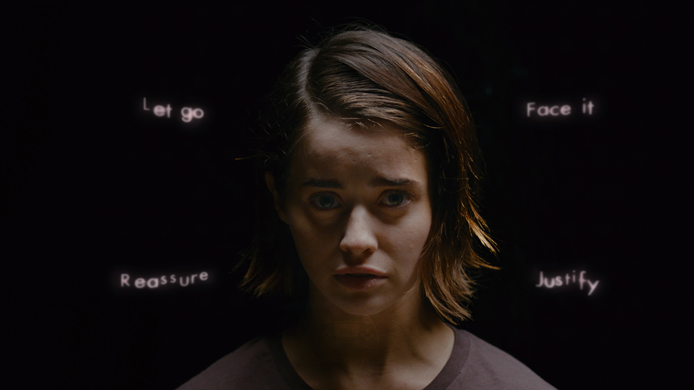

# Erica

Teoriškai FMV \(Full motion video\)
 interaktyvūs filmai skamba, kaip išties labai originali, lengvai žiūrovus sudominanti ir marketingo mylima ir lengvai reklamuojama idėja. Tokia tarpinė media forma tarp kino filmo ir žaidimo, kurioje žiūrovui rodoma istorija, kino filmas, bet paliekant nedideles galimybes žiūrovui įtakoti istorijos eigą. Vienas iš geriausiai žinomų to pavyzdžių Black mirror Bandersnatch epizodas Netflix'e. Nors daugeliui jis didelio įspūdžio visgi nepaliko, tačiau čia jau istorijos ir jūsų skonio reikalas, nes pats išpildymas visgi buvo gan kokybiškas.

Deja kol kas vis dar neteko susidurti su tokios idėjos įgyvendinimu, kuris nebūtų nuviliantis, išties derėtų konkrečiai tik šiam unikaliam formatui, o nebūtų kino filmui tiesiog pritempiamos kelios galimos pabaigos ir kuris išties pasiteisintų ir paliktų įspūdį. Tačiau vilties neprarandu, potencialo yra, tiesiog reikia gero, įtraukiančio ir apgalvoto scenarijaus autoriaus, kuris mokėtų tai išnaudoti.

Šis britų kurtas trileris ant PS4 konsolės, pavadinimu Erica taipogi pabandė savo šansą, deja prašovė net keliais aspektais.

Pirmiausia, tai interaktyvių elementų pridėta per daug ir ne vietoje. Tikrai nebūtina duoti žaidėjui atlikinėti kiekvieno monotoniško stalčiaus, durų ar dėžės atidarymo, kai realiai tai nieko nelemia, o kito galimo pasirikimo net ir nėra. Tai veikia pirmus kelis kartus, nes įdomu ir žiūrovas taip supažindinamas su dinamika.  Tačiau bekartojant vis tą patį gan greit nusibosta ir pamatai, kad tai tiesiog nieko nepriduodantis novelty, kuris iš esmės tik lėtina istorijos progresiją.

Aktoriai ir jų vaidyba taipogi toli gražu nebuvo stiprioji pusė, tačiau tai dar galima būtų ir praleisti pro akis. Nieko gero, bet netragiška.

Tačiau blogiausia dalis, tai istorija. Visiškai neįdomi, neįtraukianti, neįtikinanti siaubo ir mystery elementų turinti istorija apie okultizmą primenanti gan eilinį britišką detektyvą rodomą per tv kokį ketvirtadienio vakarą per BTV. Pabaiga lyg ir dar turi pretenzijų palikti atvirus galus, kad būtų galima ją suinterpretuoti keliais skirtingais būdais, panašiai, kaip Shutter Island, kai kyla abejonių ar visgi psichas buvo pagrindinis veikėjas ir kiti visą laiką sakė tiesą ar visgi išties pakliūta į kažkokį sąmokslą ir padarei teisingai juo nepatikėjęs. Tik skirtumas, kad tame filme tai buvo atlikta gerai ir skoningai, o čia viskas susidėlioja per daug akivaizdžiai, o ir iki pabaigos momento, tai jau tiesiog nebelabai ir berūpi. Tiek ir bendrai visa istorija, tiek ir veikėjai. Ir nors surinkti visus likusius achievement'us, jog atrakinti platininį, pasiekiant likusias žaidimo pabaigas ir nebūtų taip jau sudėtinga, tačiau prisiversti visą tai peržiūrėti dar kokius papildomus 5-is kartus, jau tiesiog per sudėtinga. Tiek kantrybės neturiu.

