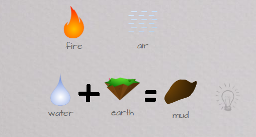

# Little Alchemy

Reikia pripažinti, kad iš manęs tikrai nesigauna gabus gameris. Žaidžiu tikrai retai, o ir žaidimus atsirinkinėju ilgai. Nesiimu žaisti belenko, nes toli gražu ne kiekvienas žaidimas patinka, o ir šiandieniniai žaidimai neretai nesugeba pasiūlyti nieko originalaus ir tiesiog slepiasi po gražios grafikos apvalkalu. Žaidžiant juos gali nejausti skirtumo tarp dešimties panašių žaidimų. Va, labai geras pavyzdys dėl [FPS’ų](http://www.google.lt/imgres?um=1&hl=en&sa=N&biw=1440&bih=838&authuser=0&tbm=isch&tbnid=joEdt2N0HR7sXM:&imgrefurl=http://grognardia.blogspot.com/2011_06_01_archive.html&docid=5wEOlXaEj48RnM&imgurl=http://1.bp.blogspot.com/-GHYtk4wk5Lk/TgDjW-FMgTI/AAAAAAAADSA/9hA1S6kFaxs/s1600/fps-map-design.jpg&w=673&h=538&ei=--RtT66xFsyM4gT42um_Ag&zoom=1). Dėl tos priežasties mane labiau domina kitokios sferos, indie kūrėjų žaidimai, kaip kad Limbo \(būtinai parašysiu\), kurie sugeba pažiūrėti į žaidimą kitaip. Originaliai.

Būna kartais, kad turi laisvas 20 min ir neturi kaip jas praleisti. Kažkas tokiais atvejais sėdi facebook’e, kuriame aš nelabai turiu ką veikti, kažkas naršo 9gag’e, o vat kažkas įsijungia ką nors paprasto pagame’int. Ar tai būtų kokie Angry Birds’ai facebook, ar tai Bejeweled pas G+.

Šį kartą parodysiu itin paprastą, tačiau žavų ir netikėtai įtraukianti žaidimuką, kaip Little Alchemy.

Žaidimukas remiasi rytuose populiaria filosofija, kad viskas ką matome susidaro iš 4 bazinių elementų: žemė, ugnis, oras, vanduo. Taigi, turime šiuos keturis elementus, kuriuos galime jungti tarpusavyje ir gauti naujus, kurie taipogi su kažkuom jungiasi. Pvz sujungus ugnį ir vandenį gauname garus, kurios sujungus su žeme, atrandame geizerį.

Šiuo metu žaidime yra išviso 250 atrakinamų elementų! Ir jų vis daugėja. Ir nors pati koncepcija ir atrodo vaikiška, tačiau garantuoju, jog per pirmas 10 minučių įsitrauksite ir jūs. Imi galvot ką čia dar būtų galima sujungti, net tada, kai nežaidi. Žinoma pirmieji elementai jungiasi ganėtinai elementariai, pvz sujungus vandenį ir vandenį, gauname jūrą, ar tai vandenį ir šalį – ledą, tačiau ne užilgo jums teks pasukti galvą ir pabūti tikrai kūrybingais, jog atrakintumėte visus galimus variantus. Yra išties juokingų ir originalių junginių, pvz, kaip kad sujungus lavoną su elektra, gauname Frankenšteiną ar uždėjus vaivorykštę ant vaivorykštės, gaunama Double Rainbow! =\)

Vienintelė problema, kad atrakinus 2/3 visų elementų, naujų atradimas pasidaro pakankamai sudėtingas ir ilgą laiką nieko neatrakinant apima frustracija. Na bet internete galima rasti krūvas hint’ų, kurie gali padėti pralaužti ledus, tačiau juos naudoti norisi kiek labiau privengti, nes kitaip žaidimas pasidaro nebeįdomus.

Taigi itin smagus, pralinksminantis, paprastas žaidimukas specialiai sekmadieniui. Geriausia, kad labai panašų rasite ir android sistemoje jūsų telefonams. Mobilioji versija gal ne tokia patogi, tačiau gali pasigirti net ir didesniu elementų kiekiu!

Give the mad scientist that lives within you a chance to see the light of day! Sėkmės kuriant ir atrandant. Na ir užmušinėjant savo laisvą laiką!

[Google Chrome savininkams](https://chrome.google.com/webstore/detail/knkapnclbofjjgicpkfoagdjohlfjhpd)

[Little Alchemy žaidimas tiesiog našyklėje ](http://littlealchemy.com/)

