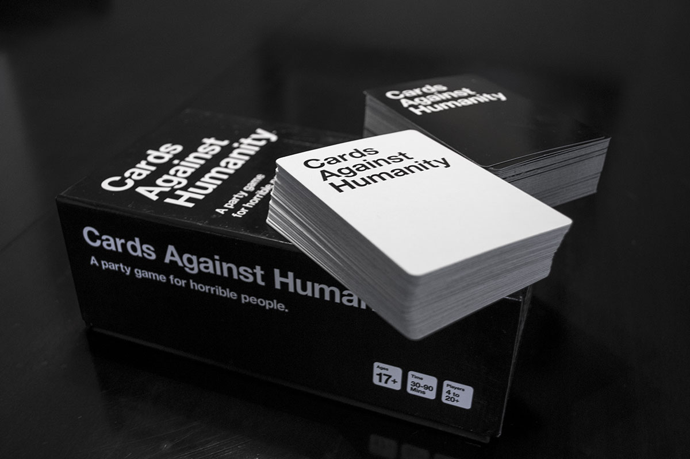
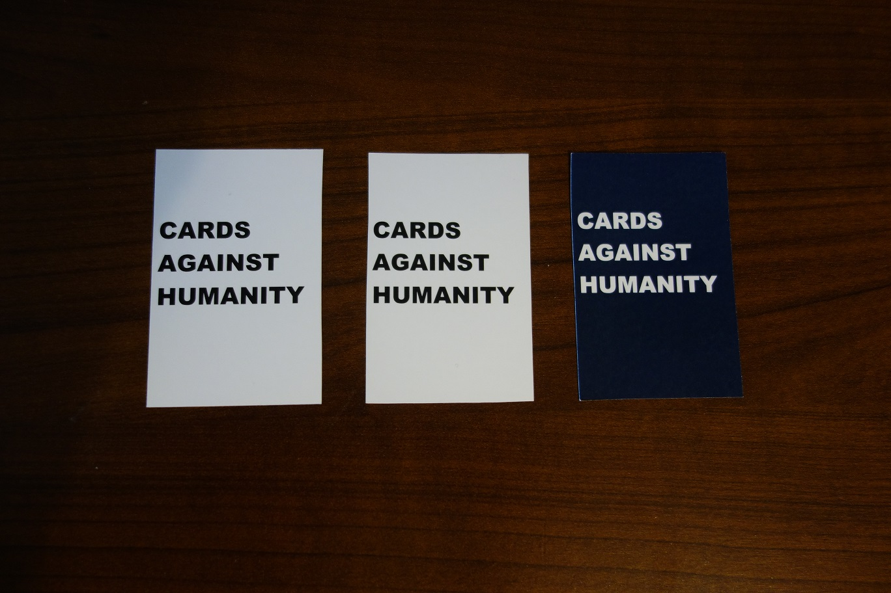
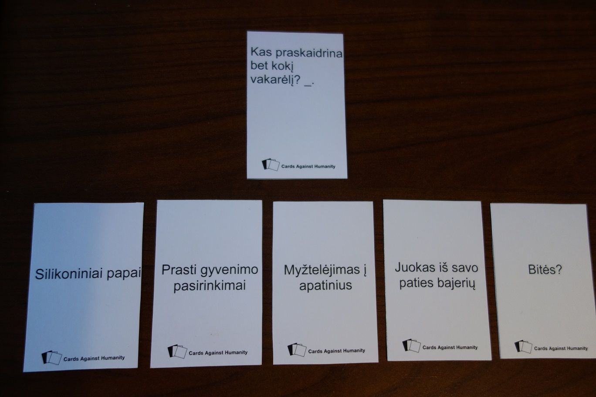
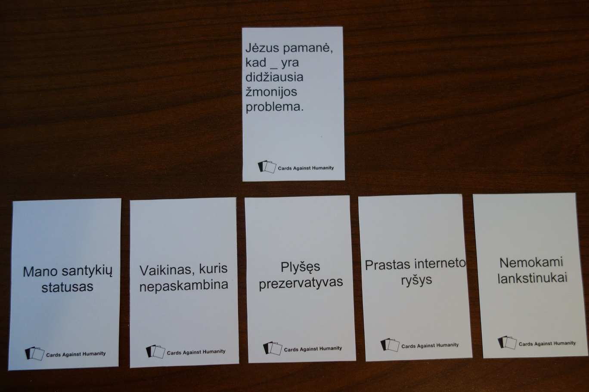

# Cards Against Humanity

2010-tais metais Highland Park aukštosios mokyklos studentai sugalvojo nuotaikingą žaidimą naujųjų metų šventimo vakarėliui. Žaidimo esmė buvo į vieno žaidėjo užduotą klausimą atsakyti kiek įmanoma labiau absurdišku, visus prajuokinančiu atsakymu. Iš esmės, tai žaidimo [Apples to Apples](http://en.wikipedia.org/wiki/Apples_to_Apples) variacija, praturtinta nekorektišku, juodu humoru. Žaidimas tą vakarą nusisekė puikiai, susilaukė nemažai pagyrų, tad žaidimo kūrėjai pakoregavę savo viziją nusprendė sukurti minios finansavimo svetainės Kickstarter projektą, kuriame iškėlė tikslą per mėnesį surinkti 4 000$ ir atspausdinti šį juodojo humoro praturtintą kortų žaidimą visiem paaukojusiems. Užsibrėžtas tikslas buvo pasiektas vos per pirmas dvi savaites, o projekto pabaigoje buvo surinka jau 15 000$, kitaip tariant 400% daugiau, nei tikėtasi. Atsidėkodami kūrėjai prie žaidimo pridėjo dar 50 papildomų kortelių, na o vos per mėnesį nuo išleidimo, žaidimas jau buvo įšokęs į geriausiai parduodamo žaidimo, Amazon internetinėje parduotuvėje, poziciją. Tokia buvo Cards Against Humanity istorijos pradžia.

Žaidimas po išleidimo susilaukdavo vis daugiau dėmesio ir tapo ypač populiarus, nors oficialiai parduodamas tik Šiaurės Amerikoje, Britanijoje ir Australijoje. Šiuo metu jau yra išleisti net 5 kortų papildymai, pridedantys po 112 naujų kortų, bei trys tematiniai papildymai, kaip kad „90s Nostalgia Pack“. 2013-tais Black Friday proga kūrėjai paskelbė anti-išpardavimą, kurio metu sugalvojo šio stalo žaidimo kainą pakelti ir nepaisant to pardavimai vis vien augo. Tai parodo kokio didelio susidomėjimo šis žaidimas susilaukė. Neoficialiais duomenimis šis kūrinys jau uždirbo apie 12 milijonų dolerių. Neblogai, kaip studentams vos per 3-erius metus.

Geriausia žinia, kad šis žaidimas yra platinamas su Creative Commons BY-NC-SA licenzija, kuri reiškia, kad žaidimą galima laisvai kopijuoti, perdarinėti tol, kol šios kopijos nėra platinamos už pinigus. Tad bazinę žaidimo versiją, be jokių papildymų galima parsisiųsti tiesiogiai iš kūrėjų puslapio ir atsispausdinus korteles iškarto pradėti žaisti. Problema tik ta, kad kadangi žaidimas yra orientuotas į Amerikos rinką, tai tiek ir kortelės yra angliškos, kas galbūt bus sunkiau vienam ar kitam jūsų draugui, tiek ir dalis juokelių yra ne itin suprantami aktyviai nesidomint vidiniais Amerikos reikalais, žvaigždėmis, aferomis ir intrigomis. Kadangi labai mėgstu juodąjį humorą ir labai norėjau išbandyti šį žaidimą, tačiau lietuviškos oficialios versijos nėra, nusprendžiau ją pasidaryti pats. Ne tik, kad išverčiau pačias juokingiausias korteles, tačiau sugalvojau nemažai naujų, ne ką mažiau absurdiškų, na ir galiausiai, žinomus žmones pakeičiau mūsų šalies atitikmenimis. Leidau pasireikšti vaizduotei ir rezultatas, manau, gavosi išties neblogas. Juokingas, absurdiškas, nesąmoningas, tačiau būtent dėlto ir juokingas, o kartais provokuojantis ir gan taiklias įžvalgas ir svarbiausia – baisiai erzinantis konservatiškus žmones, žaidimas. Kadangi noriu, kad jį atrastų ir lietuviai, tai dalinuosi juo su visais.



Keletas pavyzdžių iš mano žaidimo variacijos:

### **Žaidimo taisyklės**

-Pradedant žaidimą, vienas žaidėjas tampa kortų caru – tai yra užduodančiu klausimą. Caras traukia vieną juodą klausimo kortelę ir žvilgtelėjęs į kortelę visiems praneša kiek atsakymų reikės šiai partijai. Jei kortelėje yra du tarpo simboliai „\_“, iš kiekvieno žaidėjo bus reikalingos dvi atsakymo kortelės. Visi kiti žaidėjai traukia po 5 baltas atsakymų korteles. Jei caras praneša, jog partijai reikalingos 2 atsakymų kortelės – visi traukia po vieną extra kortelę, kad turėtų daugiau kombinacijų. Kortų caras atsakymuose nedalyvauja, tad atsakymo kortelių sau netraukia.

-Visiems baigus traukti kortas, caras garsiai perskaito klausimą, vietoj ženklo „\_“ tardamas „tarpas“. Perskaitęs klausimą padeda kortelę ant stalo, jog visi kiti žaidėjai matytų.

-Kiekvienas dalyvis parenka jo nuomone juokingiausią atsakymą iš rankoje laikomų baltų atsakymo kortelių ir padeda užverstą kortelę prie kortų caro į bendrą krūvelę.

-Visiems padėjus savo atsakymus, kortų caras atsakymų korteles išmaišo, kad nežinotų kur kieno atsakymas.

\*Dėmesio\*, jei atsakymas reikalavo 2 kortelių, tai žaidėjai atsakymus turi padėti nesumaišant kortų su kitų žaidėjų kortelėmis. Tokiu atveju dalyviai savo korteles atsitiktine tvarka išdėlioja ties užsimerkusiu caru krūvelėmis po dvi į vieną eilutę. Atsimerkęs caras nebežino kuri krūvelė priklauso kuriam dalyviui ir savo nuožiūra paima po vieną porą ir perskaito atsakymus. Kortelė padėta apačioje skaitoma pirmesnė, kad nesusimaišytų atsakymo kortelių eiliškumas.

-Kortų caras pakartoja savo klausimą garsiai, tačiau šį kartą vietoje tuščių vietų įstatydamas žaidėjų atsakymus. Visi smagiai pasijuokia iš atsakymų. Tuomet caras išrenka jam labiausiai patikusį atsakymą ir žmogus, padėjęs laimėjusią kortelę švenčia pergalę ir gauna 1 nuostabumo tašką. Partijos pabaiga.

-Po kiekvienos partijos, kortų caru tampa sekantis, po kaire nuo caro sėdintis žmogus, kuris laikinai tai partijai pasideda savo atsakymų korteles į šalį, nes atsakymuose nedalyvauja. Visos per partiją panaudotos kortelės išmetamos iš žaidimo, o žaidėjai vėl traukia po tiek baltų kortelių, kiek išnaudojo per praėjusią partiją. Kitaip tariant kiekvienas dalyvis kiekvienos partijos pradžioje turi turėti po 5 baltas korteles.

-Jei žaidėjas turi kelias korteles, kurios jo nuomone itin tinka atsakymui ir negali išsirinkti kuri yra geresnė, gali atlikti lošimą apie tai pranešęs kitiems žaidėjams ir padėti iškarto kelis atsakymus. Jei kortų caras išrinks bet kurią iš šių atsakymų kortelių, lošimą atlikęs narys gaus daugiau nuostabumo taškų. Taškų kiekis priklauso nuo padėdų papildomų kortelių kiekio. T.y. jei žaidėjas 1 atsakymo kortelės reikalaujančiam atsakymui iškarto statys 2 kortas – gaus 2 taškus, o jei turės net 3 atsakymus, tai išlošęs gaus 3 taškus. Tačiau jei nei viena kortelė nelaimės, žaidėjas gauna baudą: kiekviena papildomai panaudota kortelė iš žaidėjo minusuojama. T.y. jei žaidėjas turėjo 5 atsakymų korteles, atsakymui reikėjo 1-os, tačiau jis darė statymą ir padėjo dvi, tačiau nei viena jų nelaimėjo, tai ta papildoma kortelė minusuojama ir nuo šiol žaidėjas rankoje galės turėti ne be 5, o tik 4 žaidimo korteles. Praradęs visas korteles, žaidėjas krenta iš žaidimo.

-Sukauptus taškus galima panaudoti, jei netenkina rankoje turimos kortelės. Garsiai paskelbus kitiems žaidėjams, jog turimos kortelės parduodamos, iš žaidėjo numinusuojamas vienas nuostabumo taškas ir šis gali išmesti visas rankoje turimas korteles ir pasiimti tokį patį kiekį naujų. Žinoma, tai galima atlikti tik jei žaidėjas turi bent 1-ą tašką.

-Žaidimą laimį tas, kuris visiems nusprendus žaidimą užbaigti, turi daugiausiai nuostabumo taškų.

### **\*Papildomi žaidimo variantai**

-Kadangi žaidimas puikiausiai žaidžiasi vakarėliuose, alkoholinių gėrimų apsuptyje, tai galima įsivesti kelias papildomas taisykles dėl smagumo: kortų caras išrenka ne tik geriausią, tačiau ir jo manymu labiausiai netinkančią kortelę. Netikusios kortelės savininkas turi išgerti.

-Kiekvienos partijos metu, prieš išmaišydamas korteles į atsakymų krūvelę caras prideda vieną kortelę iš baltų kortelių krūvos. Tai bus papildomas žaidėjas, kuris vadinamas „randomu“. Jei caras išrinks randomo kortelę juokingiausia – žaidėjai pripažįsta savo beviltiškumą ir šį kartą turi išgerti visi, įskaitant ir patį carą.

Žaidimą galite atsispausdinti patys bet kurioje spausdinimo paslaugas teikiančioje parduotuvėje. Nurodykite spausdinti iš dviejų pusių. Jei norite ilgaamžiškumo ir labiau tikro kortų žaidimo pojūčio, siūlyčiau spausdinti ant storesnio, 280g popieriaus, tačiau tokiu atveju tai smarkiai iškels tokio spausdinimo kainą ir žaidimas jums jau gali kainuoti per 100lt. Ateityje planuoju žaidimą koreguoti, pataisyti klaidas ir pridėti naujų kortelių, tačiau antrą kartą spausdinti visko ne be reikės, tad iš esmės tai tik vienkartinės sąnaudos. Atsispausdinate, namie išsikarpote korteles ir turite savo nuosavą lietuvišką Cards Against Humanity variantą.

Laukiu jūsų jau sužaidusių mano „Kortų prieš žmoniją“ su pastebėjimais ir įspūdžiais ;\)



