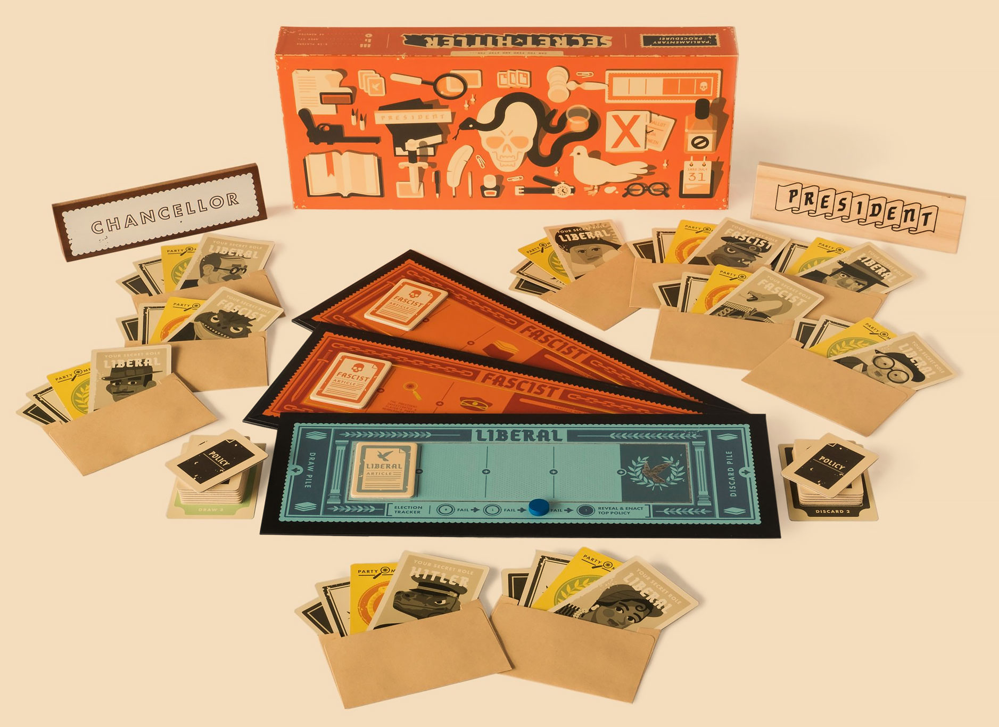
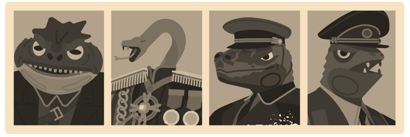
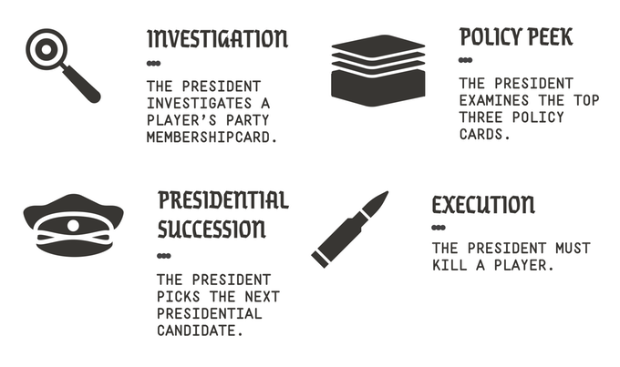
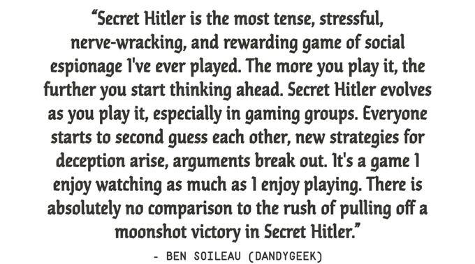

# Secret Hitler

Mėgstu stalo žaidimus, nes jie leidžia užimti susirinkusią į svečius kompaniją ir žaidžia net ir tie, kurių prie kompiuterinių žaidimų net nepasodintum. Vienintelė bėda, kad kai kuriais atvejais jei žaidimas išties labai simplistiškas ir neatrodo, jog jis bus žaidžiamas taip jau dažnai, mokėti dešimtis eurų už šio žaidimo korteles būna kiek gaila. Tokiais atvejais užsiimu ir pats pasidarau šio žaidimo versiją. Prieš porą metų jums papasakojau ir leidau parsisiųsti lietuvišką „[Kortos prieš žmoniją](http://reanimated.lt/kortos-pries-zmonija)“ versiją, šį kartą turiu pasiruošęs dar vieną puikų žaidimą, kurį pačiam pasigaminti tenka vien jau ir dėlto, kad šiuo metu žaidimas oficialiuose kanaluose yra išparduotas ir jo net negalima įsigyti.

Žaidimas intriguojančiu pavadinimu – [Slaptas Hitleris](http://www.secrethitler.com/).

Tai dramatiškas užslėptos tapatybės ir socialinės dedukcijos žaidimas, skirtas 5-10 žmonių kompanijai, kuriame netrūksta manipuliavimo ir blefavimo ir kurį žaidžiant reikia būti išties akylam, jog suprastum kas iš tiesų vyksta. Veiksmas vyksta 1932-aisiais, prieš antrojo pasaulinio karo laikotarpio Vokietijoje. Žaidėjai yra vokiečių politikai, kurie stengiasi išlaikyti trapią liberalų valdžią ir atsispirti prieš kylančią fašizmo bangą. Užduotis gan sudėtinga, nes jų tarpe jau yra infiltruotų fašistų, o vienas iš jų yra Slaptasis Hitleris. Jei jis pateks į valdžią – liberalai iškarto pralaimės. Politinės intrigos ir išdavystės – garantuotos. Šis žaidimas turi savybę gan greitai sukelti aistras ir ramiai jo sužaisti nepavyksta, tad būkite pasiruošę.

### Žaidimo taisyklės

Žaidimą sudaro trijų rūšių kortelės:

* rolės ir partijos kortelės \(po 10 vienetų, viena iš jų Hitlerio rolė\)
* įstatymų kortelės \(6 liberalūs ir 11 fašistinių įstatymų\)
* balsavimo kortelės \(po 10 vienetų „Ja!“ ir „Nein“\)

Rolės ir partijos kortelės sugrupuotos po dvi ir atitinka viena kitą: visos liberalų partijos kortelės gauna po liberalią rolę, o kiekvienai fašistinei partijos kortelei atitenka po fašistinę arba Hitlerio rolę. Žaidimas turi mechaniką, kad valdančiojoje valdžioje esantis žaidėjas gali įgauti galią patikrinti bet kurio žaidėjo partiją. Tokiu atveju yra rodoma partijos kortelė, kuri Hitlerio atveju išduos tik tai, kad žaidėjas yra fašistas, tačiau neatskleis jo tikrosios rolės. Korteles galima sudėti į vokelius, jog šios nesusimaišytų, tačiau tai nėra būtina.

Vienas žaidėjas privalo būti Hitleris ir jis negali būti vienintelis fašistas, o kadangi liberalų pagal taisykles turi būti daugiau, tai minimalus žaidėjų kiekis yra 5. Priklausomai nuo žaidėjų kiekio, skiriasi rolių kiekis bei naudojama žaidimo lenta:

* 5 žaidėjai: 3 liberalai, 1 fašistas ir Hitleris \(žino kas yra fašistas\)
* 6 žaidėjai: 4 liberalai, 1 fašistas ir Hitleris \(žino kas yra fašistas\)
* 7 žaidėjai: 4 liberalai, 2 fašistai ir Hitleris \(nežino kas yra fašistai\)
* 8 žaidėjai: 5 liberalai, 2 fašistai ir Hitleris \(nežino kas yra fašistai\)
* 9 žaidėjai: 5 liberalai, 3 fašistai ir Hitleris \(nežino kas yra fašistai\)
* 10 žaidėjų: 6 liberalai, 3 fašistai ir Hitleris \(nežino kas yra fašistai\)

5-6 žaidėjai naudoja lentą, kurioje nuo 3 fašistinio įstatymo prasideda papildomos galios, tuo tarpu 7-10 žaidėjų grupė žaidžia naudodami lentą, kurioje jau nuo antro fašistinio įstatymo prasideda privalumai. Ant pačios žaidimo lentos rasite žaidėjų kiekį.

#### **Rolių paskirstymas**

Taigi rolių ir partijų kortelių poros yra sudėliojamos užverstos ant stalo ir jų eiliškumas išmaišomas, jog niekas nežinotų kur yra kokios kortelės. Visi žaidėjai pasiima po kortelių porą ir pasižiūrį į savo slaptąją rolę. Žaidėjas tapo arba liberalu arba fašistu, tačiau vienas žaidėjas yra ne tik fašistas, bet ir slaptasis Hitleris. Jo tikslas yra būti išrinktam kancleriu, tačiau neišsiduoti ir nebūti nušautam.

#### **Nakties fazė**

Kai rolės jau yra paskirstytos, ateina naktis ir fašistai susipažįsta vienas su kitu: po instruktuojančio žaidėjo komandos visi žaidėjai užsimerkia ir padeda ranką ant stalo su sugniaužtu kumščiu. Tuomet duodama komanda ir atsimerkia tik tie kas yra fašistai, tačiau Hitleris nors ir yra fašistas, tačiau lieka užsimerkęs ir tiesiog nekeldamas rankos nuo stalo, pakelia nykštį. Fašistai susižvalgo ir susipažįsta kas bus jų evil kolegos ir kuris iš žaidėjų yra Hitleris. Tuomet po sekančios komandos visi vėl užsimerkia ir rankos patraukiamos nuo stalo, tuomet visi žaidėjai gali atsimerkti. Rezultatas: fašistai žino kas yra liberalai, kas yra fašistai ir kas yra Hitleris. Tačiau nei Hitleris, nei liberalai nežino nieko.

Kai žaidėjų yra mažesnis kiekis, žaidime dalyvauja tik vienas fašistas ir Hitleris, tokiu atveju nakties metu jie abu atsimerkia ir susipažįsta. Dalies su iškeltu nykščiu – nereikia. Tad žaidimas yra kiek įdomesnis, kai žaidžia didesnis kiekis žmonių.

#### **Valdančiosios valdžios rinkimas**

Valdančiąją valdžią sudaro du asmenys: prezidentas ir kancleris. Žaidimo pradžioje prezidentas išrenkamas atsitiktine tvarka \(galite ridenti kauliuką ar paskirti pirmuoju prezidentų jauniausią žaidėją ar pan.\). Kiekvieno roundo pradžioje į prezidentus kandidatuoja sekantis, pagal laikrodžio rodyklę sėdintis asmuo. Prezidentas skiria savo nominacija, ką norėtų paskirti kancleriu. Tuomet visi žaidėjai balsuoja už šią valdžią: ant stalo kiekvienas žaidėjas deda „Ja!“ arba „Nein“ kortelę ir visi kartu jas atverčia. Jei dauguma pritaria – naujoji valdžia išrinkta. Jei ne – prezidentu kandidatu tampa sekantis žaidėjas ir jis skiria savo kandidatą į kanclerius ir vėl balsuojama iš naujo.

#### **Įstatymų priėmimas**

Kai rinkimai baigiasi ir turima nauja valdančioji pora, prasideda įstatymo priėmimas: prezidentas iš įstatymų krūvos traukia tris užverstas korteles. Įstatymai yra arba fašistiniai arba liberalūs. Jis išmeta vieną kortelę ir likusias dvi paduoda kancleriui. Kancleris taipogi išmeta vieną kortelę ir likęs įstatymas yra priimamas. Kokios kortelės yra išmetamos parodyti negalima.

#### **Diskusijos**

Po priimto įstatymo kancleris ir prezidentas gali bandyti pasiaiškinti kas įvyko, ypač jei priimtas fašistinis įstatymas, nes kitiems žaidėjams tokia įvykių eiga kelia įtarimų. Galbūt prezidentas yra išties liberalus, tačiau jam nepasisekė ir ištraukė tris fašistines korteles, tad nei kancleris, nei prezidentas neturėjo pasirinkimo. Tačiau galbūt prezidentas yra fašistas ir ištraukęs du fašistinius ir vieną liberalų įstatymą, išmetė būtent pastarąjį ir pastatė kanclerį į situaciją, kai jam nieko nebelieka, kaip priimti fašistinį įstatymą. Žaidėjai gali garsiai aptarinėti, komentuoti ir dėstyti savo teorijas. Tai yra būtent ta dalis kurioje ir prasideda blefavimai, įtarinėjimai ir bandymas išaiškinti tiesą.

Po šios fazės roundas baigiasi ir renkama nauja valdžia.

#### **Žaidimo tikslai**

Žaidimą laimi liberalai, jei priimami 5 liberalūs įstatymai arba nužudomas Hitleris.  
Fašistai laimi žaidimą jei priimami 6 fašistiniai įstatymai arba jei Hitleris išrenkamas kancleriu po to, kai jau priimti bent 3 fašistiniai įstatymai.

### Papildomos žaidimo taisyklės

Žaidimo lentos apačioje yra skaitiklis, kuris yra paslenkamas į priekį jei nepavyksta išrinkti valdžios. Jei valdžios nepavyko išrinkti 5 kartus iš eilės – iš įstatymų krūvos paiimamas pats pirmas įstatymas ir jis automatiškai priimamas. Jei valdžia išrenkama sėkmingai – skaitiklis grąžinamas į pradinę poziciją.

Prezidentas negali kancleriu nominuoti žmogaus, kuris praėjusį ėjimą jau buvo valdžioje. Tačiau praėjusį ėjimą kancleriu buvęs asmuo gali tapti prezidentu. Ši taisyklė galioja tik išrinktiems žaidėjams, o ne nominantams.

Jei priimamas fašistinis įstatymas, prezidentas įgauna galią, nurodytą ant fašistinės žaidimo lentos: prezidentas gali patikrinti kito žaidėjo partiją, 3 pirmuosius įstatymų krūvoje gulinčius įstatymus, kuriuos trauks sekantis prezidentas arba nušauti kitą žaidėją. Šis bonusas turi būti panaudotas iškarto, kol nepasibaigė round’as.

### Žaidimo dinamika

Kadangi liberalų yra daugiau ir jie turi didesnę persvarą rinkimuose, vadinasi nei vienam žaidėjui nėra naudinga, jei jį įtarinėja esant fašistu. Liberalai visada balsuos prieš į valdžią bandantį ateiti išsidavusį fašistą, tad jis neteks galimybės manipuliuoti ir priartinti savo partiją prie pergalės. Dėlto fašistai kaip įmanoma stengiasi neišsiduoti. Tačiau kadangi fašistai vienas kitą pažįsta, jie gali padėti vienas kitam ir permesti įtarimus kitam žaidėjui ar aplinkybėms. Slaptieji fašistai turi neišsiduoti, bet tuo pat metu trukdyti priimti liberalius įstatymus ir priiminėti fašistinius. Tuo tarpu liberalai stengiasi kuo labiau parodyti, jog jie yra liberalūs, jog kiti liberalai suprastų, kad jie yra toje pačioje partijoje. Žinoma, kuo labiau žaidėjas tikina esąs liberalas, tuo didesnį įtarimą jis kelią. Kitaip tariant visi stengiasi atrodyti liberalūs, tačiau tikrai ne visi tokie ir yra.  Tai ir yra pagrindinis žaidimo dinamiką sukuriantis veiksnys. Fašistai manipuliuoja, o liberalai stengiasi dedukcijos pagalba išskaityti kas meluoja.

Nors ir yra ganėtinai logiška, kad liberali valdžia stengsis visada priiminėti tik liberalius įstatymus, tačiau yra aplinkybių, kai liberalas turėdamas pasirinkimą, gali vis vien priimti fašistinį įstatymą. Priežastis paprasta: liberalūs įstatymai nesuteikia jokių papildomų galių, tiesiog suteikia vieną tašką, priartinantį jų partiją prie pergalės, tačiau fašistiniai įstatymai, praplečia prezidento galias. Pvz. jeigu liberalus prezidentas yra beveik įsitikinęs, kuris žaidėjas galėtų būti Hitleris – jis gali priimti fašistinį įstatymą, kuris suteikia galią nušauti kitą žaidėją. Jei prezidentas buvo teisus ir nušautas iš tiesų Hitleris – liberalai iškarto laimi žaidimą. Nušautasis asmuo negali pasakyti, kuriai partijai priklausė, tiesiog atskleidžia ar jis buvo Hitleris ar ne. Jei prezidentas nepataikė, nušautasis žaidėjas iškrenta iš žaidimo ir tiesiog laukia pabaigos. Pašalintas partijos narys suteikia pranašumą konkuruojančiai partijai, nes atsiranda partijos narių kiekio disbalansas.

Būdamas liberaliu prezidentu ir ištraukęs du liberalius įstatymus ir vieną fašistinį, prezidentas susiduria su dilema: jis gali išmesti fašistinį ir kancleris garantuotai priims liberalų įstatymą ir taip priartins partiją prie pergalės, tačiau tokiu būdu prezidentas visiškai negaus jokių įžvalgų apie kanclerį. Arba gali išmesti liberalią kortelę, palikti pasirinkimą kancleriui, taip įgauti žinių apie kanclerio veiksmus, tačiau yra rizika, kad bus priimtas fašistinis įstatymas ir fašistų partija priartės prie pergalės bei padidės kitų žaidėjų nepasitikėjimas.

Nors balsų persvara ir yra liberalų pusėje, tačiau fašistinių įstatymų yra kur kas daugiau ir jie priimami dažniau.

Dažniausiai žaidimas laimimas priimtais 5 liberaliais įstatymais arba Hitlerio išrinkimu į kanclerius.

### Apie žaidimą

Hitlerio iškilimas į valdžią, kaip diktatoriui, buvo neįtikėtinai politiškas: jis nesinaudojo jėga, nuversta valdžia ar kilusia revoliucija, jog įgautų valdžios. Hitleris ir jo parankiniai metų metus manipuliavo demokratija ir pelnydavo vis daugiau galios. Savo priešininkus jis skaldė ir supriešindavo. Jo parankiniai buvo ypač gerai organizuoti ir brutalūs. Į kanclerio poziciją jis buvo paskirtas tų žmonių, kurie galvojo, kad gali jį kontroliuoti. Buvo nemažai gerų žmonių, kurie nežinojo koks pavojingas jis gali būti, kol jau nebuvo per vėlu.

Šis žaidimas labai gerai tai ir reprezentuoja. Nesiekiama atkartoti realių politinių įvykių, o tiesiog parodoma kaip gerai organizuota mažuma gali pasinaudoti sumišusia dauguma ir pasiekti savo tikslų. Sukuriamos situacijos, kurių metu žmonės lygiai taip pat gali nepastebėti akivaizdžių signalų, kurių metu net ir draugiškoje turėjusioje būti partijoje kyla paranoja ir nepasitikėjimas ir bandymas ištaisyti situaciją duodant valdžią „tinkamiems žmonėms“. Secret Hitler sukuria House of Cards lygio intrigas jūsų svetainėje.

Žaidimas sukurtas 2015-aisiais metais, kai Kickstarter finansavimo platformoje surinko 20 kartų daugiau lėšų, nei kad prašė. Pasisekimas, prie kurio sukūrimo ir prodiusavimo prisidėjo žmogus, taipogi dirbęs ir prie to paties „Cards Against Humanity“. 

### Atsisiųsti žaidimą

Šį kartą žaidimo neverčiau, nes kortelės teksto turi labai minimaliai ir jis yra visiškai suprantamas, net jei žaidėjas nesupranta angliškai. Atsiųstame dokumente rasite visas žaidimo korteles, prezidento ir kanclerio skirtukus ir dvi žaidimo lentas \(1 liberali ir viena fašistinė priklausanti nuo žaidėjų kiekio\). Atsispausdinkite korteles ant storesnio popieriaus arba atsispausdinę ant lipnaus popieriaus priklijuokite ant įprastų stalo kortų. Žaidimą pasiruošti jums kainuos vos kelis eurus spausdinimo išlaidoms ir apie 20 min jūsų laiko. Žaidimo kaina, perkant oficialų leidimą – apie 50$.

### Links



[Taisykles anglų kalba](http://www.secrethitler.com/assets/Secret_Hitler_Rules.pdf)

Taisyklių paaiškinimas video formatu:



