# Žaidimų evoliucija

## \(Part 1\): Patys pirmieji kompiuteriniai žaidimai

Pagalvojau, kad seniai berašiau didelį straipsnį. Kai ketinau rašyti paskutinį ilgą straipsnį – tiesiog ėmiau ir padariau video apžvalgą apie Win7. Kadangi patirtis rodo, kad labai ilgus straipsnius žmones tingi skaityti, tai padalinsiu šį straipsnį į daug, daug mažesnių dalių.

Kadangi studijuoju elektronikos inžineriją, bei esu šiaip kompiuterinių žaidimų mėgėjas, tai mane gana domina žaidimų tobulėjimo istorija. Kokie žaidimai pasirodė vakar, prieš mėnesį ar porą metų, mes visi kuo puikiausiai žinom, o ir tokios informacijos pilnas internetas. O vat apie žaidimų išsivystymą iki dabartinio lygio – informacijos mažokai. Kokie buvo žaidimai prieš 30 ar daugiau metų? Nuo ko viskas prasidėjo? Kokie žaidimai buvo mano vaikystėje? Į šiuos klausimus ir pabandysiu atsakyti.

Pačią pradžią apžvelgsiu elementariai, daugiau papasakosiu, nuo tos kompiuterinių žaidimų epochos, prie kurios man dar teko prisiliesti. Kad ir labai mažas buvau, bet prisiminimų dar turiu.

#### Patys pirmieji kompiuteriniai žaidimai

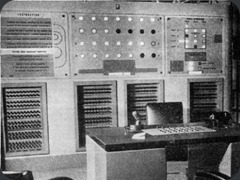

1951 kovo 5 pasaulį išvydo pirmasis kompiuterinis žaidimas “NIM” žaidžiamas kompiuteriu “[NIMROD](http://en.wikipedia.org/wiki/Nimrod_%28computing%29)”. Šis kompiuteris neturėjo grafinės išvesties. Žaidimas žaidžiamas mygtuko paspaudimais. Kompiuteris paspausdavo mygtuką tik po žmogaus paspaudimo. Taisyklių pagal kurias buvo žaidžiamas žaidimas neradau. Šitas kompiuteris davė pradžią visiem kitiem iki šiol sukurtiem žaidimam.

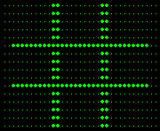

1952 A.S.Douglas \(Kembridžo universiteto profesorius/daktaras\) sukūrė Tic-Tac-Toe žaidimą \(iksiukai – nuliukai\) ant katodinio spindulių aparato. Šis aparatas tūrėjo 35×16 vienspalvių taškų ekraną. Tai pirmasis žinomas žaidimas turintis grafinę išvestį. Šis žaidimas gali būti sužaistas ir šiais laikais naudojant EDSAC simuliatorių su originaliu žaidimo algoritmu. Kas būtų, jei jis nebūtų sukurtas? Ogi žaistumėt žaidimus be jokios grafikos; nebebūtų to tipo žmonių, kurie žaidžia žaidimus tik dėl grafikos.

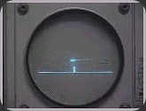

1958 William A Higinbotam sukūrė pirmą žaidimą žaidžiamą dviejų žaidėjų. Tai buvo tenisas žaidžiamas oscilografo ekrane. Buvo galima keisti gravitaciją, imituojant koks būtų teniso žaidimas kitose planetose. Autorius išradimo neužpatentavo, nes palaikė jį beverčiu ir netinkančiu prekybai. Kas būtų, jei William\`as nebūtų sukonstravęs šito daikčiuko? Ogi nežinotumėt kas yra Counter\`is.

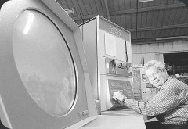

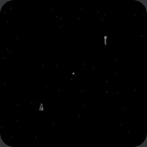

1962 Steve Russell sukūrė pirmąjį arkadinį žaidimą “[Spacewar](http://en.wikipedia.org/wiki/Spacewar!)” kompiuteriui DEC „PDP-1“. Žaidimas buvo atvaizduojamas kaip grafiką naudojant simbolius. Pirmas žaidimas kur buvo galima kažką šaudyt kosmose. Tikriausiai daugelis dabar žiūrit į fotkę ir pavydyt tokio kieto monitoriaus. O ištikro, kodėl šiuolaikiniai ekranai visi stačiakampiai arba kvadratiniai?

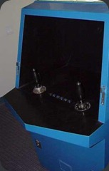

1971 du bičai: Bill Pitts ir Hugh Tuck įkūrė kompaniją ir pasinaudoję tuo, kad Steve\`as Russell\`as neprieštarauja padarė kiek patobulintą “Spacewar”, pavadino jį “[Galaxy Game](http://en.wikipedia.org/wiki/Galaxy_Game)”, įkišo jį į savo žaidimų automatą ir taip sukūrė pirmąjį komercinį video žaidimą. Toks žaidimų automatas kainavo 20000 dolerių. Ot žaidimukas. Tokį pirmąjį automatą pasistatė Stanfordo studentai savo kavinėje ir buvo itin populiarus studentų tarpe.

Kas jei nebūtų šios kaladės? Ogi per GTA IV netūrėtumėt kur pažaisti arkadų.

## \(Part 2\): Pirmoji konsolių karta

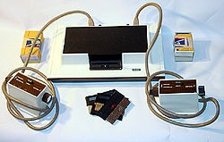

Ir taip pagaliau prižygiavom prie perversmo. Žinote, kad dabartinės konsolės \(PS3, Xbox 360, Wii\) yra jau septintoji karta? Apžvelkime jas visas!!!

#### Pirma kompiuterinių žaidimų karta \(1972-1977\)

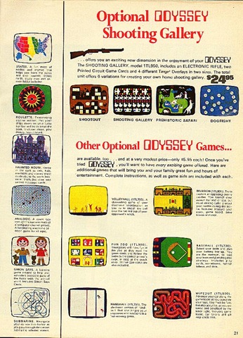

Ankstyvaisiais 1971 pradėta gaminti žaidimų konsolė [Magnavox Odyssey](http://lt.wikipedia.org/wiki/Magnavox_Odyssey) \(matote viršuje\), kurios prototipą [Ralfas Bajeris](http://lt.wikipedia.org/wiki/Ralfas_Bajeris) \(nieko bendro su dabartiniu jaunimo žodynu neturi\) sukūrė septintojo dešimtmečio antroje pusėje, o prototipą nusipirkusi kompanija Magnavox konsolę išleido 1972 m. gegužės mėnesį. 2005 m. Bajer\`is buvo apdovanotas _Nacionaliniu technologijos pažangos medaliu_ dėl pirmos kompiuterinių žaidimų konsolės išradimo. Šis žmogus laikomas kompiuterinių žaidimų tėvu. Įdomu, o kas motina? Televizorius? Na bet reikia pripažinti konsolė buvo revoliucinga, žaidimai kiek primeną Ping pong\`ą tik su kitokiomis taisyklėmis + ant teliko reikėjo uždėti skaidres, žaidimo įvaizdžiui pagerinti.

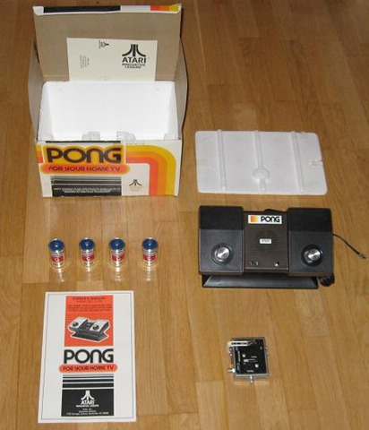

1975 m. Atari kompanija pristatė [PONG](http://en.wikipedia.org/wiki/Pong) – patobulintą Odyssey variantą. Ši konsolė turejo jau visai padorius joystick\`us \(linksmalazdes\). Pagrindinis šios konsolės žaidimas tapo žinomu visame pasaulyje – tai Ping Pong. Daugelis prisimena, šią konsolę, kaip pačią pirmąją, dėlto, kad ankstesnės konsolės nebuvo taip paplitusios. Ši konsolė buvo pirmosios kartos žaidimų kompiuterių lyderė. Su konsole buvo pridedami net 12 žaidimų tokių, kaip šachmatai, Ping Pong\`as.

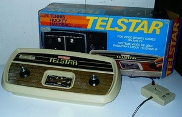

1976 Coleco kompanija išleidžia [Coleco Telstar](http://en.wikipedia.org/wiki/Coleco_Telstar) konsolę. Paskutinioji pirmosios kartos konsolė, turėjusi net 14 skirtingų leidimų \(su spalvom, be spalvų, su Ping Pong\`u, be Ping Pong\`o ir pan\). Bet kaip bebūtų, kompanija ją leido tik 2 metus. Matyt nenusisekė jų biznis. Per didelis PONG populiarumas 1980 privedė kompaniją prie bankroto. Bus jiem kopijuoti kitų gaminius.



## \(Part 3\): Antroji konsolių karta

Taigi žygiuojam toliau istorijos koridoriais. Antroji konsolių karta jau čia 

#### Antra konsolių karta \(1977-1983

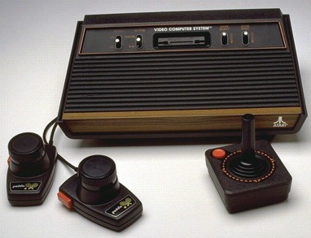

1977 Spalio 2 \(nesunku paskaičiuoti, kad pernai konsolei sukako jau 30 metų\), Atari išleido diskelių principu paremtą Video Computer System pavadintą konsolę, vėliau pervadintą į [Atari 2600](http://en.wikipedia.org/wiki/Atari_2600). Tai buvo Atari Pong įpėdinis, kuris galėjo pasiūlyti joystick\`us, perrašomas žaidimų kasetes, daugybė žaidimų. Nors ši konsolė ir nebuvo išvaizdi, tačiau tada tai buvo „dėžė“, kuri leido pažaisti combat‘ą, Pac-Man‘ą \(sėkmingiausias Atari žaidimas\), tennis‘ą ir kitus žaidimus. Tai neabejotinai, geriausia antrosios kartos konsolė \(parduota 40 mln. vienetų\), bei sėkmingiausias Atari gaminys, kurį teko aptūrėt ir man. Savo prisiminimus aprašysiu ateinančiame įraše.

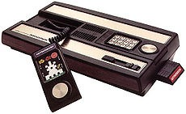

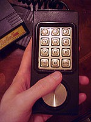

1979 m. kompanija Mattel pristatė [Intellivision](http://en.wikipedia.org/wiki/Intellivision) konsolę, kainavusią 299 USD. Šis žaidimų kompiuteris buvo kiek galingesnis ir geresnės grafikos \(tūrėjo net 16 spalvų\) nei Atari 2600 ir pirmasis pasikėsino į Atari postą, tačiau dėl pastarosios konsolės populiarumo nepavyko taip smarkiai pasidauginti ir liko gėdingoje antroje vietoje. Iš viso parduota 3 milijonai vnt, bei išleisti 125 žaidimai. Sunku patikėti, bet pradžioje žaidimus šiai konsolei kūrė 5 žmonių komanda, kuri vėliau išsiplėtė iki 110.

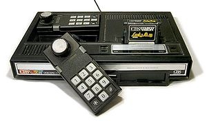

1982 m. pasirodė dar galingesnis žaidimų kompiuteris, [Telstar Arcade](http://en.wikipedia.org/wiki/Telstar_%28game_console%29) palikuonis  – [Colecovision](http://en.wikipedia.org/wiki/ColecoVision). Ši konsolė jau sugebėjo atvaizduoti [arkadų lygio](http://en.wikipedia.org/wiki/Arcade_game) žaidimus, galimybę žaisti Atari 2600 žaidimus, bei konsolės patobulinimo galimybes. Coleco tikslas buvo licenzijuoti visus arkadinius žaidimus, kurių nepavyko gauti Atari. Rezultatas – 125 žaidimai, per du konsolės gyvavimo metus. Konsolės pardavimai buvo išaugę po 1983 video žaidimų krizės, kai konsolė kainavo gerokai mažiau už konkurentus. Įdomus faktas: šią konsolę galima išgirsti minint tokių atlikėjų dainose, kaip: Fugees, Jay-Z ar Dr. Dre. Šaunumėlis.

Negaliu neparodyti bent keletos šios galingiausios antrosios kartos konsolės žaidimų:

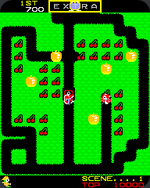

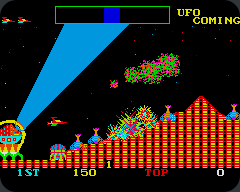

Kitos to laikmečio konsolės, susilaukusios gerokai mažiau dėmesio: [Fairchild Channel F](http://en.wikipedia.org/wiki/Fairchild_Channel_F)[RCA Studio II](http://en.wikipedia.org/wiki/RCA_Studio_II)[Interton VC 4000](http://en.wikipedia.org/wiki/VC_4000)[Odyssey²](http://en.wikipedia.org/wiki/Magnavox_Odyssey%C2%B2) \(bandymas sugrįžti į rinką\) [Arcadia 2001](http://en.wikipedia.org/wiki/Arcadia_2001)[Atari 5200](http://en.wikipedia.org/wiki/Atari_5200) \(komerciškai taip nenusisekęs projektas, tūrėjęs stoti į kovą su Colecovision\) [Vectrex](http://en.wikipedia.org/wiki/Vectrex)[SG-1000](http://en.wikipedia.org/wiki/Sega_SG-1000)[Bally Astrocade](http://en.wikipedia.org/wiki/Bally_Astrocade)[Color TV Game](http://en.wikipedia.org/wiki/Color_TV_Game).



## \(Part 4\): Atari 2600

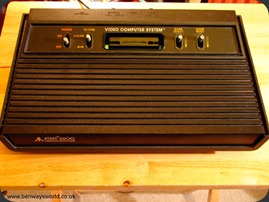

Taigi žadėjau daugiau dėmesio skirti konsolėm, kurias jau teko minkyt. Nors ši konsolė jau atšventė savo 30-metį, bet man teko prie jos prisiliesti. Kaip? Ogi atradau sandėliuke. Tai tikriausiai buvo mano brolio žaidimų kompiuteris. Taigi apie viską iš eilės.

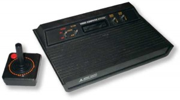

#### Life Story:

Taigi 1977 spalį Atari pristatė savo Video Computer System \(toks konkretaus pavadinimo nebuvimas ir lėmė, kad ilgą laiką aš nė nenumaniau kas per daiktas ten pas mane gulėdavo\). Tačiau vėliau konsolė pervadinta į Atari 2600 pagal kompiuterio partijos numerį: CX2600.

Pradinis konsolės variantas buvo Stella, bet projektėlis buvo kiek pastrigęs. Reikalai pajudėjo tik į kompaniją priėmus [Jay Miner](http://en.wikipedia.org/wiki/Jay_Miner). Mikroschemų architektas sugebėjo sujungti keletą sistemų į vieną ir taip kompanija išleidusi 100 milijonų dolerių tokio aparačiuko sukūrimui, sugebėjo išleisti konsolę.

Konsolės pradinė kaina buvo 199 USD, nesunku paskaičiuoti, kad kompanija privalėjo parduoti virš pusė milijonų konsolės vienetų, kad jai atsipirktų šis darbas. Atrodytų kiek bauginamai. Bet visgi konsolės pardavimai pranoko lūkesčius. 40 milijonų konsolės kopijų!!!

Nors ne viskas įvyko taip iškart. Pirmaisiais metais, kai konsolė buvo gaminama Kalifornijoje, pasisekė parduoti tik 250000 vienetų \(pusė tikslo\). O konsolei jau prilipo “Sunkiosios šešeriukės” vardas \(konsolė buvo tikrai didelė ir sunki, bei tūrėjo 6 valdomąsias svirtis korpuse\). Tuo metu sugebėjusi sutalpinti 1,19 MHz procesorių ir net 128 bytus operatyviosios atminties.

Kai publika suprato, kad galima žaisti nė vien Pong\`ą, bet ir kitus žaidimus, bei kai tik gamintojai išmoko išnaudoti konsolės galimybes – pardavimai ėmė augti, kaip ant mielių. 1979 ši dėžutė tapo geidžiamiausia ir daugiausiai parduodama Kalėdų dovana. Tais metais 1 limonas dėžučių paliko gamyklą ir iškeliavo pas laiminguosius vaikus ar jų tėvelius.

Sekančiais metais Atari licenzijavo tikru arkadų hitu tapusį [_Space Invaders_](http://en.wikipedia.org/wiki/Space_Invaders), kuris išaugino konsolės pardavimus dvigubai. Tais metais Atari iš savo konsolės, bei žaidimų pardavimų susišlavė 2 milijardus dolerių… Nieko sau, sakysit…. Palaukit, konsolės pardavimai nė neketino sustoti. Ateinačius du metus konsolės pardavimai vis dvigubėdavo. 1982 beveik 8 milijardai Atari\`ų išriedėjo į naujuosius namus.

1980 kompanija pašalino kairiąją ir dešiniąją lygių sunkumo svirteles \(skant, kad nesikartotų\). Konsolė kiek palengvėjo, bet atrodė lygiai taip pat, kaip ir standartinis variantas.

O štai 1982 kompanija išleido kiek pigesnį variantą, kuriame buvo pašalinta medinė dalis. Konsolė buvo praminta „Darth Vader“, dėl savo visiškai juodos, kampuotos išvaizdos, kiek primenančios mūsų gerai pažystamą veikėją. Tais pat metais kompanija pradėjo spausdinti ant konsolės, kad tai 2600 \(iki tol būdavo tik VCS užrašiukas\), nes prekyboje jau buvo pasirodžiusi ir [5200](http://en.wikipedia.org/wiki/Atari_5200) versija, kuri visgi nenusisekė.

Per tą laiką buvo sukurtos dar dvi konsolės versijos: [2700](http://en.wikipedia.org/wiki/Atari_2700) – kuri taip ir nebuvo pasirodžiusi, dėl savo nepatogaus dizaino; bei [2800](http://en.wikipedia.org/wiki/Atari_2800), kuri buvo pristatyta būtent Japonijos rinkai, bet iš jos buvo išstumta, dėl [Nintendo](http://en.wikipedia.org/wiki/Nintendo) [Famicom](http://en.wikipedia.org/wiki/Nintendo_Entertainment_System) populiarumo šiame regione.

Kaip bebūtų, šis gaminys tūrėjo tam tikrų problemų. Gamintojai teigė, kad konsolė tikriausiai kaip niekas kitas keliaudavo po garantinius centrus, nes nuolat gesdavo, perkaisdavo, sugesdavo gana nepatvarūs pulteliai, kuriuos įsižaidęs žaidėjas galėdavo visai nesunkai sugadinti.

Neužilgo į kovą su Atari populiarumu stojo kiti gamintojai: [Imagic](http://en.wikipedia.org/wiki/Imagic) ir [Coleco](http://en.wikipedia.org/wiki/Coleco). Taip kompanija įsivėlė į skandalą, kai kompanija [Mystique](http://en.wikipedia.org/wiki/Mystique_%28company%29) pradėjo masiškai gaminti pornografinius žaidimus. Neilgai trukus nenaudėliai buvo išmesti iš sutarties. Konsolė tesė ramų savo viešpatavimą.

Tačiau viskas turi pabaigą. Atėjo 1983 video žaidimų krizė, kai kompanijos pardavimai smarkiai krito, niekas nebenorėjo pirkti kompiuterinių žaidimų ir kompanija pradėjo patirti milžiniškus nuostolius \(apie 10000 USD per dieną!\) Taigi 1984 konsolė atiteko tokiem bičam iš [Commodore Business Machines](http://en.wikipedia.org/wiki/Commodore_Business_Machines), kurie sumastė pasipelnyt iš žinomosios konsolės. Po dviejų metų perleido konsolę, supaprastindami dizainą, suteikdami galimybę žaisti visus klasikinius žaidimus ir už visa tai prašydami tik 50 dolerių mokesčio. Taip jie iš senosios konsolės spaudė ką galėjo ir išspaudė iki 1990. Reikalą oficialiai parišo Atari kompanija, kuri 1992 Sausio 1 sako: “Viskas bičai, užteks”. Taip konsolė patapo visų laikų ilgiausiai išgyvenusi konsolė. Gaminama ji buvo 14 metų ir du mėnesius.

Rest In Peace 2600 \(Y\)

#### My memories

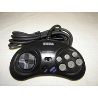

Ech, buvau aš visai pyplius, kai tekdavo grajint su šia konsole. Sandeliuke radau šią dėžę, jei tiksliau, tai “Vader\`į” \(be tų medinių pagražinimų ir tik su 4 svirtim\), paprašiau sesers, kad pajungtų prie teliko ir oj, kaip prasidėjo. Atsimenu ne vieną kartą dar teko kviesis sesę, kad patvarkytų mano “linksmalazdę, nes oj trantas buvo. Vėliau, neišsikentusi nupirko kažkokį Sega variantą, kuris buvo suderintas su Atari ir labiau panašus į mum žinomus JoyStick\`us.

Tiesa tokių dalykų kaip kasečių netūrėjau, pačiame kompiuteryje buvo įrašyti 40 žaidimų kurių pakankamai pakakdavo, o apie kasečių egzistavimą tada tik spėliodavau. Kadangi niekas iš mano draugelių nieko apie tokius čiūdus nė nežinojo, tai netūrėjau kieno paklaust.

O vat žaidimai… Uch. Tada žaidimai tikrai neatrodydavo durni, ar prasti. Man tokiam tetrių berniukui čia buvo oj kaip įdomu. Tik labai jau gasdnidavo garsai sklindatys žaidžiant žaidimus. Kai kuriuos žaidimus niekad nežaisdavau, nes bijodavau!!!

Apačioje pateiksiu keletas žaidimų nuotraukų. Tų žaidimų, kuriuos dar prisimenu.

Ech. va taip va ir bėgo mano 5-7 gyvenimo metai.

Įdomumo dėliai, tai visai neseniai aptikau Atari emuliatorių kartu su begales žaidimų. Kam įdomu – galit [išbandyt.](http://www.failai.lt/m8us5z4ktf6b/ATARI_GAMES_3326_ROMS.rar.htm)

Jei sumastytumėte šią konsolę nusipirkti dabar, tai eBay aukcione plotumėte 30-40 USD. Užsimaniau aš ją išsitraukt ir pažiūrėt, kokia jos būklė dabar, bet… Deja mano mama jau išmetė, ech o toks malonumas būtų buvęs. Na ką gi….

Keli žaidimai, kuriuos prisimenu:

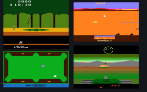











## \(Part 5\): Trečioji konsolių karta

Štai ir pasiekėm 8-bit\`ų erą, dar kitaip žinomą kaip trečiąją kartą. Liaudiškai vadinamąją “paprastuškę”.

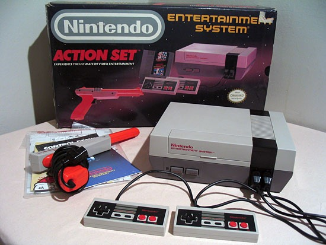

Taigi, pamatę arkadinių žaidimų sėkmę, iš šito sumastė pralobti ir japonai Nintendo. Na japonai, nebūtų japonai, jei nepadarytų tikrai gero produkto. Taip 1983 Japonijoje pasirodė [**Nintendo Family Computer \(Famicom\)**](http://en.wikipedia.org/wiki/Nintendo_Entertainment_System) ****arba dar žinomą, kaip NES \(Nintendo Entertainment System\). Pasiekus Nr.1 konsolės statusą savo šalyje, nusprendė atakuoti ir likusį pasaulį. Taip 1985 konsolė pasiekė Ameriką, bei kitas šalis. Rezulatas – per 12 metų sugebėjo aplenkti populiariąją Atari net 20 milijonų vienetų. Tai buvo trečiosios kartos žvaigždė, apie kurią plačiau – sekančiame straipsnyje.

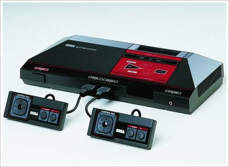

Sega negalėjo leisti taip totaliai viešpatauti vien Nintendo, tai ėmė ir 1986 mestelėjo [**Sega Master System.**](http://en.wikipedia.org/wiki/Sega_Master_System) Europoje konsolė buvo gana mėgiama, dėl savo techninės įrangos pranašumo prieš NES. Tačiau konsolė negalėjo varžytis Amerikoje ar Japonijoje, kur Nintendo ėmė viršų, kaip reikalas. Taip besitenkindamas mažesnėmis rinkomis Sega visgi sugebėjo išsiparduoti 13 milijonų konsolės vienetų.

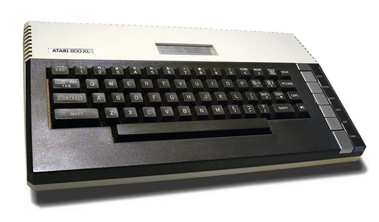

Tais pačiais metais prisikelti pabandė ir Atari. Pristatė savo [**7800**](http://en.wikipedia.org/wiki/Atari_7800) modelį, kuris tūrėjo pakeisti nenusisekusį 2600 įpėdinį – [5200](http://en.wikipedia.org/wiki/Atari_5200) ir tūrėjo sugražinti kompanijos pardavimus atimant dalį rinkos iš Nintendo. Tačiau kiek pabandę, pamatė kad nieko gero čia nebus ir pasitraukė į gerokai jiem pelningesnę: namų kompiuterių sferą, kur konsolė prilygo tuometiniams [8-bitų namų kompiuteriams](http://en.wikipedia.org/wiki/Atari_8-bit_family), kaip [Apple II](http://en.wikipedia.org/wiki/Apple_II_series). Sukūrė klaviatūrą, parašė visokias spausdinimo, skaičiavimo programėles, bei suderino konsolę su spausdintuvais. Taip Atari galutinai pasitraukė iš Video žaidimų rinkos ir jau ketvirtoje kartoje šios gamintojos nebepamatysime.

Kiti mažiau nusisekę/trumpalaikiai gaminiai:

* [Amstrad GX4000](http://en.wikipedia.org/wiki/Amstrad_GX4000)
* [C64GS](http://en.wikipedia.org/wiki/C64GS)

## \(Part 6\): Nintendo Entertainment System

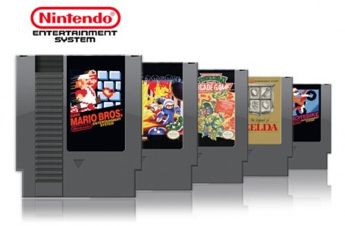

Kaip žadėjau – šįkart apie Nintendo konsolę, kurią prieš gerus 10 metų tūrėjom visi.

Taigi apie viską iš pradžių:

#### History

Stebėję milžiniškus Atari populiarumus tyleniai Japonai kūrė planus užvaldyti pasaulį. Taigi taip [Masayuki Uemura](http://en.wikipedia.org/wiki/Masayuki_Uemura) sukūrė naujosios kartos konsolę, kurią į Japonijos rinką paleido 1983 metais. Tačiau Japonai irgi yra žmonės ir klysta. Konsolėje buvo blogas chipas ir dėlto naujasis gaminys labai greit gedo ir mažai kas norėjo ją pirkti, bet greit vyrukai išsprendė savo bėdas ir kitais metais perleido konsolę, geriausiai žinomą kaip Nintendo Entertainment System \(NES\) arba Famicom. Taigi pasitaisius savo padarytas klaidas, konsolės pradavimai ėmė kilti ir 1984 pabaigoje tai jau buvo daugiausiai parduodama konsolė Japonijoje.

Jei jau sėkmė tokia didelė, tai kodėl nepabandžius ir kitur. Taip Nintendo stojo į kovą su absoliučiais lyderiais Atari, 1985 pristatydami savo vakarietišką konsolės variantą [Consumer Electronics Show](http://en.wikipedia.org/wiki/Consumer_Electronics_Show) parodoje. Pateikta atnaujinto dizaino konsolė ir keli hitais Japonijoje jau spėję tapti žaidimai, kaip Kung Fu, Pinball, Stack-Up, Tennis, Wrecking Crew, ir _Super Mario Bros._ Kalbant apie pastarąjį, tai visų laikų sėkmingiausias ne tik šios konsolės žaidimas, bet ir visame pasaulyje daugiausiai parduotas žaidimas. Plačiau apie jį – sekančiame straipsnyje

Konsolė pirmoji taikė trečiųjų šalių politika: visi žinome problemą dėl trečiųjų šalių, t.y. įrangos ir žaidimų nelegalų kopijavimą. Originaliose konsolėse buvo įdėtas nedidelis chipas, toks pat chipas būdavo įmontuojamas į originalias pilkąsias Nintendo žaidimų kasetes. Jei kasetė tūrėdavo chip\`ą – žaidimas pasileisdavo be problemų, jei ne, viskas ką galėjote išvysti, tai tik juodas ekranas. O iš trečiųjų šalių sulaukėmė pačių įvairiausių dizainų konsolės klonų, kuriuose nebūdavo šio chipo, žinoma jos būdavo pigios ir nekokybiškos, tačiau mes ir pirkdavom, nes man asmeniškai neteko matyti originalaus konsolės varianto, nei pas vieną pažystamą. Taip pat naudodavome ir geltonąsias kasetes, kurios toli gražu nebuvo originalios. Nintendo licenzijuoti žaidimai tapo tikrai populiarūs, dėlto buvo dar ne kartą perleisti kitom konsolėm. Dar ne kartą galėjome išvysti [Super Mario Bros.](http://en.wikipedia.org/wiki/Super_Mario_Bros._%28series%29), [The Legend of Zelda](http://en.wikipedia.org/wiki/The_Legend_of_Zelda_%28series%29), [Castlevania](http://en.wikipedia.org/wiki/Castlevania), ar žinomąjį [Final Fantasy](http://en.wikipedia.org/wiki/Final_Fantasy).

Sekantieji keli metai konsolei tapo ypač sėkmingi ir konsolė išstūmė jau technologiškai pasenusią Atari į šalį. Taip truko iki 1990, kai pasirodė naujos kartos konsolės, tokios, kaip [16-bit\`ų](http://en.wikipedia.org/wiki/16-bit) [Sega Mega Drive](http://en.wikipedia.org/wiki/Sega_Mega_Drive) dar žinoma, kaip Sega Genesis. Tai tūrėjo reikšti konsolės galą, tačiau nenorėdama visiškai atsilikti kompanija dar bandė gelbėtis [Super Nintendo Entertainment System](http://en.wikipedia.org/wiki/Super_Nintendo_Entertainment_System) konsole, kuri taip pat buvo 16-bit\`ų, bet nebuvo taip komerciškai nusisekusi, kaip jos pirmtakė NES.

Nepaisant smarkaus konsolės perkamumo mažėjimo Nintendo tęsė tiekti konsoles į Ameriką, netgi išleido keletą konsolės variantų su skirtingais dizainais. Taip konsolė buvo platinama dar iki 1995, kuriais JAV liko be šios konsolės. Tačiau Japonijoje dar buvo likę nemažai senųjų konsolės fanų, kuriem reikėdavo techninio palaikymo, naujų valdymo pultelių, atsarginių dalių ir panašių niekučių, tad kompanija neužraukė pačios konsolės gaminimo iki pat 2003, o techninė pagalba, bei priedai tiekti nustoti tik 2007 Spalio 31!! Tik pagalvokit: 24 metai konsolės istorijos. Reikia pripažinti – įspūdinga. Dar labiau stebina pardavimai, dėmesio! Iškvepiam! 61,91 miljonas kopijų!

#### My memories

Ohh… Tikriausiai konsolė, prie kurios praleidau daugiausiai laiko. O kas nepraleido? Smagu, tikrai smagu būna prisiminti, nes atsiminimų begalės. O kartas nuo karto užvaldanti nostalgija, priverčia įsirašyti kokį seną gerą bomberman\`ą ar Super Mario ir pažaisti geras 20 min. Aišku dabar žaidimai atrodo kur kas prastesni, gal net juokingi, tokie kokius dabar atkuria net ir paprasčiausi spalvoti telefonai, bet savo laikais jie tikrai įtraukdavo. Pagrindinis dalykas tokiose konsolėse būdavo žaidimo įdomumas, o ne grafika. O ir norėdamas pereiti žaidimą, tekdavo tą patį lygį kartoti dešimtis kartų, kol jį išmokdavai kone atmintinai. Šiuolaikiniuose žaidimuose tokio dalyko galima pasigesti. Na taip, gal tokie atkalimai mintinai tokiuose Crysis laikuose ir nereikalingi, nebereikalingas toks įdirbis ir “atkalimas”  kada ir kiek spausti “knopkę”, nes kitaip nuo vieno šūvio ar nuo vieno prisilietimo tiesiog numirdavai ir tekdavo kartoti lygį nuo pradžių, nes juk nebūdavo net save\`ų.

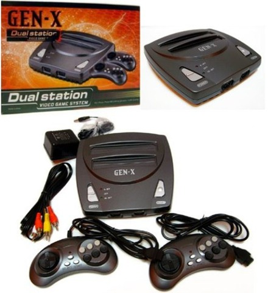

Buvau vaikas kuris tetūrėjo tetrį, bei Atari 2600 ir netūrėjo jokių kiemo draugų, nes namas pastatytas gerokai toliau nuo viso kaimo. Taip vieną kart pas kaimynų besisvečiuojant užžiūrėjau tą stebuklą… Tie žaidimai man atrodė tokie nesveiki… Parodė man kažkokį karatė mušdamiesi tarpusavyje ir taip užsinorėjau ir aš tokio daikčiuko. Tad ėmiau taupyti. Į mėnesį gaudavau po 5 lt kišenpinigių + kažkiek gaudavau švenčių proga. Taigi susiėmiau, nebepirkau jokių ledų ar saldainių ir per greičiau, nei metus sutaupiau savo pirmąjį 100 lt. Tada man buvo 7 metai. Iš kur žinau taip tiksliai? Neįsivaizduoju. Tiesiog žinau, kad tai buvo 1996-ieji. Apie savo planus nuolat pasakodavau mamai ir kai galų gale tūrėjau savo sukauptus pinigus – kaip sutarta, važiavome į Klaipėdą, į turgų, ir nusipirkau savo pirmąją konsolę. Dar atsimenu, kai pardavėjas parodė, kad viskas gerai veikia, paleido visiem mum žinomą žaidimą, kuriame reikėdavo šaudyti antis. Buvau sužavėtas ir begalo, begalo laimingas, vos sugebėjau nešokinėti iš džiaugsmo. Na ir prasidėjo… Žaidimų iš pradžių netūrėjau daug, bet juos visus belenkiek daug žaisdavau, kol mama nenuvarydavo nuo teliko. Tolesnius savo gautus kišenpinigius taupydavau naujom disketėm, magnetolai ar meškerei, tada jos taip pat buvo gana brangios. Pagrindinė problema, kad žaidimus pirkdavo mano sesuo, tad ką gausiu sužinodavau tik gaudamas disketę į ranką. Vėliau prasidėjo skolinimasis iš draugų, mainymasis žaidimais, ar jų pirkimas vienas iš kitų, žinoma taip žaidimus buvo galima nusipirkti gal 10 kart pigiau, o žaidimo kokybė nuo to visiškai nepriklausydavo.

Vienas iš įsimintinų žaidimų, tai Indiana Jones\`as, kuris kažkodėl man labai giliai įstrigo. Tikriausiai dėlto, kad jo lygiai buvo tikrai labai įvairūs, pats žaidimas buvo tikrai gana sudėtingas ir tai buvo vienas iš tų nedaugelio žaidimų, kurie tūrėjo kodų. Paspaudus pauzę, reikėdavo paspausti į viršų ir berods į kairę. tada pasidarydavai nemirtingas. Lygiai taip pat buvo galima ir išjungti šį kodą. Tokiu būdu pereidavau tas vietas, kurias tiesiog neįveikdavau.

O ką jau kalbėti apie tokius žaidimus, kaip Super Mario ar “tankiukus” \(tikslaus pavadinimo nepamenu\). Žaisdavau kone kiekvieną dieną, žaisdavau keliomis valandomis, žaisdavau su giminėmis, su draugais, ar tiesiog savo amžiaus vaikais, taip netgi susipažindavome – padedant žaidimui. Atsirasdavo savi terminai, dar dabar pamenu tokius, kaip “darakočka”, “bosiakas” ir pan. Kai kuriuose žaidimuose buvo tokia galimybė, kaip kurti lygius. Ką sukursi – tai tik tavo fantazijos reikalas. Kurdavom lygius vienas kitam ir paskui daug juokdavomės bandydami žaisti.

Vėliau įsigijau Sega Genesis ir senoji Nintendo liko užmarštyje. Tačiau sugedus Sega\`i ir likus be jokio žaidimų kompiuterio, po kurio laiko dar nusipirkau Nintendo kloną už 10 Lt. Tai jau buvo paskutinis kartas, kuris įvyko kai man buvo kokie 14-15 metų.Heh, didelis jau.

Deja, kad ir kaip norėčiau, neina man nei pusės savo visų atsiminimų išpasakoti. Taigi apsiribojam tuo kas pavyko dabar.



## \(Part 7\): Super Mario Bros.

Rašiau straipsnį apie trečiąją konsolių kartą, kurioje dievas buvo vienas: Nintendo. O kaip galima neparašyti straipsnio apie šios konsolės Super žvaigždę? Heh, juk prisipažinkit – visi mes jį žaidėm, visi mes ji mylėjom. Taigi prisiminkim/susipažinkim artimiau:

**Mario** – Nintendo talismanas ir kartu taip vadinama viena populiariausių žaidimų serijų. Taigi šis žaidimas yra [best](http://en.wikipedia.org/wiki/List_of_best-selling_video_games)[ selling video game of all time](http://en.wikipedia.org/wiki/List_of_best-selling_video_games): parduota 40.24 limonų kopijų vien pačio žaidimo, o  Mario frančizė buvo parduota net 201 milijonų kopijų tiražu!!! Fuckin awesome!!! Palyginimui, šiais laikais vienas iš geriausiai parduodamų žaidimų – “The Sims”, parduota 100 milijonų kopijų tiražu. Štai kaip sėkmingai pavyko prasimušti prieš 28 metus [Shigeru Miyamoto](http://en.wikipedia.org/wiki/Shigeru_Miyamoto) sukurtam veikėjui. Net sunku patikėti kokią įtaką gali tūrėti vienas vienintelis video žaidimas: netik sugebėjo įtakoti milžinišką Nintendo konsolės sėkmę, bet ir ištraukė JAV iš du metus trukusios [video žaidimų krizės](http://en.wikipedia.org/wiki/Video_game_crash_of_1983). Azijos šalyse Mario populiarus iki dabar. Iš viso pasirodė daugiau nei 200 žaidimuose, daugiausia Nintendo konsolems.

Firminė žaidimo melodija, sukurta [Kōji Kondō](http://en.wikipedia.org/wiki/K%C5%8Dji_Kond%C5%8D) yra atpažįstama visame pasaulyje, net tų žmonių, kurie nėra žaidę šio žaidimo, bei yra naudojama kaip sinonimas, kalbant apie video žaidimus.

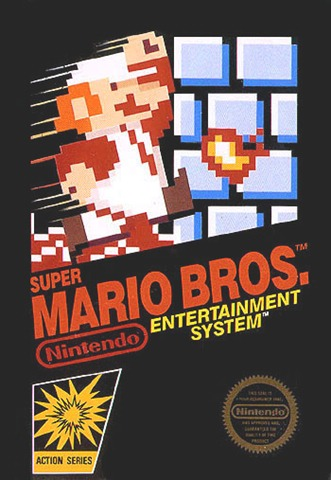

Taigi pirmą kart Mario pasirodė dar 1981 metais [Donkey Kong](http://en.wikipedia.org/wiki/Donkey_Kong_%28video_game%29) žaidime kaip šalutinis veikėjas _Jumpman_. Tai buvo paprastas arkadinis žaidimas, kuriame mes valdydami veikėją, bandome išvengti kliūčių ir užlipti į viršų pas princesę.

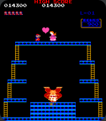

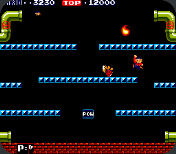

Po šio žaidimo, 1983 pasirodė antrasis serijos žaidimas [Mario Bros](http://en.wikipedia.org/wiki/Mario_Bros.). Šiame žaidime jau galima įžvelgti daug panašumų su tuo Mario, kurį mes ir žinome: vamzdžiai, vėžliai, ugnis ir pan. Bet žaidimas vis dar arkadinis.

Na ir galiausiai 1985 pasirodė tas Mario kurį aš, tu ir visi žinom – [Super Mario Bros](http://en.wikipedia.org/wiki/Super_Mario_Bros.). Linijinis žaidimas, kuriame valdai santechniką Mario, kuris moka bėgioti, trypti savo priešus ir net šaudyti.

Dauguma žino tik Super Mario Bros. žaidimą ir nė neįtaria esant kitų serijos žaidimų. O iš tikro visa serija susideda iš:

* [_Donkey Kong_](http://en.wikipedia.org/wiki/Donkey_Kong_%28video_game%29) \(1981\)
* [_Mario Bros._](http://en.wikipedia.org/wiki/Mario_Bros.) \(1983\)
* [_Super Mario Bros._](http://en.wikipedia.org/wiki/Super_Mario_Bros.) \(1985\)
* [_Super Mario Bros.: The Lost Levels_](http://en.wikipedia.org/wiki/Super_Mario_Bros_The_Lost_Levels) \(1986\)
* [_Super Mario Bros. 2_](http://en.wikipedia.org/wiki/Super_Mario_Bros.:_The_Lost_Levels) \(1988\)
* [_Super Mario Bros. 3_](http://en.wikipedia.org/wiki/Super_Mario_Bros._3) \(1988\)
* [_Super Mario Land_](http://en.wikipedia.org/wiki/Super_Mario_Land) \(1989\)
* [_Super Mario World_](http://en.wikipedia.org/wiki/Super_Mario_World) \(1990\)
* [Dr. Mario](http://en.wikipedia.org/wiki/Dr._Mario_%28video_game%29) \(1990\)
* [_Super Mario Land 2: 6 Golden Coins_](http://en.wikipedia.org/wiki/Super_Mario_Land_2:_6_Golden_Coins) \(1992\)
* [_Super Mario 64_](http://en.wikipedia.org/wiki/Super_Mario_64) \(1996\)
* [_Super Mario Sunshine_](http://en.wikipedia.org/wiki/Super_Mario_Sunshine) \(2002\)
* [_New Super Mario Bros._](http://en.wikipedia.org/wiki/New_Super_Mario_Bros.) \(2006\)
* [_Super Mario Galaxy_](http://en.wikipedia.org/wiki/Super_Mario_Galaxy) \(2007\)

**Super Mario Bros. Siužetas:**

Super Mario Bros_._ žaidime, pagrindinis veikėjas – santechnikas [Mario](http://en.wikipedia.org/wiki/Mario) turi išgelbėti Grybų karalystės princesę Toadstool \(vėliau pervadintą į princesę Peach\) iš blogojo karaliaus[ Koopa](http://en.wikipedia.org/wiki/Bowser_%28character%29) \(vėliau žinomą, kaip karalių Bowser\)Dviejų žaidėjų režime pagrindiniam žaidėjui į pagalbą stoja ir jo jaunesnis brolis [Luigi](http://en.wikipedia.org/wiki/Luigi). Kad išgelbėtų minėtąją princesę, broliai turi įveikti 8 skirtingus pasaulius išvengdami kliūčių ir priešus tiesiog sumindydami. Mario turi nukeliauti į kiekvieną naujojo pasaulio pilį ir nugalėti vieną iš karaliaus Koopa parankinių. Kad pasiektų parankinio pilį, veikėjui reikia įveikti tris to pasaulio lygius. Nugalėjus parankinį, sutinkamas grybažmogis Toad, kuris praneša: „Thank you Mario! But our princess is in another castle!“ – heh legendinė frazė :\) Taip išvadavę 7 grybažmogius ir įveikę patį Bowser, mes galų gale atrandame savo taip ilgai ieškotą princesę. Perėjus žaidimą, žaidėjui leidžiama žaidimą žaisti sunkiu režimu, kur paprasti priešai yra pakeisti vėžliais, kurių neina nugalėti ugniniais rutuliais, o ir priešų judėjimo greitis padvigubėjęs.Na taip, istorija gal ir nėra nuostabi. Ką čia slėpti… Visiškas mėšlas, bet tais laikais kai žaisdavau, tai buvo nė motais, tai būdavo galima sakyti žaidimų žaidimas. Visi mėgo Mario, visi žaidė Mario ir niekas nesiskųsdavo, kad va jo istorija yra totaliai sumauta. Gosh… Net filmą žmogeliai pastatė. Tarp kitko tai buvo pats pirmasis filmas, pastatytas pagal kompiuterinį žaidimą.

Mario kovoja su pačiu Bowser 8 pasaulio pabaigoje.

**Lygiai:**

Visą žaidimą sudaro 8 pasauliai kurių kiekvienas dar skyla į keturis lygius. Taigi iš viso žaidimą sudaro 32 lygiai. Žaidime yra 4 skirtingi lygių tipai:

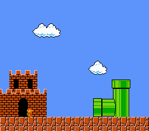

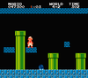

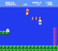

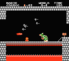

**Kiti serijos žaidimai, kuriuos man teko išbandyti:**

**Dr. Mario**

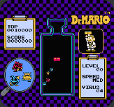

Žaidimas, padarytas Tetrio pagrindu, bet kuris man patiko gal kiek labiau. Tikslas: dėliojant skirtingų spalvų piliules, sunaikinti visus stiklainyje esančius virusus. Buvau “atkalęs” žaidimą tiek, kad įveikdavau, net sudėtingiausią lygį, kurio 75 procentai stiklainio jau būdavo užpildyti, o piliulės judėdavo kelis kart greičiau, nei įprasta. Buvau kietas :\)

 **Super Mario Bros. 3**

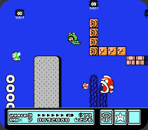

Ne toks originalus, kaip mūsų numylėtasis Super Mario Bros. tačiau įnešantis daug naujovių. Šį žaidimą atradau žymiai vėliau – turėdamas NES savo paskutinįjį kartą. Žaidimo stilius man kiek nelipo, bet žaidimas buvo žymiai įdomesnis ir gerokai sudėtingesnis. Prisimenu taip ir neužbaigiau jo.

 **Super Mario Galaxy**

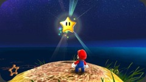

Na taip, žaidimas pasirodė tik 2007, bet jis mane buvo sudominęs ir parsisiunčiau. Bet deja jis man nepatiko, jokios nostalgijos nesukėlė ir šiaip pasirodė visiškas š, todėl ilgai mano kompe neužsibuvo. Mano nuomonė 3D mario, tai ne ta sfera, kur jam reikėjo nuait. Na bet mielas žaidimukas mažiem vaikam, be jokio smurto. Gražu, paprasta, blizgu.

**In action:**

Žiūrim į savo vaikystę :\) Faina prisiminti vieną ar kitą levelį.



## \(Part 8\): Ketvirtoji konsolių karta

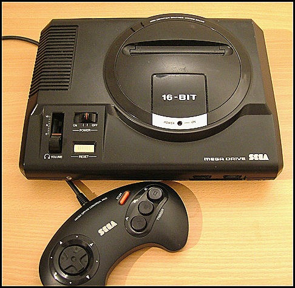

Po šiokios tokios pertraukos grįžtam prie konsolių istorijos. Šį vakarą – ketvirtoji karta \(1987–1996\).

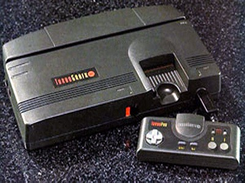

1987 spalio 30 Japonijoje pasirodė [TurboGrafx-16](http://en.wikipedia.org/wiki/TurboGrafx-16). Konsolė tūrėjo 8 bitų procesorių \(kas buvo trūkumas lyginant su konkurentais\) ir 16 bitų grafinį procesorių. Konsolė pasižymėjo itin mažais cardrige\`ais, kurie buvo kreditinės kortelės didžio, bei tai buvo pirmoji konsolė su CD palaikymu. Revoliucija :\) Toks kompaktinių diskų panaudojimas padidino konsolės panaudojimo galimybes ir tuo pasinaudoję gamintojai pagamino ne vieną programą skirtą šiai konsolei. Neskaitant tokių privalumų, konsolės populiarumui Japonijoje didelę įtaką padarė didelis erotinių žaidimų kiekis. Iš viso šios žaidimų kompiuterio parduota 10 milijonų kopijų, o žaidimai gaminti iki 1999.

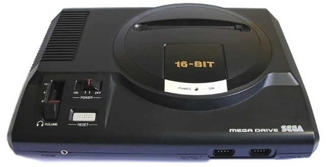

1988 Sega Japonijoje išleido [Sega Mega Drive](http://en.wikipedia.org/wiki/Sega_Mega_Drive) – vieną stipresnių ketvirtos kartos konsolių. Viso parduota 29 milijonai konsolės vienetų. Tai buvo jau penktoji Segos konsolė, kuri pakeitė jau pasenusią [Sega Master System](http://en.wikipedia.org/wiki/Sega_Master_System). Pradžioje išpopuliarėjusi Europoje ir Brazilijoje, konsolė niekaip negalėjo prasimušti JAV ir Japonijoje \(atplukdė tik 400000 vienetų pirmaisiais metais\). Į pagalbą bandė prašyti Atari kompanijos, bet Sega\`i nepatiko keliamos sąlygos, tad visko ėmėsi pati. Pasiekus Nr.1 statusą Europoje, konsolė ėmė populiarėti ir JAV ir po truputi išstūmė NES, bei TurboGrafx-16 iš lyderių pozicijų. Ypač tam padėjo 1991 pasirodęs [Sonic the Hedgehog](http://en.wikipedia.org/wiki/Sonic_the_Hedgehog_%2816-bit%29). Konsolės istorija užsibaigė 2002 su paskutiniu licenzijuotu žaidimu Brazilijoje.

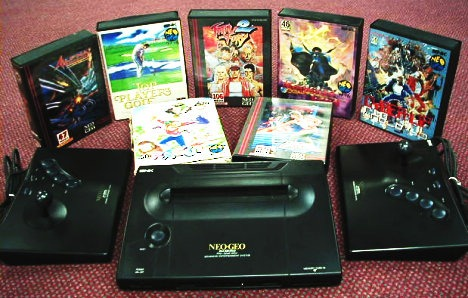

Kiek matom pirmiausia visos konsolės buvo pristatomos Japonijoje.  Taip buvo ir su [Neo Geo](http://en.wikipedia.org/wiki/Neo_Geo_%28console%29) 1990-aisiais. Kuri buvo pavyzdinė konsolė savo laiku, parodanti geriausią grafiką, bei išgaunanti geriausią garsą. Nors ji tikrai netapo tokia žinoma ir populiari, kaip SNES ar Sega, bet jai pavyko išlikti, kaip ilgiausiai parduodama ketvirtos kartos konsolė. Kompiuteris naudojo 12 Mhz Motorola procesorių, o jo vaizdo plokštė sugebėjo atkurti 4,096 spalvų. Taipogi pasižymėjo integruota garso plokšte, kuri galėjo atkurti net 15 garso kanalų. Tačiau rezoliucijos buvo nuviliančios ir dėlto žaidimai atrodydavo daug tamsesni.

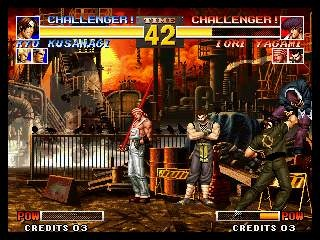

Taip pat konsolei buvo kuriami pirmieji rimtesni 3D žaidimai. 2006 pasirodęs Last Hope tapo vienu geresniu konsolės žaidimu, nors nuo jos debiuto praėjo jau 16 metų. Tačiau įsiveržti į rinką taip sėkmingai nepavyko ir dėžutė liko kitų konsolių šešėlyje. Iki pat 2007 spalio, kada buvo išleistas paskutinis žaidimas ir tolesnis palaikymas buvo nutrauktas. Taip ši konsolė tapo antroji ilgiausiai gyvavosi konsolė po [Atari 2600](http://reanimated.lt/zaidimu-evoliucija-part-4-atari-2600).

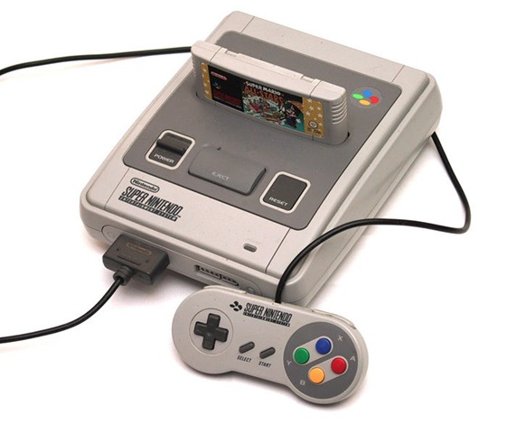

1990 lapkričio 21 Nintendo pristatė Super Nintendo Entertainment System \(SNES\). Konsolė buvo patobulintas [NES](http://reanimated.lt/zaidimu-evoliucija-part-6-nintendo-entertainment-system) variantas, kuris pasižymėjo geresne grafika \(32768 arba 15-bit\`ų spalvų\), bei garsu. Daug kas kalbėjo, kad tai tik buvo Nintendo stengimasis neatsilikti naujosios kartos konsolės gamybose, nes senukė NES jau pradėjo rodyti savo amžių, tačiau vis dar buvo perkamiausia. Kaip bebūtų ji patapo išpopuliarėti ir tapti perkamiausia ketvirtosios kartos konsole. Tam padėjo reklaminės kompanijos, gamintojų pasitikėjimas, bei populiarumas tarp vartotojų, parduota 49,10 milijonų vienetų. Šis populiarumas skatino labai didelę konkurenciją su Sega kompanija ir tai išaugo į vieną šiurkščiausių konsolių karų, kurio metu kiekviena gamintoja stengėsi parodyti kokia jos konsolė šauni ir kad priešininkų konsolė nieko nesugeba.

Nintendo išlaikė savo vardą Amerikoje net ir prasidėjus penktosios kartos konsolėms. 1994 pasirodė žaidimas [_Donkey Kong Country_](http://en.wikipedia.org/wiki/Donkey_Kong_Country)_,_ kuris parodė, kad naujesnės kartos konsolės negali pasiūlyti nieko naujo lyginant su SNES ir tokiu būdu tik sustiprino savo pardavimus. Paskutiniais metais dauguma žaidimų buvo perkurti [Game Boy Advance](http://en.wikipedia.org/wiki/Game_Boy_Advance), nes kompiuteriukas pasižymėjo panašiais duomenimis. 2007 konsolės gamyba visai nutraukta.

#### Mažiau  nusisekusios to laikmečio konsolės:

[CD-i](http://en.wikipedia.org/wiki/CD-i) – konsolė veikianti su CD, bet tesugebėjusi paplisti pusės milijono vienetų tiražu.

[Super A’Can](http://en.wikipedia.org/wiki/Super_A%27Can) – SNES klonas išleistas 1995 metais konkrečiai Kinijos Respublikai. Ir tetūrėjusi 12 žaidimų.





## \(Part ****9\): Sonic the Hedgehog

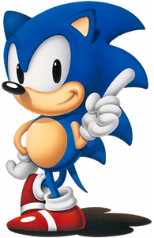

Kadangi aptaręs [trečiąją žaidimų kartą](http://reanimated.lt/zaidimu-evoliucija-part-5-trecioji-konsoliu-karta), paskyriau atskirą įrašą [Super Mario Bros.](http://reanimated.lt/zaidimu-evoliucija-part-7-super-mario-bros), tai pakalbėjęs apie [ketvirtąją kartą](http://reanimated.lt/zaidimu-evoliucija-part-8-ketvirtoji-konsoliu-karta), negaliu nepapasakoti apie šios kartos hitą Nr.1: [Sonic\`ą](http://en.wikipedia.org/wiki/Sonic_the_Hedgehog_%28character%29).[Naoto Ōshima](http://en.wikipedia.org/wiki/Naoto_%C5%8Cshima) Segos kompanijos prašymu, sukurti kažką, kas ne tik prilygtų Super Mario, bet ir pranoktų jį, nupaišė naują veikėją – ežį, pavadinimu "Mr Needlemouse". Šis tūrėjo patapti, kaip kompanijos arkliukas ir juom ir tapo. Sonic’o mėlyna spalva parinkta tam, kad derintųsi su Segos mėlynu logotipu, batai nugvelbti nuo to meto populiaraus atlikėjo [Michael Jackson](http://en.wikipedia.org/wiki/Michael_Jackson)‘o, tik parinkta raudona spalva. Ir taip atsiradus pagrindiniam veikėjui, 15 žmonių komanda, pasivadinusi, kaip Sonic Team ėmėsi darbo prie primojo serijos žaidimo: [_Sonic the Hedgehog_](http://en.wikipedia.org/wiki/Sonic_the_Hedgehog_%2816-bit%29)_._

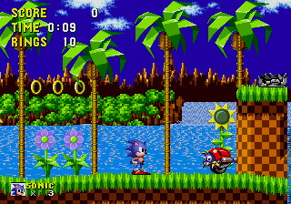

Taigi, 1991 birželio 23 pasirodė žadėtasis žaidimas, skirtas Sega Mastyer System konsolei. Tai buvo 8-bitų versija, bet pasiekus didelius pardavimus, buvo perleista ir 16-bitų Sega Mega Drive versijoms. Šis žaidimukas lėmė Sega Genesis išpopuliarėjimą, nes žaidimas pasižymėjo dar neregėtais nuotykiais, niekur neregėta grafika ir kas svarbiausia, buvo velniškai greitas. Ir tai žmones žavėjo. Šį žaidimą, įsigijęs konsolę, žaidžiau gal milijoną kartų :\)

Siužetas labai paprastas: Sonic\`as turi neleisti piktajam [Dr. Robotnik](http://en.wikipedia.org/wiki/Doctor_Eggman) \`ui surinkti šešis Chaoso smaragdus, su kuriais jis sugebėtų valdyti visą Pietų salą. Veikėjęs turi įveikti šešias zonas, kuri kiekviena susideda iš tryjų lygių, ir įveikti piktąjį RoBotnik\`ą tūnantį karo mašinose. Kaip bebūtų, blogiukas visada sugeba pasprukti. Taip, gal oskaro ir neduosim, bet žaisdavosi tikrai smagiai.

Sonic\`as sugeba bėgti \(bėgti tikrai greitai\), šokinėti, bei suktis. Ne taip, kaip kitose platforminiuose žaidimuose, žaidimas reikalavo tikrai greitos reakcijos. Tam tikslui žaidime būdavo specialios platformos, mirties kilpos ir panašūs dalykėliai, kurie leisdavo pasiekti milžiniškus greičius. O grafika tam metui buvo neįtikėtina: judančios gėlės, banguojantis vanduo, besisukantys žiedai, kurie tiesiog patapo Sonic\`o simboliu ir begalo ryškios spalvos, buvo tai ko reikėjo tam laikmečiui. Ir taip pasiekė paplisti 4 milijonų kopijų tiražu_._

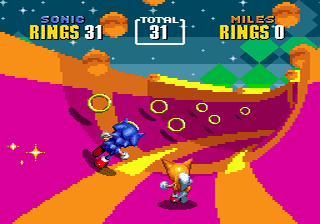

1992 lapkričio 24 pasirodė kitas serijos žaidimas: [Sonic the Hedgehog 2](http://en.wikipedia.org/wiki/Sonic_the_Hedgehog_2_%2816-bit%29). Žaidimas tęsė pirmosios dalies istorija ir pasiūlė naują papildomą veikėją – Tails, bei užrakintą veikėją Knuckles, už kurį žaisti galima tik vieną kart perėjus visą žaidimą.

Žaidimas susuktas pirmojo žaidimo varikliuku, tik sukurti kiek kitokie lygiai, o ypač smarkiai pasikeitęs bonus lygis, kuris patapo trimačiu. Šis žaidimas susilaukė daug didesnės sėkmės – parduota 6 milijonai žaidimo kopijų.

Siužetas tęsia pirmosios dalies pasakojimą, kuriame reikia nugalėti Robotnik\`o armiją, išgelbėti savo draugus ir sunaikinti Robotnik\`o karo laivą “Death Egg”.

Šį žaidimuką esu žaidęs, bet labai trumpai, kai pasiskolinau iš kažko disketę

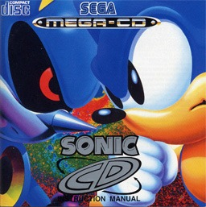

1993 lapkritį pasirodė dar vienas serijos žaidimas: [Sonic the Hedgehog CD](https://reanimated.lt/Sonic%20the%20Hedgehog%20CD), kuris buvo skirtas [Sega Mega-CD](http://en.wikipedia.org/wiki/Sega_Mega-CD) konsolei, bei pritaikytas stacionariesiems kompiuteriams. Taipogi pristatė dar du naujus veikėjus: [Metal Sonic](http://en.wikipedia.org/wiki/List_of_recurring_characters_from_Sonic_the_Hedgehog_%28games%29#Metal_Sonic) ir [Amy Rose](http://en.wikipedia.org/wiki/Amy_Rose).

Žaidimas pasižymėjo laiko teleportais, kuriuose galėdavai tą patį lygi sužaisti skirtingais laikais: dabartyje, praeityje, geroje ateityje, bei blogoje ateityje. Į juos galima patekti rankiojant ženkliukus sutinkamus žaidimo lygiuose. Kažką pakeitus – tai atsiliepia kituose matmenyse. T.y. jei praeityje surinksite visus smaragdus, tai visi Robotnik\`o robotai dabartyje bus sunaikinti ir pan.

Šis žaidimas buvo pripažintas, kaip geriausias Sonic\`o frančizės atstovas_._

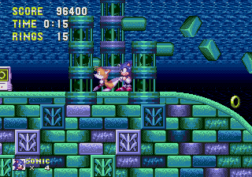

\_\_[Sonic the Hedgehog 3](http://en.wikipedia.org/wiki/Sonic_the_Hedgehog_3) – mano mėgiamiausias Sonic\`o frančizės žaidimas, kurį žaidžiau kone daugiausiai. Pasirodė šis gėris 1994 pirmojoje pusėje ir kartu su papildymu paplito 3,5 milijonų egzempliorių tiražu.

Žaidimo siužetas nieko nesiskiria nuo pirmosios dienos. Skiriasi lygiai, jų grafika, bonus lygis, kuriame reikia surinkti jau septynis smaragdus. Pasisekus tai padaryti galima pasiversti į Super Sonic\`ą \(kažkuom primena Dragon Ball serijos Sajanus\), kuris sugeba ne tik, kad skraidyti, bet ir yra nepažeidžiamas \(na nebent sutraiškomas\).

Įdomus faktas, kad pradžioje muzikos kūrimuj buvo pasamdyti Michael\`o Jacson\`o komanda, tačiau po šios žvaigždės pedofilijos skandalo Sega nutraukė kontraktą. Bet žaidime keliuose lygiuose visgi buvo panaudoti šios komandos sukurti garso takeliai.

Ši dalis suteikia labai daugiausia prisiminimų. Su draugu vis žaisdavom ir žaisdavom :_\)_

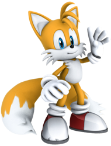

Na ir trumpai apie kitus serijos žaidimus, kurie tokios didelės revoliucijos, jau nesugebėjo padaryti:

**Sonic & Knuckles**

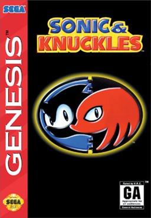

1994 išleistas žaidimas, kuris buvo kaip papildymas Sonic the Hedgehog 3 ir buvo kurtas tuo pat metu, kai žymioji dalis. Speciali, unikalios konstrukcijos kasetė būdavo prijungiama prie Sonic the Hedgehog 3 kasetės ir pasileisdavo, vos tik perėjus originalųjį žaidimą. Tai buvo kompanijos dalis, tūrėjusi prailginti žaidimo pardavimus. Bet serija atnešė per menkus pasikeitimus ir dėlto smarkiai išpopuliarėti taip ir nepavyko.

**Sonic Adventure**

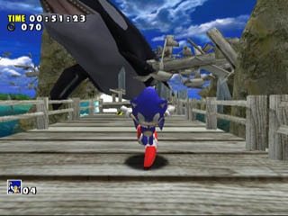

1998 gruodį [Sega Dreamcast](http://en.wikipedia.org/wiki/Dreamcast) konsolei skirtas žaidimas, kuriame Sonic\`as pirmą kartą patapo trimatis ir buvo pirmasis šeštosios kartos Sonic\`as. Galima laikyti visai nusisekusiu, nes sugebėjo peržengti milijono kopijų tiražą. Ir tapo Nr.1 Dreamcast konsolėje.

**Sonic Adventure 2**

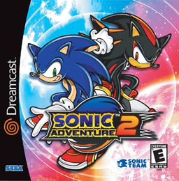

2001 sukurtas tęsinys, minintis 10 metų Sonic\`o jubiliejų, bei pristatantis dar du naujus veikėjus: [Shadow the Hedgehog](http://en.wikipedia.org/wiki/Shadow_the_Hedgehog) ir [Rouge the Bat](http://en.wikipedia.org/wiki/Rouge_the_Bat).

**Sonic Heroes**

2003-2004 išleistas visoms populiariosioms konsolėms. Pirmasis žaidimas, kurį man teko pamatyti nuo pat Sonic the Hedgehog 3 laikų. Pirmą kartą pamatęs per TV laidą, buvau apstulbęs nuo grafikos, bet kai teko išmėginti pačiam, tai buvo toks tik pusė velnio. Kamera buvo tiesiog apgailėtina, prie grafikos prikibti gal ir nereikėtų, bet pats žaidimas jau atrodė per vaikiškas. Išaugau iš tokių žaidimų, skant :\) Nepaisant neigiamų kritikų apžvalgų sugebėjo patapti ganėtinai populiarus.

**Shadow the Hedgehog**

2005 lapkritį išleistas žaidimas apie blogąją veikėjo pusę. Kiekvienas lygis tūrėjo tris režimus: Hero, Normal ir Dark. Žaidimas gavosi gana prastas ir pasidarė dergimasis iš Sonic\`o frančizės ir dauguma kritikų vertino gana neigiamai. Vidutinis įvertinimas apie 4 iš 10.

**Sonic the Hedgehog**

2006 žaidimas skirtas PS3 ir Xbox 360 konsolėms, skirtas paminėti 15-ąsias Sonic\`o metines. Antrasis serijos žaidimas gavęs [E10+ įvertinimą](http://en.wikipedia.org/wiki/Entertainment_Software_Rating_Board) \(Shadow the Hedgehog buvo pirmasis\).

**Sonic Unleashed**

2008 lapkričio 18 pasirodžiusi frančizės dalis. Kolkas naujausia. Sonic\`as dabar turi dvi puses: geroji, žaidžiant dieną, bei žvėris Sonic\`as, kai ateina naktis. Žvėris pasižymi didele jėga, tačiau jis yra labai lėtas. Dėl savo priešų traiškymo, žaidimas taip pat gavo E10+ vertinimą. Be nuostabios grafikos, bei kokybiškos muzikos šis darbas nieko gero nebepasiūlo. Taip, gal būdamas kokių 13 dabar su malonumo tokį žaidimuką žaisčiau, bet dabar aš žymiai maloniau pamaigyčiau senąjį gerąjį sonic\`ą. Lietuvišką žaidimo apžvalgėlę, galit pasiskaityti [čionais](http://reanimated.lt/sonic-unleashed). Kaip bebūtų, tai geriausias multiplatforminis Sonic\`as.

Išvada: žaidimas buvo tikrai nuostabus savo laikais, bet manau bandyti dar ir dar išpešti iš serijos – jau yra beviltiška. Leave Sonic alone!!! Tą patį būtų galima pasakyti ir apie Super Mario :\) Gal jau leiskit šiem veikėjam numirti ir patapti tiesiog video žaidimų klasika.





## \(Part 10\): Penktoji konsolių karta

Vat kaip man čia išsiplėst išėjo. Jau 10 galima sakyti jubiliejinis straipsnis ir dar net ne pabaiga. Ką gi – šiandien apie 32/64 bitų erą, arba kitaip sakant apie 3D žaidimų eros pradžią.

Laikmetis įdomus tuo, kad jam priskiriami iškart dviejų skirtingų galingumų kompiuteriai: 32 ir 64 bitų. Laikmetis apima 1993-2002 metus.

Taigi 1991 Fujitsu \(elektrotechnikos kompanija\) išleido pirmąjį 32 bitų žaidimų kompiuterį pavadinimu [FM Towns Marty](http://en.wikipedia.org/wiki/FM_Towns_Marty). Konsolė pristatyta tik Japonijos rinkai ir už jos ribų nebuvo pasirodžiusi. Tūrėjo CD palaikymą, bei diskelių įrenginį \(floppy disk drive – visai tokį pat, kaip PC\), tačiau konsolės kaina buvo gerokai per didelė ir po trijų metų pasirodžius priešininkei – Playstation, kompiuteriukas neatsilaikė ir iš prekybos buvo pašalintas. Galima rasti dizaino panašumu su PS3, ar ne?

1993 Panasonic taip pat sukonstravo savo 32 bitų žaidimų kompiuterį – [3DO Interactive.](http://en.wikipedia.org/wiki/3DO_Interactive_Multiplayer) Neskaitant konsolės sėkmės jai pasirodžius – [Time Magazine](http://en.wikipedia.org/wiki/Time_Magazine) pripažino ją, kaip 1994 metų gaminiu, jos kaina buvo gerokai per aukšta \(700 USD\) ir dėlto nepavyko varžytis su tuometiniais lyderiais Sega ar SNES. Parduota 2 milijonai konsolės vienetų.

Kaip bebūtų konsolė buvo gana originali – pulteliai tūrėjo mikrofonus, garso valdymo mygtuką, taip pat pirmą kartą konsolėje pritaikytos vizuolizacijos klausant muzikinio CD. Dėl šių savybių ji buvo perkama labiau kaip moderni audio sistema, galinti išgauti tikrai gerą garso kokybę, o ne kaip žaidimų konsolė.

1993 išleista pirma pasaulinė 32-bitų sistema – [Amiga CD32](http://en.wikipedia.org/wiki/Amiga_CD32). Tačiau spėta pristatyti tik Europoje ir Kanadoje. Planuotas pristatymas JAV auditorijai taip ir neįvyko dėl [Commodore International](http://en.wikipedia.org/wiki/Commodore_International) bankroto, skant tai buvo paskutinis pasispardymas. Konsolę galima buvo “papimpint” klaviatūra, pele, diskelių įrenginiu, kietuoju disku ir taip paversti ją iš žaidimų į namų kompiuterį. Taip pat konsolė pasižymėjo galimybe rodyti video CD ir tai lėmė, kad 1993-1994 konsolė sudarė 50 % CD-ROM rinkos Didžiojoje Britanijoje, taip gerokai sumažindama [Sega Mega-CD](http://en.wikipedia.org/wiki/Mega-CD), [Philips CDi](http://en.wikipedia.org/wiki/CD-i), ir net PC CD-ROM pardavimus. Tačiau 1994 gegužę bankrutavus firmai, pardavimai iškart pradėjo mažėti, nes nebebuvo jokio techninio palaikymo. Per savo trumpą gyvenimą konsolė parduota 100000 vienetų tiražu.

Kas čia daros, leidžiami milijonai, konsolės leidžiamos, o žmones jas naudoja visai ne tais tikslais? Chill out, viskas susitvarkys. Pamatysi :\)

1994 lapkritį Sega išleido [Sega 32X](http://en.wikipedia.org/wiki/Sega_32X). Tai nebuvo atskira konsolė, o tik [Sega Mega Drive](http://en.wikipedia.org/wiki/Sega_Mega_Drive), bei [Sega Mega-CD](http://en.wikipedia.org/wiki/Sega_Mega-CD) ****konsolių papildymas, kuris jungdavosi prie diskečių jungties, taip praplėsdamas konsolės galimybes. Kiek vėliau buvo kuriama [Sega Neptune](http://en.wikipedia.org/wiki/Sega_Neptune), kuri buvo ta pati Mega Drive konsolė, tik su jau integruotu viduje 32X čipu, bet kol konsolė buvo paruošta pardavimam, baigta kurti ir galingesnioji [Sega Saturn](http://en.wikipedia.org/wiki/Sega_Saturn). Kompanija nusprendė atšaukti Neptune ir Neptune gaminimas nė nebuvo pradėtas. Po šio įvykio kompanija nebesugebėjo išlaikyti stabilaus žaidimų tiekimo 32X moduliui ir taip daugybę Mega Drive tūrėtųjų buvo labai sunervinti ir ėmė nebepasitikėti kompanija, dėl neišplidytų 32X, bei Neptune pažadų, kurių buvo tikrai ne mažai. Šis nepasitikėjimas ir siejamas su tuo, kad firmos pardavimai pradėjo smarkiai kristi. Skant, pasižadėjai – būk malonus ir tesėk.

Taigi 1995 kovą Sega pristatė savo 32-bit\`ų konsolę – [Sega Saturn](http://en.wikipedia.org/wiki/Sega_Saturn). Neskaitant fanų nebepasitikėjimo, konsolė buvo dalinai sėkminga – parduota 9 milijonai vienetų. Bet tai nebuvo tie pardavimai, kurių tikėjosi gamintojai \(Master System ir Mega Drive pardavimai buvo kur kas sėkmingesni\). Kompanijos prezidentas [Bernie Stolar](http://en.wikipedia.org/wiki/Bernie_Stolar), matydamas konsolės nesėkmę pasakė: “Saturn tai ne ta konsolė, kuri bus firmos ateitis”. Žmonės išgirdę tai, pradėjo labai daug kalbėti apie Sega kompanijos tuo metu kuriamą naująją konsolę, žinomą “Katana” vardu. Nuolatinis žiniasklaidos dėmesys būsimai konsolei, padėjo kiek palaikyti bekrentančius Saturn pardavimus. Reikalai geriau klostėsi tik Japonijoje, kurioje konsolė išsilaikė iki 2000. Visur kitur žaisliuko platinimas “užrauktas” dar 1998. Nors konsolė ir buvo pažangiausioji penktojoje kartoje, bet neatsilaikė dėl blogo marketingo, bei nesugebėjimo sudaryti kontraktus su trečiųjų šalių žaidimų kūrėjais.

1993 lapkritį paskutinį kartą pasispardė ir mūsų gerai pažystama kompanija – Atari, kuri išleido [Jaguar](http://en.wikipedia.org/wiki/Atari_Jaguar). Konsolės startas buvo stebėtinai geras, tačiau ši platforma nelabai tūrėjo žaidimų, kurie galėtų išnaudoti jos technines savybes. [Tempest 2000](http://en.wikipedia.org/wiki/Tempest_2000), [Wolfenstein 3D](http://en.wikipedia.org/wiki/Wolfenstein_3D), [Doom](http://en.wikipedia.org/wiki/Doom_%28video_game%29), ir [Alien vs. Predator](http://en.wikipedia.org/wiki/Alien_vs._Predator_%28Jaguar_game%29) buvo vienintelės išimtys. Jaguar buvo išleista, kad techniškai pralenkti Mega Drive ir SNES konsoles ir buvo pavadinta pirmąją 64-bit\`ų konsole, bet pažvelgus į konsolės galimybes, tai buvo kiek abejotina. Pradinis konsolės vardas buvo [Atari Panther](http://en.wikipedia.org/wiki/Atari_Panther) ir tūrėjo pasirodyti dar 1991, kaip 32-bit\`ų kompiuteris. Tačiau Atari šią konsolę atidėjo ir tai laikoma gan didele kompanijos klaida, nes pasirodžiusi kartu su SNES ir Mega Drive ji tikriausiai būtų aplenkusi priešininkes ir tapusi ketvirtosios kartos hitu. Nepaisant Jaguar reklamos nebuvimo Atari pardavė virš 250000 konsolių. Skant funboy\`ai pasistengė. Taip konsolė pragyveno iki 1996. Vėliau Atari kompanija buvo parduota [JT Storage](http://en.wikipedia.org/wiki/JT_Storage) firmai ir nustojo gaminti žaidimų konsoles.

Ir štai 1994 gruodį Sony kompanija pristatė tikrą bombą – [Sony PlayStation](http://en.wikipedia.org/wiki/Sony_PlayStation), kainavusią 299 USD \(startinė kaina, vėliau naudota ir PS2\). Kompanija, pasinaudojusi visomis savo turimomis marketingo žiniomis, išradingumu reklamos srityje, bei pirmųjų ir trečiųjų šalių žaidimų kūrėjų kontraktais, sugebėjo tapti Nr.1 penktosios kartos konsole, kurios parduota net 102 milijonai kopijų \(2008 liepos duomenimis\) ir tapo pirmoji konsolė peržengusi 100 milijonų pardavimų ribą. Kaip kompanijos pasisekimo priežastis nurodoma tai, kad Sony prisistatė, kaip žaidimų kompiuteris suaugusiems \(teigdami, kad kitų konsolių kuriami žaidimai skirti vaikams, prisižiūrėjusiems animacinių filmukų – ir tai buvo tiesa\).

Šis kompiuteriukas buvo pirmasis PlayStation serijos kompiuteris \(vėliau sekė [Net Yaroze](http://en.wikipedia.org/wiki/Net_Yaroze), [PS one](http://en.wikipedia.org/wiki/PlayStation#PS_one), [PSX](http://en.wikipedia.org/wiki/PSX_%28DVR%29), [PocketStation](http://en.wikipedia.org/wiki/PocketStation), [PlayStation 2](http://en.wikipedia.org/wiki/PlayStation_2), [PlayStation Portable](http://en.wikipedia.org/wiki/PlayStation_Portable),  [PlayStation 3](http://en.wikipedia.org/wiki/PlayStation_3), tačiau apie juos – kiek vėliau\). Šio žvėriuko gamyba nutraukta tik 2006 kovo 23, t.y. po 11metų, nuo konsolės debiuto.

Tai buvo revoliucinė konsolė, kuri parodė pasauliui, kas yra tikras žaidimų kompiuteris. Atminties kortelės, tobuli joystick\`ai, graži, spalvinga trimatė grafika, muzikos leistuvas. Tai buvo daugiau nei kas galėjo įsivaizduoti. Sony padarė milžinišką šuolį į priekį visoje žaidimų industrijoje.

Konsolė pasirodė su daugybe, iškart hit\`ais tapusių žaidimų, kaip: [Battle Arena Toshinden](http://en.wikipedia.org/wiki/Battle_Arena_Toshinden), [Twisted Metal](http://en.wikipedia.org/wiki/Twisted_Metal), [Tekken](http://en.wikipedia.org/wiki/Tekken_%28video_game%29), [Warhawk](http://en.wikipedia.org/wiki/Warhawk_%28PlayStation_game%29), [Air Combat](http://en.wikipedia.org/wiki/Air_Combat), [Philosoma](http://en.wikipedia.org/wiki/Philosoma), ir [Ridge Racer](http://en.wikipedia.org/wiki/Ridge_Racer) – puikūs žaidimai, kurie dar ne kartą susilaukė tęsinių, tačiau pats populiariausias konsolės žaidimas – [Gran Turismo](http://en.wikipedia.org/wiki/Gran_Turismo_%28video_game%29). Šio žaidimo parduota 10,85 milijonai vienetų. Iš viso konsolė susilaukė net 7978 skirtingų žaidimų \(įskaitant žaidimus, išleistus skirtingiems regionams su skirtingais pavadinimais\). Labai didelę pardavimų dalį sudarė Japonijos rinkai skirti role-playing games \(žinomi RPG trumpiniu\) žaidimai, kurie šioje šalyje buvo ypač populiarūs. Paskutinis žaidimas, kurio susilaukė ši konsolė – [FIFA Football 2005](http://en.wikipedia.org/wiki/FIFA_Football_2005)

2000 liepa išleista ir atnaujinta konsolės versija, pavadinimu – PS1 arba PSone. Atnaujinta konsolės išvaizda: kompiuteris tapo gerokai mažesnis, bei aptakesnių formų. Taip pat atnaujinta konsolė tūrėjo naują grafinį vartotojo meniu, bei papildomą jungtį, pasijungti konsolę į tinklą ir tokiu būtų žaisti multiplayer žaidimus.

Kompiuteris apie kurį reikėtų rašyti daug daugiau, tačiau keliaujame toliau.

1996 liepą Nintendo išleido savo trečiąją konsolę – [Nintendo 64](http://en.wikipedia.org/wiki/Nintendo_64) \(arba tiesiog N64\). Dar SNES laikais, buvo sukurta reklama, kurios metu žaidėjas naudodamas grandininį pjūklą bando atidaryti žaidimo automatą, kad galėtų iš jo išsitraukt pačią konsolę. Ši reklama sukėlė daug kalbų ir žmonės manė, kad reklamoje demonstruojama būsimos konsolės neįtikėtinai galinga techninė pusė. Tačiau pasirodžius pačiai konsolei, gerbėjai pamatė, kad ji visai ne tokia, kokios jie tikėjosi ir liko labai nuvilti.

Bet ne viskas klostėsi taip blogai!!!

Tai buvo paskutinė Nintendo konsolė, kuri naudojo žaidimų disketes. Kaip kompiuteris su disketėmis, jis sugebėjo pasiūlyti stulbinamą 3D grafiką, niekuo nenusileidžiančią PS grafikai, tačiau pats kompiuteris kainavo visu 100 doleriu pigiau, nei minėtasis Sony atstovas. Beto tai juk buvo Nintendo!!! Visi dar žaidė su seniaisiais Nintendo, o vat čia naujas, geresnis, patogesnis. Taip po truputi N64 iškovojo vietą po saule ir kompanija sugebėjo parduoti net 32,93 milijonus kopijų, neabejotinai atimdami milžinišką rinkos dalį iš Sony. Užtikrinta antra vieta pagal pardavimus.

Populiariausias konsolės žaidimas [Super Mario 64](http://en.wikipedia.org/wiki/Super_Mario_64) – parduota 11,62 miljonai vienetų.

#### Kitos mažiau nusisekusios konsolės

[PC-FX](http://en.wikipedia.org/wiki/PC-FX) – 1994 gruodį išleista taip ir neįvertinta konsolė, pasižymėjusi ypač geros kokybės vaizdu, tačiau netūrėjusi žaidimų, išnaudojančių jos galimybes. Taip tesėsi iki 1998, kai PlayStation galutinai išstūmė pastarąją iš rinkos. Bet nepaisant to – tai buvo galingesnė konsolė, nei garsioji PlaySation. Išviso sukurti 62 žaidimai konsolei, kurie daugiausia reikalauja gero išsilavinimo, bei gilių Japonijos pažinimo žynių

[Apple Bandai Pippin](http://en.wikipedia.org/wiki/Apple_Bandai_Pippin) – kompiuterių grandų bandymas įsilieti į rinką, kaip multimedijos kompiuteris, kuriu būtų galima žiūrėti filmus, klausytis muzikos, žaisti CD žaidimus, bei pasijungti į tinklą. Šis kompiuteris paplito 42000 kopijų tiražu. Įdomu, tai, kad kompiuteris patenka į [25 Worst Tech Products of all Time](http://www.pcworld.com/reviews/article/0,aid,125772,pg,6,00.asp#pippin) sąrašą, kur užima 22 vietą. Kodėl jis toks prastas? Kompiuteris tūrėjo Mac OS – o tai reiškia, kad žaidimų jam beveik nebuvo, kompiuterio procesorius buvo tikrai silpnas, tad ir tie žaidimai, kurie buvo – atrodė prastai. Interneto greitis buvo daugiau, nei lėtas ir visas šis baisumas kainavo net 600 dolerių!!! Tuom viskas ir pasakyta

[Casio Loopy](http://en.wikipedia.org/wiki/Casio_Loopy) – 1995 metų kompiuteriukas skirtas tik Japonijai ir tik mergaitėms ir šiam kompiuteriukui buvo išleista tik 10 žaidimų. Įdomu tai, kad korpuse buvo įmontuotas mažas spalvotas printeris, kuris galėjo atspausdinti mažus lipdukus iš žaidimo nuotraukų. Visai fun  :kietulis

Dar vienas 1994 išleistas kompiuteriukas, skirtas \(gėjams?\) vaikams. Kompiuteris tetūrėjo tik vieną programą – apklausą apie anime. Na japonijos vaikams gal ir nieko kompiuteriukas, ypač, kad buvo tikrai nebrangus.

#### Išvada:

Jei 1994 – 2006 netūrėjai PlayStation arba N64, reiškia tu negyvenai. Esi daug nepatyręs ir turi laikyti save nepilnaverčiu žmogum!!!

Just joke\`in…







## \(Part 11\): Šeštoji konsolių karta

Žmonės suprato, kad žaisti žaidimus konsolės pagalba yra visai kitoks potyris, nei sėdėti prilipus prie stacionaraus kompiuterio. Tad ši konsolių karta gali pasigirti savo pasiekimais, bei tikrai aukštais pardavimais.

Šeštoji karta \(dar žinoma, kaip 128-bitų era\) prasidėjo 1998 ir teoriškai tesėsi iki 2006. Bet sakyti, kad ji visai užsibaigė būtų nevisiškai teisinga, nes dar dabar parduodamos naujos PS2 konsolės, bei kuriami žaidimai jai.

Apie viską plačiau:

Taigi oficialiai šeštąją kartą pradėjo Sega kompanija, kuriai žūtbūt reikėjo atgauti rinką, po nesėkmingo Sega Saturn pasirodymo. Kompanija nutuokė apie Sony ketinimus ir 16 mėn. prieš PlayStation 2 išleidimą parodė pasauliui [Dreamcast](http://en.wikipedia.org/wiki/Dreamcast). Šis gaminys sėkmingai pakėlė Sega’os reputaciją žaidimų industrijoje, tačiau konsolei neužteko laiko “įsivažiuoti”, nes 2000-ųjų kovą pasirodė lauktoji PlayStation 2. Taigi Sega liko nutraukti Dreamcast gamybą ir ji galiausiai iš vis pasitraukė iš konsolių gamybos biznio.

Dreamcast vos pasirodžiusi iškart tapo visų konsolių lyderė \(žaidimai vos išleisti šiai konsolei, mušdavo visus pardavimo rekordus\), nes niekas netūrėjo tokios stiprios techninės pusės, tokios kokybiškos, tikroviškos grafikos \(pirmoji konsolė sugebėjusi garantuoti pilną SD rezoliuciją\), tai buvo aparatas į kurį vien pažvelgus, galėjai suprasti, kad jis skirtas žaisti. Taip pat konsolė galėjo pasiūlyti didelį spektrą online žaidimų, kurie žaidžiami per integruotą modemą; bei interneto naršyklę, kurios metu, galėjote naršyti internete tiesiog per savo televizorių.

Sega nutraukė šio žaisliuko gamybą 2001 kovą, tačiau \(kaip visad\) Japonijoje konsolei pavyko išsilaikyti net iki 2006, o licenzijuoti žaidimai kurti net iki 2008. Negalėtume konsolės laikyti visiškai mirusia, nes net šiemet konsolei dar buvo pristatyti Dux, Rush Rush Rally Racing, Age of the Beast ir _Little Ninja_ žaidimai_._ Tiesa tai tik žinomų žaidimų perdariniai specialiai Japonijos publikai.

Kodėl Dreamcast buvo nutraukta yra kelios priežastis. Žinoma viena iš pagrindinių priežasčių, tai PS2 pasirodymas. Šis Sony gaminys per metus sugebėjo atimti didžiąją dalį Dreamcast rinkos. Taip pat prie nutraukimo prisidėjo ir sprendimas į įrenginį montuoti [GD-ROM](http://en.wikipedia.org/wiki/GD-ROM), kuris nepateisino lūkesčių lyginant su PS2 DVD galimybėmis. Taip pat ši technologija leido labai lengvai kopijuoti žaidimus, dėlto piratavimas buvo neįtikėtinai didelis ir kūrėjai ėmė netekti pinigų.

Išviso parduoda 10,9 milijonai konsolės vienetų, o populiariausiais žaidimas: [Sonic Adventure](http://en.wikipedia.org/wiki/Sonic_Adventure) – parduota 2,5 milijonai.

Taigi, 2000 kovo 4 išėjo didžiausiais Dreamcast priešas – PlayStation 2. Heh jau 9 metai neabejotinos sėkmės ir populiarumo ženklas. Taip ši konsolė tapo visų laikų daugiausiai parduota konsolė. Parduota net 140 milijonų kopijų!!! Da best in the world!!! :gerulis:

Ar atsimenate kas dėjosi, kai konsolė pasirodė? Kovo 4 – debiutas, kovo 5 -parduota net 980,000 konsolės vienetų!!!! Tačiau iki 2000 pabaigos tik keli milijonai žmonių teturėjo konsolę. Kodėl? Taip nutiko, nes konsolės pristatymas labai strigo ir platintojų parduotuvėse, vos pasirodžiusios konsolėms jos būdavo išgraibstytos. Kur nueisi – tuščios lentynos. Vienintelis būdas nusipirkti konsolę buvo online aukcionuose, kur žmonės mokėdavo virš 1000 dolerių, kad tik galėtų gauti šį gėrį. Žinoma, vėliau tiekimas į JAV buvo sutvarkytas ir tada jau visi norintys galėjo ją įsigyti. Kodėl visi taip pamišo tik dėl vienos konsolės? Priežasčių buvo daug.

Pirmiausia, tai milžiniška sesutės PS1 sėkmė, kuri paklojo puikius pamatus būsimajai PS2 – žmonės jau žinojo laukiantys aukščiausios kokybės gaminio, pasitikėjo kompanija ir žinojo, kad Sony jų nenuvils. Taip pat sėkmę užtikrino tiesiog milžiniška konsolės galia, kuri visa galva lenkė tuometinius kompiuterius. Sony nedelsė ir sudarė kontraktus su didžiausiomis žaidimų kompanijomis ir taip užtikrino visą aibę naujausių žaidimų, kurie tiekiami žaidimų kompiuteriukui net ir dabar. O ką kalbėti apie tokius Sony kozirius, kaip: [Final Fantasy](http://en.wikipedia.org/wiki/Final_Fantasy_X), [Grand Theft Auto](http://en.wikipedia.org/wiki/Grand_Theft_Auto_III), [Metal Gear Solid](http://en.wikipedia.org/wiki/Metal_Gear_Solid_2), bei [Kingdom Hearts](http://en.wikipedia.org/wiki/Kingdom_Hearts),  kurie jau buvo užsitikrinę pripažinimą ir neabejotinai padidino PS2 pardavimus. O populiariausias konsolės žaidimas tapo [Gran Turismo 3: A-Spec](http://en.wikipedia.org/wiki/Gran_Turismo_3:_A-Spec) – 14.89 milijono kopijų.

Taip pat, kaip viena iš kertinių sėkmės priežasčių laikoma ir PS2 sugebėjimas paleisti PS1 žaidimus, o tai reiškė, kad drąsiai gali nusikratyti savo senosios konsolės ir tūrėti vieną, kuris sugeba viską. Taip pat ryškų pėdsaką pardavimuose paliko ir žymioji PS9 reklama, kurioje PS2 parodoma, kaip dar vienas laiptelis link “tobulų” žaidimų. O ką jau kalbėti apie standartinę PlayStation kainą \(299,99 USD – tiek kainavo, tiek PS1, tiek PS2\). Už šią kainą gaudavai įrankį su kuriuo gali ne tik, kad žaisti žaidimus, bet naudoti, kaip tikrų tikriausią namų pramogų centrą – klausyti muzikos, žiūrėti DVD filmus, tam netgi skirtas specialus valdymo pultelis.

Lyderė laikėsi gana stabiliai, tačiau per kelerius metus reikėjo pristatyti kažką naujo, kad visi sukrustų ir vėl atkreiptų dėmesį į gaminį. Ir Sony kuo puikiausiai žinojo ką daryti: dar 2004 vasarą buvo nutraukta PS2 gamyba. Tai buvo padaryta tam, kad visos senosios konsolės versijos būtų išparduotos ir tiekėjai pajustų trūkumą. Ir štai 2004 spalį kartu su [Grand Theft Auto: San Andreas](http://en.wikipedia.org/wiki/Grand_Theft_Auto:_San_Andreas) debiutu startavo naujasis PS2 modelis. Tai buvo žymiai, žymiai dailesnė, bei tikrai maža konsolės versija.

2005 lapkritį, PS2 tapo greičiausiai 100 milijonų ribą peržengusi konsolė: 5 metai ir 9 mėnesiai nuo pardavimų starto – aplenkė savo sesutę PS1, kuri iki tol, vis dar buvo vienintelė konsolė peržengusi šią ribą, jai tai padaryti prirekė 9 metų ir 6 mėnesių.

Visi teigė, kad pasirodžius next-gen konsolėms, PS2 bus nurašytas ir niekam tikęs. Heh, bet tik pasižiūrėkite: sudėjus Wii, Xbox 360 ir PS3 pardavimus – PS2 visvien išlieka visa galva auksčiau. Ar kam nors pavyks aplenkti PS2?

Pasakočiau daugiau, bet nebemanau, kad tai reikalinga. Juk visai neseniai dar patys žaisdavom, o gal net dar ir žaidžiam. Tai kam apie tai pasakoti :\) Konsolė su kuria kiekvienas niurzga pajaučia tikrąjį žaidimo malonumą. \(Man visos maloniausios žaidimo valandos prabėgo būtent fotelyje prie šio kompiuteriuko :\)

[GameCube](http://en.wikipedia.org/wiki/Nintendo_GameCube) – 2001 spalio 14 ketvirtąją išleista trečioji šeštosios kartos konsolė, kuri pasiekė šią vietą ne tik pagal išleidimo datą, bet ir pagal pardavimus: 21,6 milijonai. Šis “kubikas” buvo pirmasis kompanijos gaminys, naudojantis optinius diskus, vietoj diskečių \(žmogeliai susiprato, kad sukurdami N64 su disketėmis, o ne su kompaktiniais diskais – padarė klaidą\). Siekdami pranašumo prieš konkurentus, įdiegė ir [miniDVD](http://en.wikipedia.org/wiki/MiniDVD) palaikymą, kokio netūrėjo nei PS2, nei Xbox, bet užtai nepritaikė konsolės muzikos ir filmų žiūrėjimui \(skant, darė, darė ir nedadarė :\)\)

Kaip bebūtų Nintendo visada labiau orientavosi į vaikus \(ne taip, kaip Xbox ar PS2\). Dėl šios priežasties konsolė buvo leidžiama daugybės spalvų, žaidimai leidžiami šiai konsolei – spalvotos, linksmos arkardos. Populiariausiais konsolės žaidimas – [Super Smash Bros. Melee](http://en.wikipedia.org/wiki/Super_Smash_Bros._Melee) – 7,09 milijono. Pasižiūrėjus į šį žaidimą galima susidaryti bendrą vaizdą apie konsolę. Nesiginčijam, gal ir geras gaminys, bet daugiausiai orientuotas į konkrečias rinkas.

Na ir galiausiai – paskutinis šeštosios kartos kompiuteris, bei pagrindinis PS2 priešas: [Xbox](http://en.wikipedia.org/wiki/Xbox). Konsolė iškopė į antrąją vietą ir netapo pirma ko gero, tik dėl geresnio Sony marketingo. Tačiau Xbox išsikovojo daugybę fanų ir susikūrė tikrai stiprią rinką JAV ir Europoje. Už lygiai tą pačią kainą \(299,99 USD\) Microsoft\`as pasiūlė kur kas galingesnį kompiuterį nei PS2. Jei PS2 siūlė 294 MHz procesorių, tai Xbox pasiūlė 733 MHz. Jei PS2 didžiavosi savo 147 MHz vaizdo procesoriumi, tai Xbox davė 233 MHz. Be šių žymiai įspūdingesnių duomenų, dar sugebėjo rip\`inti muziką iš muzikinių CD ir rašyti dainas į savo kietąjį diską. Žaidėjams tai labai patiko. O ką bekalbėti apie online tinklą – Xbox Live, leidžiantį ne tik kad žaisti žaidimus, kaupti duomenis, bet ir siųstis naujausių žaidimų Demo versijas ar nusipirkti juos. Xbox Live viršūne tapo [Halo 2](http://en.wikipedia.org/wiki/Halo_2) – kuris iš šio tinko buvo parsiųstas net 8 milijonus kartų – tapdamas geriausiai parduodamu Xbox žaidimu. PS2 dėl tokio vieningo tinklo nebuvimo beliko gėdytis ir šią problemą puolė spręsti sekančioje kartoje :kietulis:

Tačiau nepaisant techninio pranašumo Xbox į rinką atėjo, kai joje karaliavo konkurentė Sony \(2001 lapkričio 15\). Taipogi Xbox netūrėjo žaidimų, kurie galėtų išnaudoti visas technines galimybes, tad jokio pranašumo prieš PS2 nesugebėdavo parodyti. Microsoft\`as norėjo gelbėtis ekliuzyviniais žaidimais, tokiais, kaip [Tom Clancy’s Splinter Cell](http://en.wikipedia.org/wiki/Tom_Clancy%27s_Splinter_Cell). Tačiau Sony pavykdavo susitarti su gamintojais ir šie “exlusive”\`ai būdavo priviliojami ir prie PS2. O ką jau bekalbėti apie Japonijos rinką, kur Xbox rinka buvo apgailėtina \(nepavyko Microsoft\`ui susikalbėt su japonais ir praktiškai netūrėjo jokių kontraktų su japonų žaidimų kūrėjais. Vėliau kompanija sutiko, kad tai buvo didelė klaida\).

Taip bekovodama su Sony, ši konsole išgyveno iki 2006 pabaigos, bei buvo parduota 24 milijonai kopijų tiražu.

#### Išvada:

Jei neturi next-gen konsolės, tai nebūt išbandžiusiam šių dviejų pagrindinių konsolių yra nusikaltimas. PS2 gali pasigirti savo populiarumu, pardavimais, bei žaidimų skaičiumi. O Xbox savo fanų vieningumu ir sistema, kuri juos visus apjungia.





