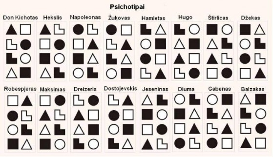

# Me

Aktyvus, tačiau reikalaujantis laiko pasikrovimui; komunikabilus, tačiau nemokantis užkalbinti; įsitraukiantis, draugiškas, bet tuo pat metu greitai pavargstantis nuo žmonių. Ne kompanijos siela, tačiau su artimais žmonėmis tikras pliurpalas ir neužsibūnantis ilgai prie vienos minties. Kiek mizantropiškas. Besilaikantis pažadų, tačiau drėbiantis viską tiesiai šviesiai, todėl kai kas palaikytų stačiokišku. Pastabus, bet tai atneša manymą, kad esu egoistiškas: retai klausinėju, nes išgirstu daug ką iš detalių. Tačiau kur Jin ten ir Jang. Atviras, dažniausiai linksmas (nors juodas humoras man nevengtinas), tikrai padedantis, jei tik kas paprašo. Išklausantis ir padarantis išvadas, tačiau tikrai nemokantis paguosti. Tęsiantis pažadus, tačiau negyvenantis po rožiniais akiniais. Gal turintis polinkį į savikritiką, bet tik dėl to, kad siekiu iš savęs geriausio, o iš kitų nesitikiu nieko. Lūkesčiai yra linkę būti nuvilti.

### Hekslis

**Apibendrinančios sąvybės**\
Šiek tiek avantiūristiškas, kalbus, emocionalus žmogus. Veiklūs, energingi, gero būdo, betarpiški, moka mėgautis tuo, kas yra, ir nesijaudina dėl ateities. Nesusigaudo savo ir kitų fizinėje būsenoje. Niekad nežino savo negalavimų ir pojūčių priežasčių. Gydytojui kalba ne ką skauda, o apie blogą nuotaiką. Apie jo savijautą galima gauti informaciją tik užduodant konkrečius klausimus. Stengiasi nieko neskolinti, pasiskolinęs visada atiduoda. Pats nemėgsta skolinti, apie tai nepamiršta, bet negali paprašyti atiduoti. Smalsūs ir įžvalgūs stebėtojai. Jie priima daiktus tokiais, kokie jie yra, pasižymi plačiu akiračiu, tolerancija ir prisitaikymu kitų atžvilgiu. Svarbu matyti perspektyvą ateityje. Kai nėra ko tikėtis, Heksliui neramu, jis blaškosi, bet negalvoja kaip surasti išeitį situacijoje. Dėmesį koncentruoja ties procesu, kurio metu kuriamas rezultatas. Nemėgsta ilgų aiškinimų. Geriausiai jam sekasi dirbti su realiais daiktais, kuriuos galima valdyti ir naudoti – po vieną, paeiliui ar visus drauge.

**Santykiai su žmonėmis**\
Lengvai sueina į kontaktus su žmonėmis, bendrauja lengvai ir draugiškai, atviras ir nuoširdus. Atidus jų emocijoms, gerai supranta motyvus, kuriais vadovaujasi žmonės. Siekia valdyti aplinkinių jausmus. Kiekvienam sugeba parinkti žodžius, kokių žmogui būtent tuo metu reikia. Jeigu reikia gali ir sumeluoti, o žmonės net nepajus. Jis gerai jaučia savo ir kitų žmonių galimybes. Domisi keistais, išsiskiriančiais žmonėmis, lengvai bendrauja. Moka kiekvienam patikti, randa raktą į kiekvieno žmogaus širdį. Altruistas: dėl jam simpatiškų žmonių gali padaryti daugiau, nei iš jo laukiama. Turi sąmojaus, sugeba pralinksminti žmones. Bet gali šią savybę panaudoti prieš žmogų, kuris jo nuomone neteisingai elgiasi. Priima žmogų koks jis yra, bet, jei reikia, gali padaryti “savu” manipuliuodamas santykiais su juo. Greit nusivilia savo simpatijomis. Žmonėse mato daug gerų dalykų ir jiems tai emocingai pasako. Patiklus, pokalbyje gali papasakoti, ko nereikia. Rimtuose jausmuose konservatyvus. Elgesio etiškumą vertina pats, kartais nepaklusdamas visuomenės normoms. Paprastai turi „prisikaupę“ įvairiausių istorijų ir juokų, tinkamų visiems gyvenimo atvejams, ir kuriais prireikus gali palinksminti publiką.

Vyrai laisvesni, šnekesni, nei moterys. Moka leisti pinigus. Reikėtų įvertinti Hekslio optimizmą ir tai, kad jis nepavargsta, siekdamas savo tikslų, ieškodamas grožio, šiltų, draugiškų žmonių tarpusavio santykių. Bet dėl noro palaikyti gerus santykius su visais perkrauna save nereikalingais kontaktais.

**Darbas**\
Negali dirbti nuobodaus, monotoniško darbo, kai reikia pasinerti į detales. Tokį darbą paprasčiausiai meta. Linkęs į persidirbimą. Įsitraukia į darbą tuoj pat ir dirba aktyviai, bet dažnai nespėja padaryti darbo laiku, nes užsiima antraeiliais dalykais, dažnai pritrūksta kantrybės, nuoseklumo. Nemoka atlikti kruopštaus darbo, praleidžia detales. Reakcija į nesėkmes audringa, bet trumpa. Traumuoja klausimas: kodėl tu taip padarei? Tai jį veda prie pasyvumo. Susidomėjęs kokia nors idėja, aktyviai ją reklamuoja. Išreiškęs iniciatyvą, ieško žmonių, kurie gali įgyvendinti jo idėjas jam nedalyvaujant. Nemėgsta reglamentacijos, taisyklių, grafikų, suvaržančių jo nepriklausomybę, negerbia subordinacijos, hierarchijos priešininkas. Gana neorganizuotas ir nepraktiškas. Geriausios veiklos sritys – humanitarinė sfera, pedagogika, menas, žurnalistika, pažinčių tarnybos, psichologinis konsultavimas.

**Apranga, tvarka**\
Savo drabužiais stengiasi neišsiskirti iš aplinkos, nors atitinkamomis progomis gali sublizgėti, pritrenkti aplinkinius savo ekstravagantiškumu. Šiaip aprangai skiria nedaug dėmesio. Tvarkingam būti sunku. Tai priklauso nuo nuotaikos ir aplinkinių. Panašiai ir su valgiu.

**Laikas**\
Laiką jaučia instinktyviai – laikrodis jam nereikalingas. Planuoti veiksmus ateičiai sunku, nes tai priklauso nuo jo nuotaikos. Dažnokai metasi nuo vieno nuotykio prie kito, gana greitai ir lengvai atsisakydami to, kas juos jau nustojo dominti ir traukti. Jiems vertėtų išmokti racionaliau tvarkyti savo laiką ir sudarinėti ilgalaikiškesnius planus.

pagal [D.Kersey testą ](http://www.socionika.org/testaik.htm)
