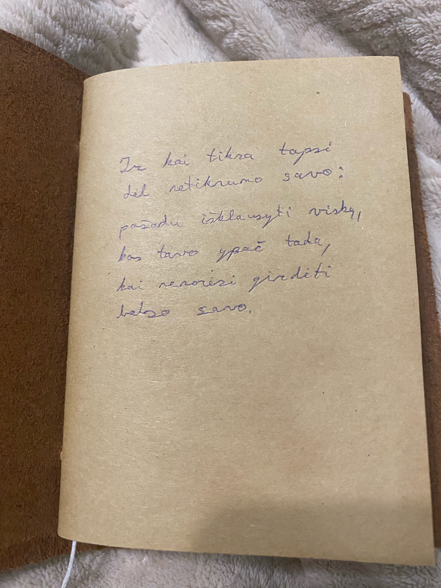
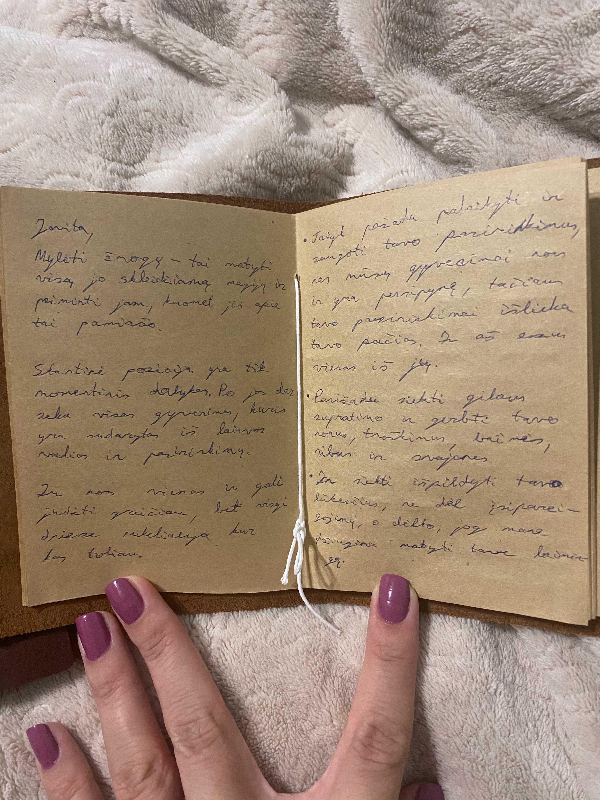
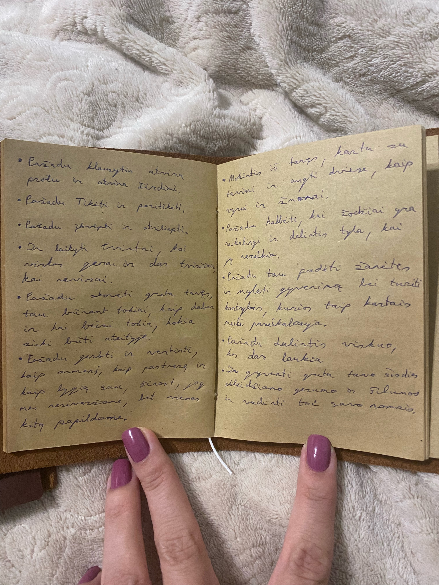
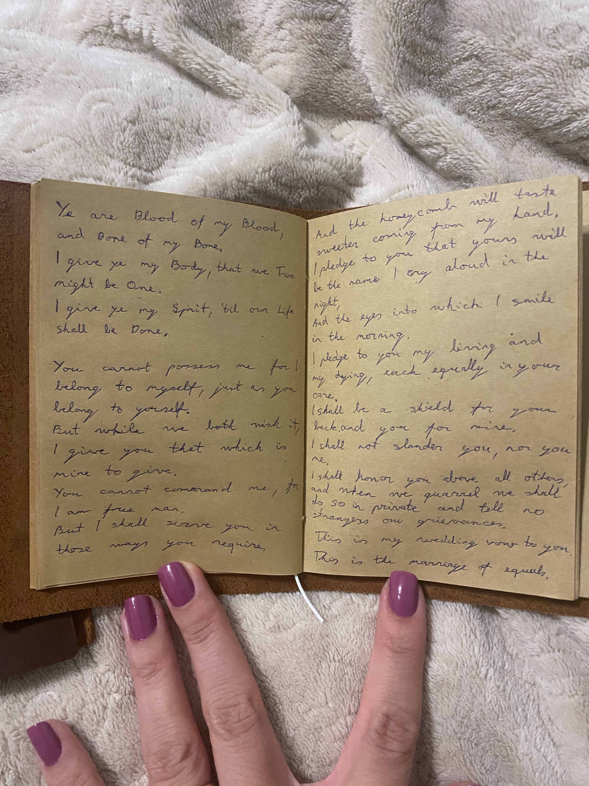

# Vestuvių įžadai

_Ir kai tikra tapsi dėl netikrumo savo: pažadu išklausyti viską, kas tavo ypač tada, kai nenorėsi girdėti balso savo._

Mylėti žmogų - tai matyti visą jo skleidžiamą magiją ir priminti jam, kuomet jis apie tai pamiršto.

Startinė pozicija yra tik momentinis dalykas. Po jos dar seka visas gyvenimas, kuris yra sudarytas iš laisvos valios ir pasirinkimų. Ir nors vienas žmogus ir gali judėti greičiau, bet visgi dviese nukeliauja kur kas toliau.

* Taigi pažadu palaikyti ir saugoti tavo pasirinkimus, nes mūsų gyvenimai nors ir yra persipynę, tačiau tavo pasirinkimai išlieka tavo pačios. Ir aš esu vienas iš jų.
* Pasižadu siekti gilaus supratimo ir gerbti tavo norus, troškimus, baimes, ribas ir svajones.
* Ir siekti išpildyti tavo lūkesčius, ne dėl įsipareigojimų, o dėlto, kad mane džiugina matyti tave laimingą.
* Pažadu klausytis atviru protu ir atvira širdimi.
* Pažadu Tikėti ir pasitikėti.
* Pažadu įkvėpti ir atsiliepti.
* Ir laikyti tvirtai, kai viskas gerai ir dar tvirčiau, kai nevisai.
* Pažadu stovėti greta tavęs tau būnant tokiai, kaip dabar ir būnant tokiai, kokia sieki būti ateityje.
* Pažadu gerbti ir vertinti kaip asmenį, kaip partnerę ir kaip lygią sau, žinant, kad mes nesivaržome tarpusavyje, bet vienas kitą papildome.
* Mokintis iš tavęs, kartu su tavimi ir augti kartu, kaip vyrui ir žmonai.
* Pažadu kalbėti, kai žodžiai yra reikalingi ir dalintis tyla, kai jų nereikia.
* Pažadu tau padėti mylėti gyvenimą ir turėti kantrybės, kurios taip kartais meilė pareikalauja.
* Pažadu dalintis viskuo kas dar laukia.
* Ir gyventi greta tavo širdies skleidžiamo gerumo ir šilumos ir visą tai vadinti savo namais.

\--

Celtic Wedding Pledge

Ye are Blood of my Blood, and Bone of my Bone.\
I give ye my Body, that we Two might be One.\
I give ye my Spirit, 'til our Life shall be Done.

You cannot possess me for I belong to myself, just as you belong to yourself.\
But while we both wish it, I give you that which is mine to give.\
You cannot command me, for I am a free man.\
But I shall serve you in those ways you require\
And the honeycomb will taste sweeter coming from my hand.\
I pledge to you that yours will be the name I cry aloud in the night,\
And the eyes into which I smile in the morning.\
I pledge to you the first bite of my meat and the first drink from my cup.\
I pledge to you my living and my dying, each equally in your care.\
I shall be a shield for your back and you for mine.\
I shall not slander you, nor you me.\
I shall honor you above all others, and when we quarrel we shall do so in\
Private and tell no strangers our grievances.\
This is my wedding vow to you\
This is the marriage of equals.

   
